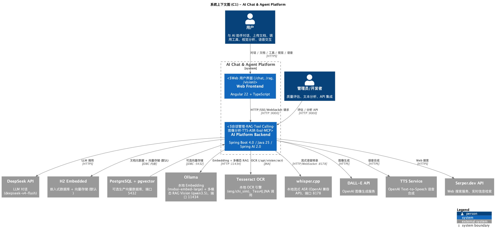
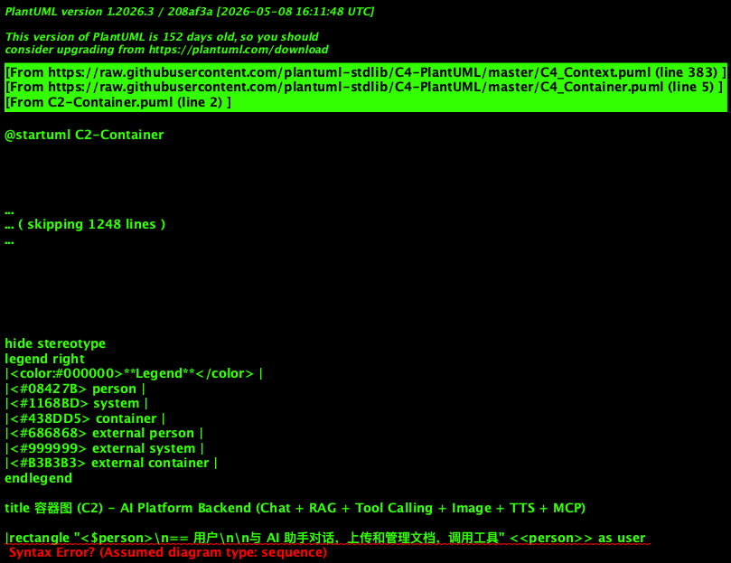
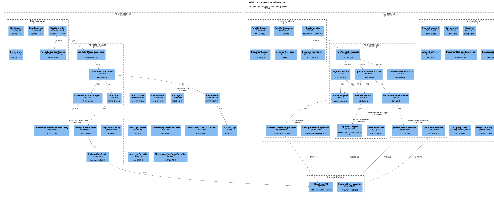
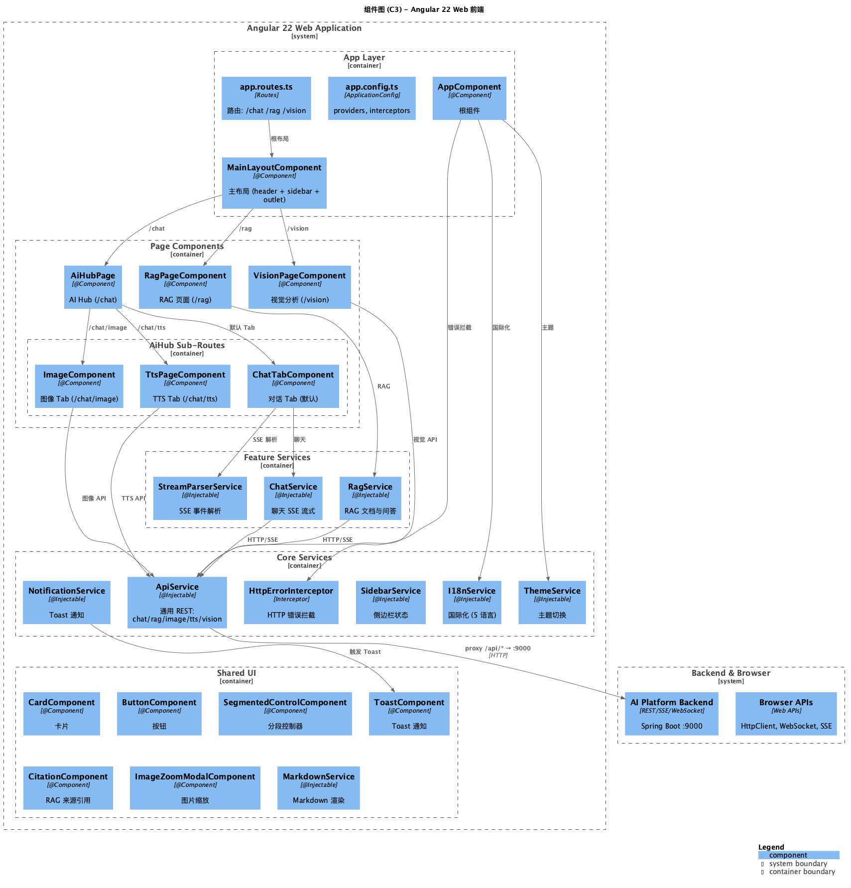
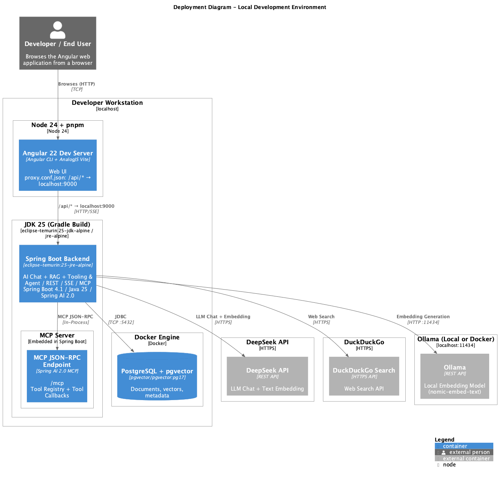

# AI-Explore

基于 Spring AI + Angular 的 AI 应用平台，支持 RAG 文档问答、Tool Calling、图像生成、语音合成、视觉分析和实时流式语音识别。

## 核心功能

| 功能 | 描述 | 技术亮点 |
|------|------|---------|
| **AI 对话** | 多 Provider (OpenAI/Anthropic/Ollama) 切换，SSE 流式输出 | Markdown 渲染，会话管理 |
| **RAG 文档问答** | PDF/TXT 文档上传，向量检索增强生成 | 流式响应，来源引用，**本地 Ollama 视觉理解** |
| **Tool Calling** | 天气查询、文档搜索、Web 搜索 | 自动工具选择 |
| **图像生成** | DALL-E/FLUX 图像生成 | 多尺寸支持 |
| **语音合成 (TTS)** | 多语言多音色，语速调节 | 实时预览，下载 MP3 |
| **实时语音识别 (ASR)** | WebSocket 流式语音转文字 | whisper.cpp 本地免费 ASR |
| **视觉分析** | 图像描述、物体检测、OCR 文字识别 | `/vision` 独立页面，ONNX Runtime + BLIP/YOLO + Tess4J |
| **Chat 评估** | LLM-as-a-Judge 质量评分 | 相关性/安全性/事实性，可选参考文档 |
| **文本分析** | 结构化情感分析 | Spring AI Structured Output |

## 技术栈

| 组件 | 技术 |
|------|------|
| 后端 | Java 25 + Spring Boot 4.1 |
| AI | Spring AI 2.0 (DeepSeek / OpenAI / Ollama) |
| 本地视觉 (RAG) | Ollama qwen3.5（多模态 RAG 对话，非 `/vision`） |
| 图像分析 (CV) | ONNX Runtime + BLIP/YOLOv8 ONNX + Tess4J/Tesseract |
| 本地 Embedding | Ollama mxbai-embed-large (1024 维) |
| 本地 ASR | whisper.cpp (端口 8178) |
| 前端 | Angular 22 + TypeScript |
| 数据库 | H2 嵌入式 + Liquibase |
| 部署 | `./gradlew bootRun` + 静态前端；生产可用 Docker 镜像（默认 H2，PostgreSQL + pgvector 需自行编排） |

## 快速启动

```bash
# 1. 配置 API Keys
cat > .env << EOF
DEEPSEEK_API_KEY=your-deepseek-key
OPENAI_API_KEY=your-openai-key
SERPER_API_KEY=your-serper-key   # 可选，Web 搜索用
EOF

# 2. 启动后端 (H2 自动建表)
./gradlew bootRun

# 3. 新终端启动前端
cd src/main/web && pnpm install && pnpm start
```

访问 http://localhost:4200

## API 示例

### AI 对话

```bash
curl -X POST http://localhost:9000/api/chat \
  -H "Content-Type: application/json" \
  -d '{"message": "你好"}'
```

### RAG 文档问答

```bash
# 上传文档
curl -X POST http://localhost:9000/api/rag/documents/upload \
  -F "file=@manual.pdf" -F "title=用户手册"

# 流式问答
curl -X POST http://localhost:9000/api/rag/chat/stream \
  -H "Content-Type: application/json" \
  -H "Accept: text/event-stream" \
  -d '{"query": "产品的保修期是多久？"}'

# 多模态问答（带图片）
curl -X POST http://localhost:9000/api/rag/chat/stream \
  -H "Content-Type: application/json" \
  -H "Accept: text/event-stream" \
  -d '{"query": "这张图表说明了什么？", "images": ["data:image/png;base64,iVBORw0KG..."]}'
```

### Tool Calling (天气 + Web 搜索)

```bash
curl -X POST http://localhost:9000/api/tools/chat \
  -H "Content-Type: application/json" \
  -d '{"question": "今天北京的天气怎么样？"}'

# 需要实时信息时自动调用 Web 搜索
curl -X POST http://localhost:9000/api/tools/chat \
  -H "Content-Type: application/json" \
  -d '{"question": "What is the latest AI news today?"}'
```

### 图像生成

```bash
curl -X POST http://localhost:9000/api/images/generate \
  -H "Content-Type: application/json" \
  -d '{"prompt": "A beautiful sunset over the ocean", "width": 1024, "height": 1024}'
```

### 语音合成

```bash
curl -X POST http://localhost:9000/api/audio/speak \
  -H "Content-Type: application/json" \
  -d '{"text": "Hello, welcome to AI Explore!", "voice": "en-US"}' \
  --output speech.mp3
```

### 实时语音识别 (WebSocket)

```bash
# WebSocket 连接
wss://localhost:9000/ws/audio/transcribe

# 客户端发送音频 base64
{"type": "audio", "data": "base64_wav_data"}

# 服务端返回部分结果
{"type": "partial", "text": "正在识别..."}

# 服务端返回最终结果
{"type": "final", "text": "识别完成的文字"}
```

## 项目结构

```
explore-ai/
├── src/main/java/com/ai/
│   ├── chat/           # AI 对话
│   ├── rag/            # RAG 文档问答
│   │   ├── domain/repository/  # DocumentReader, DocumentWriter 等
│   │   └── infrastructure/     # 向量存储、ETL 适配器
│   ├── tools/          # Tool Calling (天气/搜索)
│   ├── image/          # 图像生成
│   ├── vision/         # 图像分析 (Caption/Detect/OCR) — 本地模块
│   ├── audio/          # 语音合成 + ASR
│   ├── analysis/       # 文本结构化分析
│   ├── eval/           # Chat 质量评估 — 可选模块
│   ├── mcp/            # MCP Server/Client — 可选模块
│   └── common/         # 共享配置、LLM 工厂、全局异常处理
│
├── src/main/web/       # Angular 22 前端
│   └── app/
│       ├── rag/        # RAG 页面
│       ├── vision/     # 视觉分析（可按环境关闭）
│       └── ai-hub/     # AI Hub (对话/TTS/图像)
│
├── docs/c4/           # C4 架构图
```

云端部署（Railway + Vercel）默认关闭 Vision、whisper ASR、MCP、Eval；本地开发默认全部启用。

---

## C4 架构图

### C1 - 系统上下文



### C2 - 容器图



### C3 - 后端组件



### C3 - 前端组件



### C4 - 部署图



---

## 图像分析（Vision）

`/vision` 使用本地 CV 引擎（**非** Ollama Prompt），与 RAG 多模态对话（Ollama qwen3.5）相互独立：

| 能力 | API | 技术 |
|------|-----|------|
| Caption | `POST /api/vision/caption` | ONNX Runtime + BLIP ONNX |
| Detect | `POST /api/vision/detect` | ONNX Runtime + YOLOv8 ONNX (COCO 80 类) |
| OCR | `POST /api/vision/ocr` | Tess4J + Tesseract |
| Health | `GET /api/vision/health` | 各 Provider 就绪状态 |

**依赖**：

- 系统安装 [Tesseract](https://github.com/tesseract-ocr/tesseract)（macOS: `brew install tesseract`）
- 本地 ONNX 模型与 tessdata（`pnpm vision:models` 下载至 `models/`）

```bash
pnpm vision:models      # 下载 ONNX 模型与 tessdata 到 models/
pnpm vision:fixtures    # 生成测试样例图
./gradlew bootRun       # 启动后端 (port 9000)
pnpm vision:verify      # API 功能验证 smoke test
```

### API 示例

```bash
# 图像描述
curl -X POST http://localhost:9000/api/vision/caption \
  -F "file=@photo.jpg"

# 目标检测
curl -X POST http://localhost:9000/api/vision/detect \
  -F "file=@photo.jpg"

# OCR 文字识别
curl -X POST http://localhost:9000/api/vision/ocr \
  -F "file=@scan.png"

# 健康检查
curl http://localhost:9000/api/vision/health
```

集成测试（需模型已下载）：

```bash
VISION_MODELS_READY=true ./gradlew test --tests com.ai.vision.VisionFunctionalVerificationIT
```

---

## 文档

- [API 文档](./docs/api.md)
- [C4 架构图](./docs/c4/)
- [沃德利地图](./docs/Wardley-Map.md)
- [用户故事地图](./docs/User-Story-Map.md)
- [快速入门](./docs/QUICKSTART.md)
