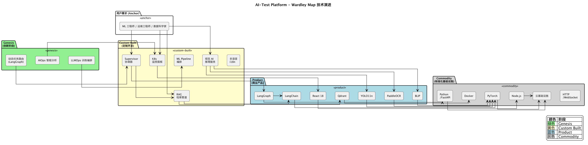
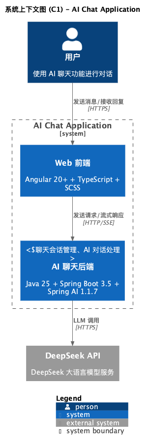
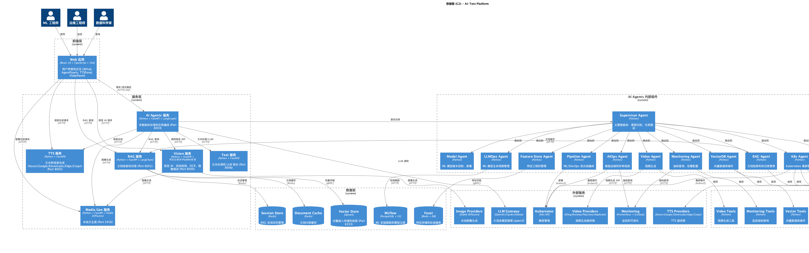
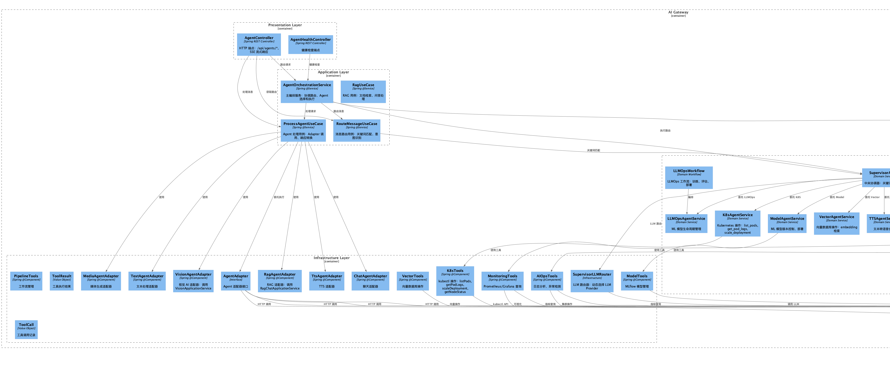
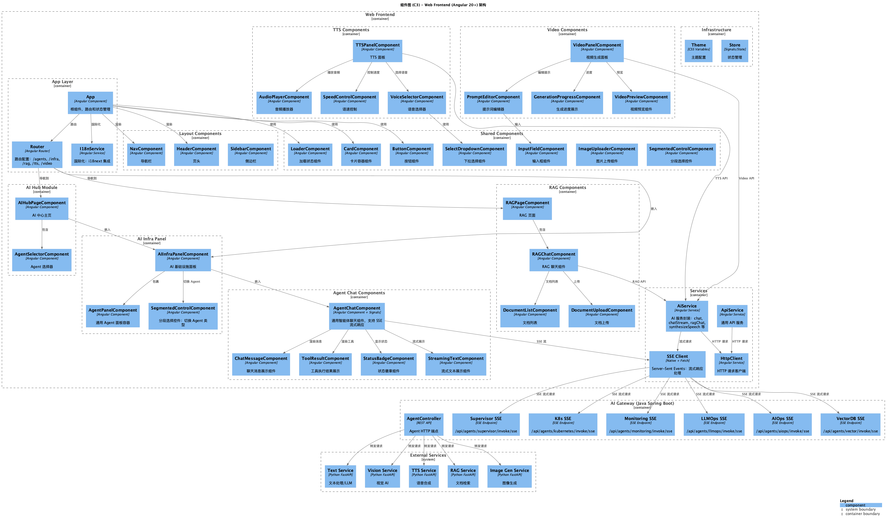
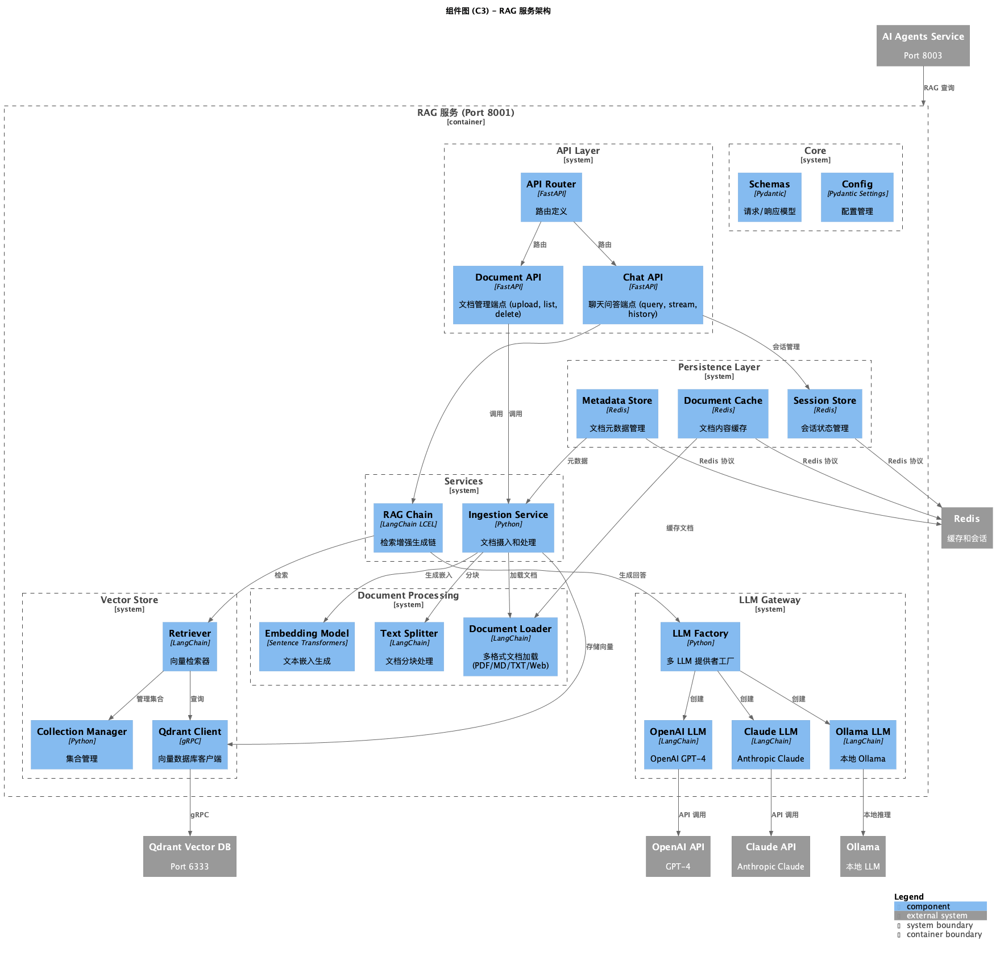

# AI-Test Platform

企业级 AI 基础设施管理平台，支持多智能体协作、视觉 AI、RAG 文档问答、文本生成、语音合成、图像生成等多种 AI 能力。

## 功能特性

### 12 个 AI Agents 智能体

基于 LangGraph 的智能体编排框架，提供 12 个专业智能体，由 Supervisor 作为中央协调器统一调度：


| 智能体               | 功能              | 场景                        |
| ----------------- | --------------- | ------------------------- |
| **Supervisor**    | 多智能体协调器         | 任务路由、智能调度、结果聚合            |
| **K8s**           | Kubernetes 集群管理 | Pod、Service、Deployment 管理 |
| **VectorDB**      | 向量数据库           | 嵌入管理、相似度搜索                |
| **RAG**           | 检索增强生成          | 文档问答、知识库管理                |
| **Pipeline**      | 工作流编排           | 自动化流水线编排                  |
| **LLMOps**        | LLM 运维          | 训练、微调、评估                  |
| **AIOps**         | 智能运维            | 事件分析、根因定位                 |
| **Feature Store** | 特征存储            | 特征工程管理                    |
| **Monitoring**    | 监控系统            | 指标查询、告警配置                 |
| **Model**         | ML 模型管理         | 版本控制、部署、推理                |
| **TTS**           | 语音合成           | 文本转语音、多语言配音              |
| **Video**         | 视频生成           | 文生视频、动态内容创作               |


### Vision AI

- **目标检测**：基于 YOLO11n 模型的实时目标检测
- **图像描述**：基于 BLIP 模型的图像描述生成
- **OCR 识别**：基于 PaddleOCR 的文字识别
- **图像生成**：基于 Stable Diffusion 的文生图

### RAG 文档问答

- 多格式文档支持（Markdown、PDF、网页、文本）
- 基于 Qdrant 的向量检索
- 灵活的 LLM 支持（OpenAI GPT、Anthropic Claude、Ollama）
- 流式响应和对话历史
- 持久化会话管理
- 智能缓存机制
- 文档元数据管理

### 文本生成 (Text-to-Text)

- 多 Provider 支持（OpenAI GPT、Anthropic Claude、Ollama）
- 文本补全和对话生成
- 流式响应（SSE）
- 会话管理和历史记录

### 语音合成 (Text-to-Speech)

- 多 Provider 支持（Azure、Google、ElevenLabs、Coqui）
- 多语言语音合成
- 流式音频输出
- 支持 AI Agents 智能体调用（TTS Agent）

### 视频生成 (Text-to-Video)

- 多 Provider 支持（Sora、Pika、Runway、Kling 等）
- 文本/图像驱动的视频生成
- 支持 AI Agents 智能体调用（Video Agent）

### 本地图像生成

- 基于 Stable Diffusion 的文生图
- 可配置步数、引导系数、种子等参数
- 支持 CUDA/MPS/CPU 设备

## 架构图

### Wardley 地图


### C1 系统上下文图


### C2 容器图


### C3 组件图

#### AI Agents 服务组件


#### 前端组件


#### RAG 服务组件


## 技术栈

### 前端

- React 18 + TypeScript
- Vite 构建工具
- Emotion CSS-in-JS
- i18n 多语言支持 (EN/ZH/JA/FR/ES)
- theme.ts 苹果风格设计系统

### AI Agents

- Python / FastAPI
- LangChain / LangGraph
- Ollama (本地 LLM)

### 后端服务

- Node.js / Express.js
- Python / FastAPI

### 数据层

- Qdrant 向量数据库
- MLflow (实验跟踪)
- Feast (特征存储)

### 基础设施

- Kubernetes
- Prometheus
- Grafana

## 项目结构

```
ai-test/
├── apps/
│   ├── web/              # React 前端应用
│   │   └── src/
│   │       ├── components/
│   │       │   ├── agents/      # Agent 聊天组件 (AgentChat, ChatMessage, ToolResult, StatusBadge)
│   │       │   ├── panels/      # AIInfraPanel 统一面板 (Supervisor/K8s/Monitoring/Model/LLMOps/AIOps/VectorDB)
│   │       │   └── AIHub.tsx   # AI 能力展示中心
│   │       ├── i18n/            # 多语言支持 (EN/ZH/JA/FR/ES)
│   │       │   ├── index.tsx    # I18nProvider + useI18n hook
│   │       │   └── locales.ts   # 翻译文本
│   │       └── theme.ts          # 苹果风格设计系统
│   └── server/             # Express 后端服务
├── packages/
│   ├── config/            # 共享配置
│   └── utils/             # 共享工具库
├── services/
│   ├── ai_agents/        # AI Agents 服务 (FastAPI)
│   │   ├── agents/       # 12 个专业智能体
│   │   │   ├── supervisor.py    # 中央协调器
│   │   │   ├── k8s_agent.py     # K8s 管理
│   │   │   ├── vector_db_agent.py # 向量数据库
│   │   │   ├── rag_agent.py     # RAG 检索
│   │   │   ├── pipeline_agent.py # 工作流编排
│   │   │   ├── llmops_agent.py   # LLM 运维
│   │   │   ├── aiops_agent.py    # 智能运维
│   │   │   ├── feature_store_agent.py # 特征存储
│   │   │   ├── monitoring_agent.py   # 监控告警
│   │   │   ├── model_agent.py     # ML 模型管理
│   │   │   ├── tts_agent.py      # 语音合成
│   │   │   └── video_agent.py    # 视频生成
│   │   ├── core/         # 核心组件 (base, prompts, schemas)
│   │   ├── tools/        # 工具集
│   │   │   ├── http_tools.py      # HTTP API 调用
│   │   │   ├── system_tools.py    # 系统命令执行
│   │   │   ├── k8s_tools.py       # Kubernetes 操作
│   │   │   ├── vector_tools.py    # 向量数据库操作
│   │   │   ├── monitoring_tools.py # 监控指标查询
│   │   │   ├── tts_tools.py       # TTS 语音合成
│   │   │   ├── video_tools.py     # 视频生成
│   │   │   └── ...
│   │   └── graphs/       # LangGraph 工作流
│   ├── rag/              # RAG 服务 (FastAPI)
│   │   └── src/
│   │       ├── api/      # REST API
│   │       ├── core/     # LLM 网关、嵌入模型
│   │       ├── services/ # 文档摄取、RAG 链
│   │       └── persistence/ # 缓存管理、会话存储
│   ├── vision-service/   # Vision AI 服务 (FastAPI)
│   │   └── src/
│   │       ├── api/      # API 路由
│   │       ├── providers/ # 图像处理 Provider
│   │       ├── models/   # YOLO/BLIP/PaddleOCR
│   │       └── core/     # 配置管理
│   ├── text-service/     # Text-to-Text LLM 服务 (FastAPI)
│   │   └── src/
│   │       ├── api/      # API 路由
│   │       └── core/     # LLM 网关
│   ├── tts-service/      # Text-to-Speech 服务 (FastAPI)
│   │   └── src/
│   │       ├── providers/ # 多 TTS Provider
│   │       ├── routers/  # API 路由
│   │       └── utils/    # 音频工具
│   └── media-gen/        # 本地文生图服务 (FastAPI)
│       └── app.py        # Stable Diffusion
├── docs/                 # 项目文档
│   └── c4/              # C4 架构图
└── tests/               # 测试文件
```

## 快速开始

### 环境要求

- Node.js >= 20
- Python >= 3.10
- pnpm >= 9
- Docker (用于 Qdrant)

### 安装依赖

```bash
# 安装 pnpm
npm install -g pnpm

# 安装所有依赖
pnpm install
```

## 服务端口

| 服务 | 端口 | 说明 |
| --- | --- | --- |
| Web 前端 | 5173 | React 开发服务器 |
| 后端服务器 | 3000 | Express.js 服务 |
| AI Agents | 8003 | 多智能体编排 |
| Vision Service | 8002 | 视觉 AI（YOLO/BLIP/OCR/SD） |
| RAG Service | 8001 | 文档检索增强生成 |
| Text Service | 8004 | 文本生成（GPT/Claude/Ollama） |
| TTS Service | 8004+ | 语音合成（端口共享或可配置） |
| Media Gen | 3456 | 本地文生图（Stable Diffusion） |
| Qdrant | 6333 | 向量数据库 |
| Ollama | 11434 | 本地 LLM（可选） |

### 启动服务

```bash
# 启动所有服务 (开发模式)
pnpm dev

# 启动特定服务
cd apps/web && pnpm dev              # 前端 (端口 5173)
cd services/ai_agents && python main.py  # AI Agents (端口 8003)
cd services/rag && uvicorn src.main:app --reload  # RAG (端口 8001)
cd services/vision-service && uvicorn src.main:app --reload  # Vision (端口 8002)
cd services/text-service && uvicorn src.main:app --reload --port 8004  # Text (端口 8004)
cd services/tts-service && uvicorn src.main:app --reload  # TTS (端口 8004+)
cd services/media-gen && python app.py  # Media Gen (端口 3456)
```

### 配置

各服务需要配置环境变量：

**AI Agents 服务** (`services/ai_agents/.env`):

```env
OLLAMA_BASE_URL=http://localhost:11434
OLLAMA_MODEL=qwen2.5:7b
```

**RAG 服务** (`services/rag/.env`):

```env
QDRANT_HOST=localhost
QDRANT_PORT=6333
LLM_PROVIDER=openai
OPENAI_API_KEY=your-api-key
```

**Vision 服务** (`services/vision-service/.env`):

```env
HOST=0.0.0.0
PORT=8002
```

## 开发指南

### 前端开发

```bash
cd apps/web

# 开发服务器
pnpm dev

# 类型检查
pnpm build

# 代码检查
pnpm lint
```

### AI Agents 开发

```bash
cd services/ai_agents

# 创建虚拟环境
python -m venv .venv
source .venv/bin/activate

# 安装依赖
pip install -r requirements.txt

# 启动服务
python main.py
```

### RAG 服务开发

```bash
cd services/rag

# 创建虚拟环境
python -m venv .venv
source .venv/bin/activate

# 安装依赖
pip install -e .

# 启动 Qdrant (Docker)
docker compose up qdrant -d

# 启动服务
uvicorn src.main:app --reload
```

## Docker 部署

```bash
# 启动所有服务
docker compose -f services/rag/docker-compose.yml up -d
docker compose -f services/ai_agents/docker-compose.yml up -d
```

## 文档

- [项目文档](./docs/README.md)
- [架构设计](./docs/ARCHITECTURE.md)
- [API 参考](./docs/API.md)
- [开发指南](./docs/DEVELOPMENT.md)
- [Wardley 地图](./docs/wardley-map.png)
- [C4 模型](./docs/c4/README.md)
- [RAG 服务](./services/rag/README.md)

## 支持的多语言

- English
- 中文
- 日本語
- Français
- Español

## License

MIT