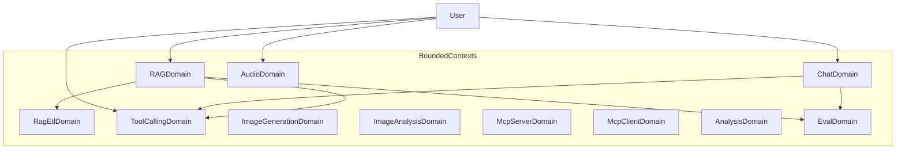

# Domain Glossary | 领域术语表

> AI Chat & Agent Platform — Ubiquitous Language（统一语言）

---

## 1. Purpose | 文档说明

### Purpose

This document defines the project **Ubiquitous Language**. English terms are the **preferred canonical names** and must align with code, API, and architecture naming. Chinese labels are provided for localization and stakeholder communication only.

### Maintenance Principles

1. **Glossary first**: Add or update terms here before implementing code
2. **Code sync**: Domain model changes (entity, value object, enum) must update the corresponding glossary entry
3. **Preferred term**: Use the **Preferred Term (English)** column for code, API, Jira keys, commits, and technical docs

### Reference Rules


| Scenario                   | Rule                                                             |
| -------------------------- | ---------------------------------------------------------------- |
| Java class / API / commits | Use Preferred Term (English)                                     |
| Jira / user stories        | English preferred; Chinese may appear in parentheses for clarity |
| Frontend i18n              | Map English preferred terms to localized UI copy                 |
| Cross-team communication   | Lead with English; add Chinese when needed                       |


---

## 2. Bounded Contexts | 限界上下文总览


| Bounded Context          | 中文名         | Code Package             | Frontend Route    |
| ------------------------ | ----------- | ------------------------ | ----------------- |
| Chat Domain              | 对话          | `com.ai.chat`            | `/chat`           |
| Generation Domain        | 生成          | — (UI shell)             | `/generate`       |
| RAG Domain               | 知识问答        | `com.ai.rag`             | `/rag`            |
| Image Analysis Domain    | 图像分析        | `com.ai.vision`          | `/vision`         |
| RAG ETL Domain           | RAG 数据管道    | `com.ai.rag.domain.port` | —                 |
| Tool Calling Domain      | 工具调用        | `com.ai.tools`           | —                 |
| Image Generation Domain  | 图像生成        | `com.ai.image`           | `/generate/image` |
| Audio Domain (TTS + ASR) | 语音（合成 + 转写） | `com.ai.audio`           | `/generate/tts`   |
| MCP Server Domain        | MCP 服务端     | `com.ai.mcp.server`      | —                 |
| MCP Client Domain        | MCP 客户端     | `com.ai.mcp.client`      | —                 |
| Analysis Domain          | 结构化分析       | `com.ai.analysis`        | —                 |
| Eval Domain              | 对话质量评估      | `com.ai.eval`            | —                 |


**Frontend route map (canonical)**


| Route             | Preferred Term (English) | API prefix                      |
| ----------------- | ------------------------ | ------------------------------- |
| `/chat`           | Chat                     | `/api/text`, `/api/sessions`    |
| `/generate/image` | Image Generation         | `/api/images`                   |
| `/generate/tts`   | Text-to-Speech           | `/api/audio` (alias `/api/tts`) |
| `/rag`            | Document QA (RAG)        | `/api/rag`                      |
| `/vision`         | Image Analysis           | `/api/vision`                   |


**Planned sidebar labels (no route yet):** `supervisor`, `kubernetes`, `monitoring`, `aiinfra`, `modelDev`, `modelOps`, `model`, `llmops`, `aiops`, `vectordb` — i18n keys retained for future modules.




---

## 3. Cross-Cutting Terms | 通用架构术语


| Preferred Term (English) | 中文   | Definition                                                                            | Type         | Code Mapping                                                | Notes                                       |
| ------------------------ | ---- | ------------------------------------------------------------------------------------- | ------------ | ----------------------------------------------------------- | ------------------------------------------- |
| Aggregate Root           | 聚合根  | Root entity within a transaction boundary; external access goes through the root only | Architecture | `ChatSession`                                               | One aggregate per transaction               |
| Entity                   | 实体   | Domain object with identity and mutable lifecycle                                     | Architecture | `ChatMessage`, `Document`                                   | Distinguished by ID                         |
| Value Object             | 值对象  | Immutable object compared by value, no standalone identity                            | Architecture | `ChatSessionId`, `DocumentId`, `SourceDocument`             | Use `record` or factory methods             |
| Domain Service           | 领域服务 | Stateless domain logic that does not belong to a single entity                        | Architecture | `LanguageDetectionService`                                  | Cross-entity operations                     |
| Use Case                 | 用例   | Application-layer orchestration of domain objects and ports                           | Architecture | `RagChatUseCase`, `ChatUseCase`                             | No business-rule details                    |
| Facade                   | 门面   | Simplified application entry point                                                    | Architecture | `ChatFacade`, `ToolsFacade`                                 | Coordinates multiple use cases              |
| Port                     | 端口   | Domain-defined contract for external capabilities                                     | Architecture | `DocumentSearchTool`, `WebSearchTool`                       | Dependency inversion                        |
| Adapter                  | 适配器  | Infrastructure implementation of a port                                               | Architecture | `OllamaEmbeddingAdapter`, `SerperWebSearchAdapter`          | Lives in `infrastructure/`                  |
| Repository               | 仓储   | Persistence abstraction for aggregate roots                                           | Architecture | `ChatSessionRepository`, `IDocumentRepository`              | Interface in domain, impl in infrastructure |
| Streaming (SSE)          | 流式响应 | Real-time AI output via Server-Sent Events                                            | Technical    | `StreamingService`                                          | Supported in Chat and RAG                   |
| Provider                 | 提供商  | LLM or AI service vendor (e.g. OpenAI, Ollama)                                        | Business     | Frontend `selectedProvider`                                 | User-selectable model source                |
| Domain Exception         | 领域异常 | Exception representing a business rule violation                                      | Architecture | `ChatSessionNotFoundException`, `DocumentNotFoundException` | Mapped to HTTP 4xx                          |


---

## 3.5 AI Engineering Terms | AI 工程通用术语


| Preferred Term (English)             | 中文      | Definition                                                 | Type      | Code Mapping                                  | Notes                               |
| ------------------------------------ | ------- | ---------------------------------------------------------- | --------- | --------------------------------------------- | ----------------------------------- |
| Large Language Model (LLM)           | 大语言模型   | Neural model for text generation and reasoning             | Technical | `ChatModel`, DeepSeek API                     | Core text generation engine         |
| ChatClient                           | 对话客户端   | Spring AI fluent API for LLM interactions                  | Technical | `ChatClient`, `ChatClient.Builder`            | Spring AI 2.0 core API              |
| ChatModel                            | 对话模型    | Abstraction over an LLM provider                           | Technical | `org.springframework.ai.chat.model.ChatModel` | Implemented by OpenAI, Ollama, etc. |
| Prompt                               | 提示词     | Input text sent to an LLM                                  | Technical | `Prompt`, `PromptTemplate`                    | User + system messages              |
| System Prompt                        | 系统提示词   | Instruction defining AI role and behavior                  | Technical | `PromptTemplates`                             | Prepended to every request          |
| Prompt Template                      | 提示词模板   | Reusable prompt with placeholders                          | Technical | `PromptTemplate`                              | Used in RAG and Eval                |
| Context Window                       | 上下文窗口   | Maximum conversation history included in a request         | Technical | `ChatSession.getRecentMessages()`             | Limits token usage                  |
| Token                                | 令牌      | Atomic unit of text for LLM input/output and billing       | Technical | —                                             | Industry standard unit              |
| Temperature                          | 温度      | Sampling parameter controlling output randomness (0–1)     | Technical | —                                             | Lower = more deterministic          |
| Retrieval-Augmented Generation (RAG) | 检索增强生成  | Pattern combining retrieval with LLM generation            | Pattern   | `RagChatUseCase`                              | Retrieve → augment → generate       |
| Augmented Generation                 | 增强生成    | LLM generation conditioned on retrieved context            | Pattern   | `RagChatUseCase.chat()`                       | Core RAG generation step            |
| Vector Store                         | 向量存储    | Database storing Embedding vectors for similarity search   | Technical | `H2VectorAdapter`, pgvector                   | Default: H2 embedded                |
| Tool Callback                        | 工具回调    | Spring AI mechanism for LLM-initiated tool invocation      | Technical | `ToolCallback`, `McpToolCallbackRegistry`     | Bridges LLM and Tools               |
| Advisor                              | 顾问      | Interceptor/enhancer in the ChatClient call chain          | Technical | Spring AI Advisors                            | e.g. structured output              |
| Multimodal                           | 多模态     | Input combining text and other modalities (e.g. image)     | Technical | `VisionChatUseCase`                           | Ollama qwen3.5                      |
| Model Context Protocol (MCP)         | 模型上下文协议 | Standard protocol for exposing Tools and Resources to LLMs | Protocol  | `AiMcpServerService`                          | Anthropic-initiated standard        |
| Agent Pipeline                       | Agent 流水线 | User-authored multi-agent graph executed in topological order | Pattern   | `com.ai.agent` + `/agents` pipeline view | AI-148 canvas + `/api/agents/pipeline/invoke/sse` |
| Agent Pipeline Template              | Agent 编排模版 | Built-in ordered agent graph users can apply in one click | Pattern   | `/agents` Pipeline templates | AI-163 catalog + canvas apply |
| Orchestrator                         | 编排器     | Agent that delegates tasks to specialized Subagents        | Pattern   | `.cursor/agents/orchestrator.md`              | Minimal task routing                |
| Subagent                             | 子智能体    | Specialized Agent focused on a single responsibility       | Pattern   | `.cursor/agents/*.md`                         | e.g. domain-expert, developer       |
| Grounding                            | 事实锚定    | Constraining LLM answers to retrieved Source Documents     | Pattern   | `RagChatUseCase.buildPrompt()`                | Reduces unsupported claims          |
| Prompt Engineering                   | 提示工程    | Crafting prompts to improve LLM output quality             | Practice  | —                                             | No fine-tuning in this project      |


---

## 4. Context-Specific Terms | 分上下文术语表

### 4.1 Chat Domain | 对话


| Preferred Term (English) | 中文   | Definition                                            | Type              | Code Mapping                                  | Notes                                  |
| ------------------------ | ---- | ----------------------------------------------------- | ----------------- | --------------------------------------------- | -------------------------------------- |
| Chat Session             | 会话   | Multi-turn conversation container between user and AI | Aggregate Root    | `ChatSession`                                 | Default title: "New Chat"              |
| Chat Message             | 消息   | Single message within a session                       | Entity            | `ChatMessage`                                 | Immutable; created via factory methods |
| User Message             | 用户消息 | Message sent by the user                              | Enum / Role       | `ChatMessageType.USER`, role=`user`           | —                                      |
| Assistant Message        | 助手消息 | Message returned by the AI                            | Enum / Role       | `ChatMessageType.ASSISTANT`, role=`assistant` | —                                      |
| Chat Session ID          | 会话标识 | Unique identifier of a session                        | Value Object      | `ChatSessionId`                               | —                                      |
| Message ID               | 消息标识 | Unique identifier of a message                        | Value Object      | `MessageId`                                   | —                                      |
| Chat Session Status      | 会话状态 | Lifecycle state of a session                          | Enum              | `ChatSessionStatus`                           | ACTIVE, CLOSED                         |
| Chat Stream              | 流式对话 | Receive AI replies in real time via SSE               | Use Case Behavior | `ChatUseCase.chatStream()`                    | See `docs/api.md`                      |
| Recent Messages          | 最近消息 | Last N messages in a session for context window       | Domain Behavior   | `ChatSession.getRecentMessages(int)`          | —                                      |
| Language Detection       | 语言检测 | Detect language of user input text                    | Domain Service    | `LanguageDetectionService`                    | —                                      |


**Chat Session Status**


| Preferred Term (English) | 中文  | Meaning                              |
| ------------------------ | --- | ------------------------------------ |
| ACTIVE                   | 活跃  | Session accepts new messages         |
| CLOSED                   | 已关闭 | Session is finished; no new messages |


---

### 4.2 RAG Domain | 知识问答


| Preferred Term (English) | 中文       | Definition                                          | Type                 | Code Mapping                              | Notes                                                               |
| ------------------------ | -------- | --------------------------------------------------- | -------------------- | ----------------------------------------- | ------------------------------------------------------------------- |
| Document                 | 文档       | User-uploaded knowledge source file (TXT/PDF)       | Entity               | `Document`                                | Full lifecycle                                                      |
| Document ID              | 文档标识     | Unique identifier of a document                     | Value Object         | `DocumentId`                              | —                                                                   |
| Document Status          | 文档状态     | Processing state from upload to ready               | Enum                 | `DocumentStatus`                          | See state machine                                                   |
| Document Chunk           | 文档分块     | Smallest retrieval unit after document splitting    | Entity               | `DocumentChunk`                           | Includes embedding vector                                           |
| Raw Document             | 原始文档     | Normalized document view before ETL processing      | Value Object         | `RawDocument`                             | content + metadata + source                                         |
| Chunking                 | 分块       | Process of splitting document text into chunks      | Application Behavior | `ChunkingService`                         | Configurable size/overlap                                           |
| Embedding                | 嵌入向量     | Vector representation of text for similarity search | Technical            | `EmbeddingAdapter`                        | Ollama mxbai-embed-large                                            |
| Retrieval                | 检索       | Find relevant chunks via vector similarity          | Application Behavior | `DocumentSearchService`                   | topK + scoreThreshold                                               |
| Source Document          | 来源文档     | Retrieved chunk with similarity score               | Value Object         | `SourceDocument`                          | Domain field `text`; SSE JSON uses `"text"` via `SourceDocumentDto` |
| Context                  | 上下文      | Retrieved text and sources passed to the LLM        | Application Concept  | `RagApplicationService.retrieveContext()` | Augments the Prompt                                                 |
| RAG Chat                 | RAG 对话   | Generate AI answers from retrieved context          | Use Case             | `RagChatUseCase`                          | Supports streaming                                                  |
| Vision Chat              | 视觉问答     | Multimodal RAG Q&A over images in chat stream       | Use Case             | `VisionChatUseCase`                       | Ollama multimodal; not `/api/vision/`*                              |
| Document Upload          | 文档上传     | Upload file and trigger processing pipeline         | Use Case             | `DocumentUploadService`                   | TXT / PDF                                                           |
| Vector Similarity        | 向量相似度    | Cosine similarity between two vectors               | Domain Utility       | `VectorSimilarity`                        | —                                                                   |
| Chunk Size               | 分块大小     | Maximum characters per chunk                        | Config               | `RagProperties.Chunk.size`                | Default: 500                                                        |
| Chunk Overlap            | 分块重叠     | Overlapping characters between adjacent chunks      | Config               | `RagProperties.Chunk.overlap`             | Default: 50                                                         |
| Top K                    | 检索数量     | Maximum number of chunks returned                   | Config               | `RagProperties.Retrieval.topK`            | Default: 5                                                          |
| Score Threshold          | 分数阈值     | Minimum similarity score for retrieval results      | Config               | `RagProperties.Retrieval.scoreThreshold`  | Default: 0.5                                                        |
| Document Reader          | 文档读取器    | ETL port: reads raw bytes into RawDocument          | Port                 | `DocumentReader`                          | e.g. PDF text extraction                                            |
| Document Transformer     | 文档转换器    | ETL port: transforms RawDocument into chunks        | Port                 | `DocumentTransformer`                     | Chunking + embedding                                                |
| Document Writer          | 文档写入器    | ETL port: persists processed chunks to Vector Store | Port                 | `DocumentWriter`                          | Writes to H2 / pgvector                                             |
| RAG ETL Pipeline         | RAG 数据管道 | End-to-end ingest: Reader → Transformer → Writer    | Pipeline             | `DocumentUploadService`                   | Triggered on upload                                                 |


**Document Status State Machine**

```
UPLOADING → PROCESSING → READY
    ↓           ↓
  FAILED ←──── FAILED
```


| Preferred Term (English) | 中文  | Meaning                            | Transitions To         |
| ------------------------ | --- | ---------------------------------- | ---------------------- |
| UPLOADING                | 上传中 | File is being uploaded             | PROCESSING, FAILED     |
| PROCESSING               | 处理中 | Chunking and embedding in progress | READY, FAILED          |
| READY                    | 就绪  | Available for RAG retrieval        | PROCESSING (reprocess) |
| FAILED                   | 失败  | Processing failed                  | PROCESSING (retry)     |


---

### 4.3 Tool Calling Domain | 工具调用


| Preferred Term (English) | 中文       | Definition                                            | Type                | Code Mapping                              | Notes                                |
| ------------------------ | -------- | ----------------------------------------------------- | ------------------- | ----------------------------------------- | ------------------------------------ |
| Tool Calling             | 工具调用     | LLM invokes external tools based on user intent       | Capability          | `ToolsFacade`                             | Spring AI Tool                       |
| Tool Chat                | 工具对话     | AI conversation with tool capabilities                | Use Case Behavior   | `ToolsController.chatWithTools()`         | —                                    |
| Tool Result              | 工具结果     | Outcome of a tool invocation (success or failure)     | Value Object        | `ToolResult`                              | `success()` / `failure()`            |
| Tool Callback Registry   | 工具回调注册表  | Registry mapping tool names to ToolCallback instances | Port                | `McpToolCallbackRegistry`                 | Used by MCP Client                   |
| Document Search Tool     | 文档搜索工具   | Search documents in the RAG knowledge base            | Port                | `DocumentSearchTool`                      | Domain port                          |
| RAG Search Tool          | RAG 搜索工具 | MCP tool adapter delegating to DocumentSearchService  | Adapter             | `RagSearchTool`                           | Invoked via MCP                      |
| Document Search          | 文档检索     | Vector similarity retrieval over document chunks      | Application Service | `DocumentSearchService`                   | Uses `DocumentChunkSearchRepository` |
| Weather Tool             | 天气工具     | Query weather and forecast                            | Tool                | `WeatherTools`                            | Mock data                            |
| Web Search Tool          | 网页搜索工具   | Search live web content via Serper                    | Port / Adapter      | `WebSearchTool`, `SerperWebSearchAdapter` | Requires API key                     |


---

### 4.4 Image Generation Domain | 图像生成


| Preferred Term (English)  | 中文   | Definition                                    | Type             | Code Mapping                      | Notes                                                |
| ------------------------- | ---- | --------------------------------------------- | ---------------- | --------------------------------- | ---------------------------------------------------- |
| Image Generation          | 图像生成 | Generate images from text prompts             | Use Case         | `ImageFacade`                     | Spring AI `ImageModel`                               |
| Image Generation Request  | 生成请求 | Request with prompt, size, quality, etc.      | DTO              | `ImageGenerationRequest`          | POST `/api/images/generate`                          |
| Image Generation Response | 生成响应 | Response with `imageUrl` and/or `imageBase64` | DTO              | `ImageGenerationResponse`         | Fields: `imageUrl`, `imageBase64`, `model`, `status` |
| Prompt                    | 提示词  | Text describing the desired image             | Business Concept | `ImageGenerationRequest.prompt()` | —                                                    |
| Generated Image           | 生成图像 | Domain result of image generation             | Value Object     | `GeneratedImage`                  | URL or base64 payload                                |


---

### 4.4a Image Analysis Domain | 图像分析


| Preferred Term (English) | 中文   | Definition                                               | Type              | Code Mapping               | Notes                                                    |
| ------------------------ | ---- | -------------------------------------------------------- | ----------------- | -------------------------- | -------------------------------------------------------- |
| Image Analysis           | 图像分析 | Standalone caption, detect, and OCR over uploaded images | Capability        | `VisionAnalysisUseCase`    | Frontend route `/vision`                                 |
| Caption                  | 图像描述 | Natural-language description of image content            | Use Case Behavior | `POST /api/vision/caption` | ONNX Runtime + BLIP ONNX; multipart `file`               |
| Object Detection         | 目标检测 | List detected objects with confidence and bbox           | Use Case Behavior | `POST /api/vision/detect`  | ONNX Runtime + YOLOv8 ONNX (COCO 80 classes)             |
| OCR                      | 文字识别 | Extract visible text from image                          | Use Case Behavior | `POST /api/vision/ocr`     | Tess4J + Tesseract; returns `fullText`                   |
| Caption Engine           | 描述引擎 | Natural-language image captioning                        | Infrastructure    | `OnnxBlipCaptioner`        | ONNX Runtime + BLIP ONNX (vision encoder + text decoder) |
| Detect Engine            | 检测引擎 | Real-time object detection                               | Infrastructure    | `OnnxYoloDetector`         | ONNX Runtime + YOLOv8 ONNX                               |
| OCR Engine               | 识别引擎 | Optical character recognition                            | Infrastructure    | `Tess4jOcrEngine`          | Tess4J wrapper over Tesseract 5.x                        |
| Vision Chat              | 视觉问答 | RAG chat with image attachments                          | Use Case          | `VisionChatUseCase`        | SSE `/api/rag/chat/stream` with `images[]`               |


**Do not conflate:** **Image Analysis** (`/vision`, `/api/vision/`*) vs **Vision Chat** (multimodal RAG stream).

---

### 4.5 Audio Domain (TTS + ASR) | 语音


| Preferred Term (English)           | 中文     | Definition                                 | Type                | Code Mapping                         | Notes                                                 |
| ---------------------------------- | ------ | ------------------------------------------ | ------------------- | ------------------------------------ | ----------------------------------------------------- |
| Text-to-Speech (TTS)               | 语音合成   | Convert text into spoken audio             | Use Case            | `AudioFacade`                        | Dedicated `app.ai.tts.`* config                       |
| Voice                              | 音色     | Voice type used for synthesis              | Business Concept    | `VoiceInfo`, `VoiceCatalog`          | GET `/api/audio/voices`                               |
| Speech Text                        | 语音文本   | Validated text input for TTS               | Value Object        | `SpeechText`                         | —                                                     |
| Synthesized Audio                  | 合成音频   | Domain result of TTS conversion            | Value Object        | `SynthesizedAudio`                   | Audio bytes                                           |
| Synthesize                         | 合成     | Execute text-to-speech conversion          | Use Case Behavior   | `AudioFacade.synthesize()`           | POST `/api/audio/speak` (alias `/api/tts/synthesize`) |
| Automatic Speech Recognition (ASR) | 自动语音识别 | Convert spoken audio to text               | Capability          | `StreamingTranscriptionUseCase`      | whisper.cpp                                           |
| Streaming Transcription            | 流式转写   | Real-time ASR over WebSocket               | Use Case Behavior   | `AudioTranscriptionWebSocketHandler` | Port 8178                                             |
| Transcription                      | 转写     | Single ASR result converting audio to text | Application Concept | `WhisperCppTranscriptionAdapter`     | Returns text                                          |


---

### 4.6 MCP Domain | MCP 服务


| Preferred Term (English) | 中文        | Definition                                    | Type              | Code Mapping                         | Notes                          |
| ------------------------ | --------- | --------------------------------------------- | ----------------- | ------------------------------------ | ------------------------------ |
| MCP Server               | MCP 服务端   | Expose AI platform capabilities externally    | Service           | `AiMcpServerService`                 | Model Context Protocol         |
| MCP Client               | MCP 客户端   | Connect to and invoke external MCP services   | Service           | `AiMcpClientService`                 | Registers external tools       |
| MCP Tool                 | MCP 工具    | Callable tool under MCP protocol              | Technical         | `AiMcpClientService.registerTools()` | —                              |
| MCP Tool Definition      | MCP 工具定义  | Name and description of an MCP tool           | Value Object      | `McpToolDefinition`                  | Registered by Client           |
| MCP Session              | MCP 会话    | Active connection session to an MCP server    | Entity            | `McpSession`                         | Managed by `McpSessionManager` |
| MCP Server Connection    | MCP 服务端连接 | Connection metadata to an external MCP server | Value Object      | `McpServerConnection`                | —                              |
| MCP Chat                 | MCP 对话    | AI conversation initiated via MCP Client      | Use Case Behavior | `McpClientController.chat()`         | —                              |


---

### 4.7 Analysis Domain | 结构化分析


| Preferred Term (English) | 中文    | Definition                                          | Type             | Code Mapping                      | Notes                       |
| ------------------------ | ----- | --------------------------------------------------- | ---------------- | --------------------------------- | --------------------------- |
| Structured Output        | 结构化输出 | AI returns strongly typed JSON instead of free text | Technical        | `SpringAiStructuredOutputUseCase` | Spring AI `.entity()`       |
| Text Analysis            | 文本分析  | Summarize, classify sentiment, etc.                 | Use Case         | `AnalysisController`              | —                           |
| Text Analysis Result     | 分析结果  | Result with summary, sentiment, key points          | DTO              | `TextAnalysisResult`              | —                           |
| Sentiment                | 情感    | Sentiment classification of text                    | Enum             | `TextAnalysisResult.Sentiment`    | POSITIVE, NEUTRAL, NEGATIVE |
| Key Points               | 关键点   | Extracted core points from text                     | Business Concept | `TextAnalysisResult.keyPoints()`  | —                           |
| Named Entities           | 命名实体  | Named entities extracted from text (NLP)            | Business Concept | `TextAnalysisResult.entities()`   | Not a DDD Entity            |


---

### 4.8 Eval Domain | 对话质量评估


| Preferred Term (English) | 中文      | Definition                                       | Type         | Code Mapping                              | Notes                      |
| ------------------------ | ------- | ------------------------------------------------ | ------------ | ----------------------------------------- | -------------------------- |
| Chat Evaluation          | 对话评估    | Assess quality and safety of an AI response      | Use Case     | `ChatQualityEvaluator`                    | Spring AI Evaluators       |
| Chat Evaluation Result   | 评估结果    | Scores and flags from a chat evaluation          | Value Object | `ChatEvaluationResult`                    | Multiple score dimensions  |
| Relevancy Evaluator      | 相关性评估器  | Measures answer relevance to the user question   | Evaluator    | `RelevancyEvaluator`                      | Spring AI built-in         |
| Fact-Checking Evaluator  | 事实性评估器  | Checks answer factuality against context         | Evaluator    | `FactCheckingEvaluator`                   | Requires context documents |
| Coherence Score          | 连贯性分数   | Score for logical flow of the response (0–1)     | Metric       | `ChatEvaluationResult.coherenceScore()`   | —                          |
| Relevance Score          | 相关性分数   | Score for answer relevance to the question (0–1) | Metric       | `ChatEvaluationResult.relevanceScore()`   | —                          |
| Helpfulness Score        | 有用性分数   | Score for practical usefulness (0–1)             | Metric       | `ChatEvaluationResult.helpfulnessScore()` | —                          |
| Factuality Score         | 事实性分数   | Score for factual accuracy against context (0–1) | Metric       | `ChatEvaluationResult.factualityScore()`  | Nullable if unavailable    |
| Overall Score            | 综合分数    | Weighted aggregate evaluation score (0–1)        | Metric       | `ChatEvaluationResult.overallScore()`     | —                          |
| Safety Flag              | 安全标记    | Indicator of potential safety issues in response | Metric       | `ChatEvaluationResult.safetyFlags()`      | List of flag strings       |
| Evaluation ChatClient    | 评估对话客户端 | Separate ChatClient instance for evaluation      | Technical    | `evaluationChatClient` bean               | Mitigates model bias       |


---

## 5. Terms to Avoid | 禁用/易混淆术语对照


| Avoid ❌              | Use Instead ✅              | Notes                                       |
| -------------------- | -------------------------- | ------------------------------------------- |
| chat history         | **Chat Session**           | Aggregate root containing multiple messages |
| chat content         | **Chat Message**           | Single user/assistant message               |
| knowledge base file  | **Document**               | Uploaded file in RAG context                |
| knowledge base       | **Document** collection    | RAG context; not a separate domain object   |
| snippet / paragraph  | **Document Chunk**         | Smallest RAG retrieval unit                 |
| search result        | **Source Document**        | RAG retrieval hit                           |
| vector / vector data | **Embedding**              | Text vectorization result                   |
| AI reply stream      | **Streaming (SSE)**        | SSE implementation                          |
| API class            | **Port** / **Adapter**     | Architecture layering context               |
| DB operation class   | **Repository**             | Aggregate persistence abstraction           |
| table row            | **Entity**                 | Domain model context                        |
| AI model (generic)   | **LLM** / **ChatModel**    | Specify model type                          |
| GPT / ChatGPT        | **LLM** + **Provider**     | Use Provider, not brand names               |
| fine-tuning          | **Prompt Engineering**     | No fine-tuning in this project              |
| hallucination        | low **Factuality Score**   | Use Eval domain terminology                 |
| Vision AI            | **Image Analysis**         | Renamed in UI; route `/vision`              |
| AI Hub               | **Chat** + **Generation**  | Split into `/chat` and `/generate/`*        |
| plugin               | **Tool** / **MCP Tool**    | Distinguish Tool Calling from MCP           |
| bot                  | **Agent** / **ChatClient** | Prefer Agent for autonomous entities        |


Chinese equivalents to avoid in technical docs:


| 避免 ❌  | 应使用 ✅                   |
| ----- | ----------------------- |
| 聊天记录  | **Chat Session**        |
| 知识库文件 | **Document**            |
| 片段    | **Document Chunk**      |
| 搜索结果  | **Source Document**     |
| 大模型   | **LLM**                 |
| 幻觉    | **Factuality Score** 偏低 |
| 插件    | **Tool** / **MCP Tool** |


---

## 6. Maintenance | 维护与关联文档

### Related Docs


| Document                            | Description                              |
| ----------------------------------- | ---------------------------------------- |
| [C4 Architecture](c4/README.md)     | Bounded contexts and component structure |
| [User Story Map](User-Story-Map.md) | User activities and business value       |
| [API Reference](api.md)             | REST / SSE endpoints                     |
| [Quick Start](QUICKSTART.md)        | Local development setup                  |


### Change Workflow

```
1. Identify new concept or terminology ambiguity
2. Update this glossary (add or revise entry)
3. Update domain model (entity / vo / enum)
4. Update API / frontend i18n
5. Reference glossary changes in PR
```

### Ownership

- **domain-expert**: Term consistency and aggregate boundaries
- **architect**: Architecture terms and layering compliance
- **developer**: Implement using English preferred terms

---

*Last updated: 2026-07-10*