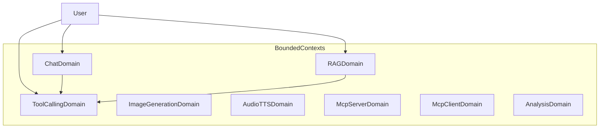

# Domain Glossary | 领域术语表

> AI Chat & Agent Platform — Ubiquitous Language（统一语言）

---

## 1. Purpose | 文档说明

### Purpose

This document defines the project **Ubiquitous Language**. English terms are the **preferred canonical names** and must align with code, API, and architecture naming. Chinese labels are provided for localization and stakeholder communication only.

### Maintenance Principles

1. **Glossary first**: Add or update terms here before implementing code
2. **Code sync**: Domain model changes (entity, value object, enum) must update the corresponding glossary entry
3. **Preferred term**: Use the **Preferred Term (English)** column for code, API, Jira keys, commits, and technical docs

### Reference Rules

| Scenario | Rule |
|----------|------|
| Java class / API / commits | Use Preferred Term (English) |
| Jira / user stories | English preferred; Chinese may appear in parentheses for clarity |
| Frontend i18n | Map English preferred terms to localized UI copy |
| Cross-team communication | Lead with English; add Chinese when needed |

---

## 2. Bounded Contexts | 限界上下文总览

| Bounded Context | 中文名 | Code Package | Frontend Route |
|----------------|--------|--------------|----------------|
| Chat Domain | 对话 | `com.ai.chat` | `/chat` |
| RAG Domain | 知识问答 | `com.ai.rag` | `/rag` |
| Tool Calling Domain | 工具调用 | `com.ai.tools` | — |
| Image Generation Domain | 图像生成 | `com.ai.image` | `/chat/image` |
| Audio/TTS Domain | 语音合成 | `com.ai.audio` | `/chat/tts` |
| MCP Server Domain | MCP 服务端 | `com.ai.mcp.server` | — |
| MCP Client Domain | MCP 客户端 | `com.ai.mcp.client` | — |
| Analysis Domain | 结构化分析 | `com.ai.analysis` | — |



---

## 3. Cross-Cutting Terms | 通用架构术语

| Preferred Term (English) | 中文 | Definition | Type | Code Mapping | Notes |
|--------------------------|------|------------|------|--------------|-------|
| Aggregate Root | 聚合根 | Root entity within a transaction boundary; external access goes through the root only | Architecture | `ChatSession` | One aggregate per transaction |
| Entity | 实体 | Domain object with identity and mutable lifecycle | Architecture | `ChatMessage`, `Document` | Distinguished by ID |
| Value Object | 值对象 | Immutable object compared by value, no standalone identity | Architecture | `ChatSessionId`, `DocumentId`, `SourceDocument` | Use `record` or factory methods |
| Domain Service | 领域服务 | Stateless domain logic that does not belong to a single entity | Architecture | `LanguageDetectionService` | Cross-entity operations |
| Use Case | 用例 | Application-layer orchestration of domain objects and ports | Architecture | `RagChatUseCase`, `ChatUseCase` | No business-rule details |
| Facade | 门面 | Simplified application entry point | Architecture | `ChatFacade`, `ToolsFacade` | Coordinates multiple use cases |
| Port | 端口 | Domain-defined contract for external capabilities | Architecture | `DocumentSearchTool`, `WebSearchTool` | Dependency inversion |
| Adapter | 适配器 | Infrastructure implementation of a port | Architecture | `OllamaEmbeddingAdapter`, `SerperWebSearchAdapter` | Lives in `infrastructure/` |
| Repository | 仓储 | Persistence abstraction for aggregate roots | Architecture | `ChatSessionRepository`, `IDocumentRepository` | Interface in domain, impl in infrastructure |
| Streaming (SSE) | 流式响应 | Real-time AI output via Server-Sent Events | Technical | `StreamingService` | Supported in Chat and RAG |
| Provider | 提供商 | LLM or AI service vendor (e.g. OpenAI, Ollama) | Business | Frontend `selectedProvider` | User-selectable model source |
| Domain Exception | 领域异常 | Exception representing a business rule violation | Architecture | `ChatSessionNotFoundException`, `DocumentNotFoundException` | Mapped to HTTP 4xx |

---

## 4. Context-Specific Terms | 分上下文术语表

### 4.1 Chat Domain | 对话

| Preferred Term (English) | 中文 | Definition | Type | Code Mapping | Notes |
|--------------------------|------|------------|------|--------------|-------|
| Chat Session | 会话 | Multi-turn conversation container between user and AI | Aggregate Root | `ChatSession` | Default title: "New Chat" |
| Chat Message | 消息 | Single message within a session | Entity | `ChatMessage` | Immutable; created via factory methods |
| User Message | 用户消息 | Message sent by the user | Enum / Role | `ChatMessageType.USER`, role=`user` | — |
| Assistant Message | 助手消息 | Message returned by the AI | Enum / Role | `ChatMessageType.ASSISTANT`, role=`assistant` | — |
| Chat Session ID | 会话标识 | Unique identifier of a session | Value Object | `ChatSessionId` | — |
| Message ID | 消息标识 | Unique identifier of a message | Value Object | `MessageId` | — |
| Chat Session Status | 会话状态 | Lifecycle state of a session | Enum | `ChatSessionStatus` | ACTIVE, CLOSED |
| Chat Stream | 流式对话 | Receive AI replies in real time via SSE | Use Case Behavior | `ChatUseCase.chatStream()` | See `docs/api.md` |
| Recent Messages | 最近消息 | Last N messages in a session for context window | Domain Behavior | `ChatSession.getRecentMessages(int)` | — |
| Language Detection | 语言检测 | Detect language of user input text | Domain Service | `LanguageDetectionService` | — |

**Chat Session Status**

| Preferred Term (English) | 中文 | Meaning |
|--------------------------|------|---------|
| ACTIVE | 活跃 | Session accepts new messages |
| CLOSED | 已关闭 | Session is finished; no new messages |

---

### 4.2 RAG Domain | 知识问答

| Preferred Term (English) | 中文 | Definition | Type | Code Mapping | Notes |
|--------------------------|------|------------|------|--------------|-------|
| Document | 文档 | User-uploaded knowledge source file (TXT/PDF) | Entity | `Document` | Full lifecycle |
| Document ID | 文档标识 | Unique identifier of a document | Value Object | `DocumentId` | — |
| Document Status | 文档状态 | Processing state from upload to ready | Enum | `DocumentStatus` | See state machine |
| Document Chunk | 文档分块 | Smallest retrieval unit after document splitting | Entity | `DocumentChunk` | Includes embedding vector |
| Chunking | 分块 | Process of splitting document text into chunks | Application Behavior | `ChunkingService` | Configurable size/overlap |
| Embedding | 嵌入向量 | Vector representation of text for similarity search | Technical | `EmbeddingAdapter` | Ollama nomic-embed-text |
| Retrieval | 检索 | Find relevant chunks via vector similarity | Application Behavior | `DocumentSearchService` | topK + scoreThreshold |
| Source Document | 来源文档 | Retrieved chunk with similarity score | Value Object | `SourceDocument` | text + score + metadata |
| RAG Chat | RAG 对话 | Generate AI answers from retrieved context | Use Case | `RagChatUseCase` | Supports streaming |
| Vision Chat | 视觉问答 | Multimodal RAG Q&A over images | Use Case | `VisionChatUseCase` | Ollama qwen3.5 |
| Document Upload | 文档上传 | Upload file and trigger processing pipeline | Use Case | `DocumentUploadService` | TXT / PDF |
| Vector Similarity | 向量相似度 | Cosine similarity between two vectors | Domain Utility | `VectorSimilarity` | — |
| Chunk Size | 分块大小 | Maximum characters per chunk | Config | `RagProperties.Chunk.size` | Default: 500 |
| Chunk Overlap | 分块重叠 | Overlapping characters between adjacent chunks | Config | `RagProperties.Chunk.overlap` | Default: 50 |
| Top K | 检索数量 | Maximum number of chunks returned | Config | `RagProperties.Retrieval.topK` | Default: 5 |
| Score Threshold | 分数阈值 | Minimum similarity score for retrieval results | Config | `RagProperties.Retrieval.scoreThreshold` | Default: 0.5 |

**Document Status State Machine**

```
UPLOADING → PROCESSING → READY
    ↓           ↓
  FAILED ←──── FAILED
```

| Preferred Term (English) | 中文 | Meaning | Transitions To |
|--------------------------|------|---------|----------------|
| UPLOADING | 上传中 | File is being uploaded | PROCESSING, FAILED |
| PROCESSING | 处理中 | Chunking and embedding in progress | READY, FAILED |
| READY | 就绪 | Available for RAG retrieval | PROCESSING (reprocess) |
| FAILED | 失败 | Processing failed | PROCESSING (retry) |

---

### 4.3 Tool Calling Domain | 工具调用

| Preferred Term (English) | 中文 | Definition | Type | Code Mapping | Notes |
|--------------------------|------|------------|------|--------------|-------|
| Tool Calling | 工具调用 | LLM invokes external tools based on user intent | Capability | `ToolsFacade` | Spring AI Tool |
| Tool Chat | 工具对话 | AI conversation with tool capabilities | Use Case Behavior | `ToolsController.chatWithTools()` | — |
| Document Search Tool | 文档搜索工具 | Search documents in the RAG knowledge base | Port | `DocumentSearchTool` | Domain port |
| RAG Search Tool | RAG 搜索工具 | Infrastructure implementation of document search | Adapter | `RagSearchTool` | Invoked by LLM |
| Weather Tool | 天气工具 | Query weather and forecast | Tool | `WeatherTools` | Mock data |
| Web Search Tool | 网页搜索工具 | Search live web content via Serper | Port / Adapter | `WebSearchTool`, `SerperWebSearchAdapter` | Requires API key |

---

### 4.4 Image Generation Domain | 图像生成

| Preferred Term (English) | 中文 | Definition | Type | Code Mapping | Notes |
|--------------------------|------|------------|------|--------------|-------|
| Image Generation | 图像生成 | Generate images from text prompts | Use Case | `SpringAiImageGenerationUseCase` | DALL-E API |
| Image Generation Request | 生成请求 | Request with prompt, size, quality, etc. | DTO | `ImageGenerationRequest` | — |
| Image Generation Response | 生成响应 | Response with image URL or Base64 | DTO | `ImageGenerationResponse` | — |
| Prompt | 提示词 | Text describing the desired image | Business Concept | `ImageGenerationRequest.prompt()` | — |

---

### 4.5 Audio/TTS Domain | 语音合成

| Preferred Term (English) | 中文 | Definition | Type | Code Mapping | Notes |
|--------------------------|------|------------|------|--------------|-------|
| Text-to-Speech (TTS) | 语音合成 | Convert text into spoken audio | Use Case | `TextToSpeechUseCase` | — |
| Voice | 音色 | Voice type used for synthesis | Business Concept | `TextToSpeechUseCase.getAvailableVoices()` | — |
| Synthesize | 合成 | Execute text-to-speech conversion | Use Case Behavior | `TextToSpeechUseCase.synthesize()` | Returns audio stream |

---

### 4.6 MCP Domain | MCP 服务

| Preferred Term (English) | 中文 | Definition | Type | Code Mapping | Notes |
|--------------------------|------|------------|------|--------------|-------|
| MCP Server | MCP 服务端 | Expose AI platform capabilities externally | Service | `AiMcpServerService` | Model Context Protocol |
| MCP Client | MCP 客户端 | Connect to and invoke external MCP services | Service | `AiMcpClientService` | Registers external tools |
| MCP Tool | MCP 工具 | Callable tool under MCP protocol | Technical | `AiMcpClientService.registerTools()` | — |
| MCP Chat | MCP 对话 | AI conversation initiated via MCP Client | Use Case Behavior | `McpClientController.chat()` | — |

---

### 4.7 Analysis Domain | 结构化分析

| Preferred Term (English) | 中文 | Definition | Type | Code Mapping | Notes |
|--------------------------|------|------------|------|--------------|-------|
| Structured Output | 结构化输出 | AI returns strongly typed JSON instead of free text | Technical | `SpringAiStructuredOutputUseCase` | Spring AI `.entity()` |
| Text Analysis | 文本分析 | Summarize, classify sentiment, etc. | Use Case | `AnalysisController` | — |
| Text Analysis Result | 分析结果 | Result with summary, sentiment, key points | DTO | `TextAnalysisResult` | — |
| Sentiment | 情感 | Sentiment classification of text | Enum | `TextAnalysisResult.Sentiment` | POSITIVE, NEUTRAL, NEGATIVE |
| Key Points | 关键点 | Extracted core points from text | Business Concept | `TextAnalysisResult.keyPoints()` | — |
| Entities | 实体 | Named entities extracted from text | Business Concept | `TextAnalysisResult.entities()` | Not a DDD Entity |

---

## 5. Terms to Avoid | 禁用/易混淆术语对照

| Avoid ❌ | Use Instead ✅ | Notes |
|----------|----------------|-------|
| chat history | **Chat Session** | Aggregate root containing multiple messages |
| chat content | **Chat Message** | Single user/assistant message |
| knowledge base file | **Document** | Uploaded file in RAG context |
| snippet / paragraph | **Document Chunk** | Smallest RAG retrieval unit |
| search result | **Source Document** | RAG retrieval hit |
| vector / vector data | **Embedding** | Text vectorization result |
| AI reply stream | **Streaming (SSE)** | SSE implementation |
| API class | **Port** / **Adapter** | Architecture layering context |
| DB operation class | **Repository** | Aggregate persistence abstraction |
| table row | **Entity** | Domain model context |

Chinese equivalents to avoid in technical docs:

| 避免 ❌ | 应使用 ✅ |
|--------|----------|
| 聊天记录 | **Chat Session** |
| 知识库文件 | **Document** |
| 片段 | **Document Chunk** |
| 搜索结果 | **Source Document** |

---

## 6. Maintenance | 维护与关联文档

### Related Docs

| Document | Description |
|----------|-------------|
| [C4 Architecture](c4/README.md) | Bounded contexts and component structure |
| [User Story Map](User-Story-Map.md) | User activities and business value |
| [API Reference](api.md) | REST / SSE endpoints |
| [Quick Start](QUICKSTART.md) | Local development setup |

### Change Workflow

```
1. Identify new concept or terminology ambiguity
2. Update this glossary (add or revise entry)
3. Update domain model (entity / vo / enum)
4. Update API / frontend i18n
5. Reference glossary changes in PR
```

### Ownership

- **domain-expert**: Term consistency and aggregate boundaries
- **architect**: Architecture terms and layering compliance
- **developer**: Implement using English preferred terms

---

*Last updated: 2026-07-10*
