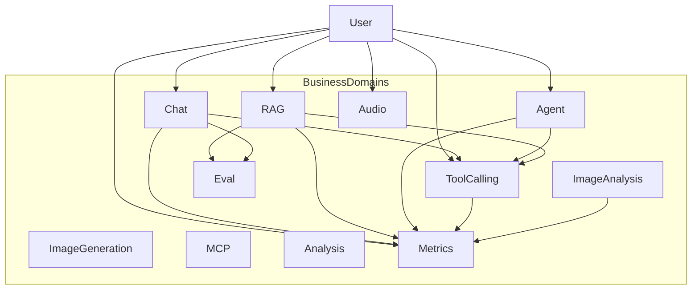

# Glossary | 领域术语表

> AI Chat & Agent Platform — Ubiquitous Language（统一语言）

---

## 1. Purpose | 文档说明

This document defines the project **Ubiquitous Language**. English terms are the **preferred canonical names** and must align with code, API, and architecture naming. Chinese labels are for localization and stakeholder communication only.

### Maintenance Principles

1. **Glossary first**: Add or update terms here before implementing code
2. **Code sync**: Domain model changes (entity, value object, enum) must update the corresponding glossary entry
3. **Preferred term**: Use the **Preferred Term (English)** column for code, API, Jira keys, commits, and technical docs

### Reference Rules


| Scenario                   | Rule                                                             |
| -------------------------- | ---------------------------------------------------------------- |
| Java class / API / commits | Use Preferred Term (English)                                     |
| Jira / user stories        | English preferred; Chinese may appear in parentheses for clarity |
| Frontend i18n              | Map English preferred terms to localized UI copy                 |
| Cross-team communication   | Lead with English; add Chinese when needed                       |


---

## 2. Business Domains | 业务域总览


| Preferred Term   | 中文        | Java Package      | Frontend Route          | API Prefix                                | Feature Flag                  | Notes                                 |
| ---------------- | --------- | ----------------- | ----------------------- | ----------------------------------------- | ----------------------------- | ------------------------------------- |
| Chat             | 对话        | `com.ai.chat`     | `/chat`, `/privacy`     | `/api/text`, `/api/sessions`, `/api/chat`, `/api/privacy` | —                             | UI under `app/chat/` + `app/privacy/` |
| Agent            | Agent 流水线 | `com.ai.agent`    | `/agents`               | `/api/agents`                             | `module-agents`               | Pipeline / Supervisor / Worker SSE    |
| RAG              | 知识问答      | `com.ai.rag`      | `/rag`                  | `/api/rag`                                | —                             | ETL interfaces in `domain.repository` |
| Tool Calling     | 工具调用      | `com.ai.tools`    | —                       | `/api/tools`                              | —                             | Weather + Serper                      |
| Analysis         | 结构化分析     | `com.ai.analysis` | —                       | `/api/chat/analyze`                       | —                             | No dedicated frontend route           |
| Eval             | 对话质量评估    | `com.ai.eval`     | `/eval`                 | `/api/eval`                               | `module-eval`                 | LLM-as-a-Judge                        |
| Image Generation | 图像生成      | `com.ai.image`    | `/generate/image`       | `/api/images`                             | —                             | UI under `app/generate/image/`        |
| Image Analysis   | 图像分析      | `com.ai.vision`   | `/vision`               | `/api/vision`                             | `module-vision`               | Caption / Detect / OCR                |
| Audio            | 语音        | `com.ai.audio`    | `/generate/tts`, `/asr` | `/api/audio`, `/ws/audio`                 | `module-audio-asr` (ASR only) | TTS always on                         |
| MCP              | MCP       | `com.ai.mcp`      | `/mcp`                  | `/api/mcp`, `/api/mcp/client`             | `module-mcp`                  | Server + Client in one package        |
| Workflow         | 工作流原语    | `com.ai.workflow` | —                       | `/api/workflows`                          | —                             | Spring AI Effective Agents patterns   |
| Generation       | 生成        | —                 | `/generate`             | —                                         | —                             | UI shell for image + TTS              |
| Common           | 横切        | `com.ai.common`   | —                       | —                                         | —                             | Feature flags, filters, shared tools  |
| Metrics          | AI 指标看板  | `com.ai.metrics`  | `/metrics`              | `/api/metrics`                            | —                             | Overview + domain drill-down          |


**Frontend route map (canonical)**


| Route             | Preferred Term   | API prefix                      |
| ----------------- | ---------------- | ------------------------------- |
| `/chat`           | Chat             | `/api/text`, `/api/sessions`    |
| `/agents`         | Agent            | `/api/agents`                   |
| `/generate`       | Generation       | —                               |
| `/generate/image` | Image Generation | `/api/images`                   |
| `/generate/tts`   | Text-to-Speech   | `/api/audio` (alias `/api/tts`) |
| `/rag`            | RAG              | `/api/rag`                      |
| `/vision`         | Image Analysis   | `/api/vision`                   |
| `/asr`            | Audio (ASR)      | `/ws/audio`                     |
| `/mcp`            | MCP              | `/api/mcp`, `/api/mcp/client`   |
| `/eval`           | Eval             | `/api/eval`                     |
| `/metrics`        | Metrics          | `/api/metrics`                  |


**Planned sidebar labels (no route yet):** `kubernetes`, `monitoring`, `aiinfra`, `modelDev`, `modelOps`, `model`, `llmops`, `aiops`, `vectordb` — i18n keys retained for future modules. Nav key `agents` maps to **Agent** (`/agents`).

**Sidebar IA groups (frontend):** `MODULE_NAV_TABS` in `src/main/web/app/core/config/module-nav.config.ts` orders live nav as **Work** (`/chat` → `/rag` → `/metrics` → `/agents`), **Create** (`/generate`), **Lab** (`/vision`, `/asr`, `/mcp`, `/eval`, flag-gated). Default route remains `/chat`. Do not wire planned AIOps keys into these groups until productized.

**Page layout by scenario (frontend):** each live route uses a task-fit shell — Chat (conversation column); RAG (document rail + Q&A); Agent (canvas + results rail with input inside the rail); Generation image/TTS and Vision (form ‖ preview/result); ASR (connection bar + live transcript); MCP (status bar + tools list); Eval (input ‖ scores); Metrics (KPI strip + charts + drill-down table).




---

## 3. Chat | 对话


| Preferred Term (English) | 中文   | Definition                                            | Type              | Code Mapping                                  | Notes                                  |
| ------------------------ | ---- | ----------------------------------------------------- | ----------------- | --------------------------------------------- | -------------------------------------- |
| Chat Session             | 会话   | Multi-turn conversation container between user and AI | Aggregate Root    | `ChatSession`                                 | Default title: "New Chat"; owned by Client Identity |
| Client Identity          | 客户端身份 | Anonymous browser identity for session ownership (HttpOnly cookie) | Technical         | `ClientIdentity`, `ea_cid` / `__Host-ea_cid` | Server-issued; not stored in localStorage |
| Privacy Erasure          | 隐私清除 | Delete all sessions for current Client Identity / rotate identity cookie | Use Case          | `PrivacyController`, `deleteAllSessionsForClient` | GDPR-style right to erasure for anonymous chats |
| Privacy Consent          | 隐私同意 | Browser preference for optional analytics (RUM / LaunchDarkly) | Technical         | `PrivacyConsentService`, `explore-ai-privacy-consent` | Stored in localStorage; necessary Client Identity cookie is separate |
| Data Retention           | 数据留存 | Timed purge of inactive sessions and aged metrics events | Job               | `ChatDataRetentionJob`, `app.data-retention` | Default 90d aligned with Client Identity cookie |
| Plan Quota               | 套餐配额 | Daily hard limit on billable AI API calls for Free/Pro plan | Technical         | `billing.web.UsageQuotaFilter`, `app.billing` | Returns `429` / `QUOTA_EXCEEDED`; distinct from short-window rate limit |
| Metrics Admin Key        | Metrics 管理密钥 | Shared secret protecting `/api/metrics/**` when configured | Technical         | `MetricsAdminAuthFilter`, `METRICS_ADMIN_API_KEY` | Header `X-Admin-Key`; empty key keeps local Metrics UI open |
| Account Me               | 当前账号 | Viewer identity for commercialization (anonymous today) | Use Case          | `AccountController` `/api/account/me` | Foundation for OAuth user + Workspace claim |
| Legal Documents          | 法律文档 | Terms, Privacy Policy, Cookie Policy, Sub-processors pages | UI                | `/legal`, `/legal/:doc` | Distinct from interactive `/privacy` controls |
| Chat Message             | 消息   | Single message within a session                       | Entity            | `ChatMessage`                                 | Immutable; created via factory methods |
| User Message             | 用户消息 | Message sent by the user                              | Enum / Role       | `ChatMessageType.USER`, role=`user`           | —                                      |
| Assistant Message        | 助手消息 | Message returned by the AI                            | Enum / Role       | `ChatMessageType.ASSISTANT`, role=`assistant` | —                                      |
| Chat Session ID          | 会话标识 | Unique identifier of a session                        | Value Object      | `ChatSessionId`                               | —                                      |
| Message ID               | 消息标识 | Unique identifier of a message                        | Value Object      | `MessageId`                                   | —                                      |
| Chat Session Status      | 会话状态 | Lifecycle state of a session                          | Enum              | `ChatSessionStatus`                           | ACTIVE, CLOSED                         |
| Chat Stream              | 流式对话 | Receive AI replies in real time via SSE               | Use Case Behavior | `ChatUseCase.chatStream()`                    | See `docs/api.md`                      |
| Recent Messages          | 最近消息 | Last N messages in a session for context window       | Domain Behavior   | `ChatSession.getRecentMessages(int)`          | —                                      |
| Language Detection       | 语言检测 | Detect language of user input text                    | Domain Service    | `LanguageDetectionService`                    | Used by `LocalizedRagPromptBuilder` |


**Chat Session Status**


| Preferred Term (English) | 中文  | Meaning                              |
| ------------------------ | --- | ------------------------------------ |
| ACTIVE                   | 活跃  | Session accepts new messages         |
| CLOSED                   | 已关闭 | Session is finished; no new messages |


---

## 4. Agent | Agent 流水线


| Preferred Term (English) | 中文            | Definition                                                    | Type           | Code Mapping                                       | Notes                                           |
| ------------------------ | ------------- | ------------------------------------------------------------- | -------------- | -------------------------------------------------- | ----------------------------------------------- |
| Agent                    | Agent         | Specialized worker that performs a typed task                 | Entity         | `AgentDefinition`                                  | Registered in `AgentRegistry`                   |
| Agent Type               | Agent 类型      | Canonical type id of an Agent                                 | Value Object   | `AgentType`                                        | e.g. weather, search                            |
| Agent Definition         | Agent 定义      | Name, type, tools, and prompt binding for an Agent            | Entity         | `AgentDefinition`                                  | —                                               |
| Agent Registry           | Agent 注册表     | Lookup of available Agent definitions                         | Repository     | `AgentRegistry`, `InMemoryAgentRegistry`           | —                                               |
| Agent Pipeline           | Agent 流水线     | User-authored multi-agent graph executed in topological order | Aggregate      | `AgentPipeline`                                    | Canvas + `POST /api/agents/pipeline/invoke/sse` |
| Pipeline Node            | 流水线节点         | Graph node binding an Agent Type                              | Value Object   | `AgentPipeline.PipelineNode`                       | —                                               |
| Pipeline Edge            | 流水线边          | Directed handoff between nodes                                | Value Object   | `AgentPipeline.PipelineEdge`                       | —                                               |
| Agent Pipeline Template  | Agent 编排模版    | Built-in ordered agent graph users can apply in one click     | Pattern        | `/agents` Pipeline templates                       | Catalog + real tool workers                     |
| Agent Facade             | Agent 门面      | Application entry for list, invoke, supervisor, pipeline      | Facade         | `AgentFacade`                                      | —                                               |
| Orchestrator Workers     | 编排用例          | Runs Worker Agents according to a routing or pipeline plan    | Use Case       | `OrchestratorWorkersUseCase`                       | —                                               |
| Supervisor Router        | Supervisor 路由 | Chooses next Agent / subtasks for a user message              | Application    | `SupervisorRouter`, `SpringAiSupervisorRouter`     | `POST /api/agents/supervisor/invoke/sse`        |
| Worker Agent Invoker     | Worker 调用器    | Invokes a single Worker Agent with streaming                  | Application    | `WorkerAgentInvoker`, `SpringAiWorkerAgentInvoker` | DSML strip via `ToolCallMarkupFilter`           |
| Tool Call Markup Filter  | 工具标记过滤器   | Strips legacy DSML-style tool markup from model text          | Utility        | `ToolCallMarkupFilter`, `SanitizingChatMemory`     | Chat SSE, ChatMemory, Agent workers             |
| Tool Call Loop Guard     | 工具循环守卫     | Allows datetime bridge then forces final answer after search; repairs DSML-only turns | Utility        | `ToolCallLoopGuard`, `ToolCallLoopGuardAdvisor`, `LoopGuardToolCallingManager` | Prevents DSML / phantom fetch after searchWeb   |
| Routing Plan             | 路由计划          | Planned subtasks for Supervisor orchestration                 | Value Object   | `RoutingPlan`                                      | —                                               |
| Agent Handoff            | Agent 交接      | Transfer marking delegation from one Agent to another         | Stream Event   | `agent_handoff`                                    | Frontend stage boundaries                       |
| Agent Prompt Catalog     | Agent 提示词目录   | Loads Agent system prompts from classpath and appends shared style | Infrastructure | `AgentPromptCatalog`, `prompts/agent/*.st`     | Via `PromptTemplates.loadAgentSystemPrompt`     |
| Agent Skill              | Agent 技能      | Reusable SKILL.md instruction pack for Agent workers             | Value Object   | `AgentSkill`, `agent/skills/*/SKILL.md`        | Opt-in via `app.agent.skills`                   |
| Agent Skills Runtime     | Agent 技能运行时   | Loads controlled skill ids and injects prompt/tool metadata        | Infrastructure | `AgentSkillsRuntime`, `AgentSkillLoader`       | Default off; uses `spring-ai-agent-utils`       |
| Prompt Catalog           | 提示词目录         | Versioned prompt fragments under classpath resources               | Infrastructure | `classpath:prompts/**`                         | shared / chat / rag / agent / task / guards     |
| Prompt Templates         | 提示词组合服务       | Composes default system, RAG system, and Agent prompts             | Infrastructure | `PromptTemplates`, `ClasspathPromptTemplate`     | Injected into ChatClientFactory                 |
| Localized RAG Prompt     | 本地化 RAG 提示词    | Builds multilingual RAG/Vision user prompts with shared style      | Infrastructure | `LocalizedRagPromptBuilder`                    | Used by `RagChatUseCase`, `VisionChatUseCase`   |


---

## 4.1 Workflow | Effective Agents 工作流


| Preferred Term (English)     | 中文           | Definition                                              | Type           | Code Mapping                                           | Notes                                              |
| ---------------------------- | ------------ | ------------------------------------------------------- | -------------- | ------------------------------------------------------ | -------------------------------------------------- |
| Chain Workflow               | 链式工作流        | Sequential LLM steps; each output feeds the next        | Domain Service | `ChainWorkflow`, `SpringAiChainWorkflow`               | Anthropic Effective Agents / Spring AI examples    |
| Parallelization Workflow     | 并行化工作流       | Concurrent LLM calls over independent items             | Domain Service | `ParallelizationWorkflow`, `SpringAiParallelizationWorkflow` | Sectioning / voting                              |
| Routing Workflow             | 路由工作流        | Classify input then run a specialized prompt            | Domain Service | `RoutingWorkflow`, `SpringAiRoutingWorkflow`           | Structured classification via `.entity()`          |
| Orchestrator-Workers Workflow | 编排-工人工作流    | Plan subtasks, parallel workers, synthesize             | Domain Service | `OrchestratorWorkersWorkflow`, `SpringAiOrchestratorWorkersWorkflow` | Distinct from Agent `OrchestratorWorkersUseCase` |
| Evaluator-Optimizer Workflow | 评估-优化工作流     | Generator/evaluator loop until PASS or max iterations   | Domain Service | `EvaluatorOptimizerWorkflow`, `SpringAiEvaluatorOptimizerWorkflow` | Returns solution + chain of thought            |


---

## 5. RAG | 知识问答


| Preferred Term (English) | 中文       | Definition                                          | Type                 | Code Mapping                              | Notes                                                               |
| ------------------------ | -------- | --------------------------------------------------- | -------------------- | ----------------------------------------- | ------------------------------------------------------------------- |
| Document                 | 文档       | User-uploaded knowledge source file (TXT/PDF)       | Entity               | `Document`                                | Full lifecycle                                                      |
| Document ID              | 文档标识     | Unique identifier of a document                     | Value Object         | `DocumentId`                              | —                                                                   |
| Document Status          | 文档状态     | Processing state from upload to ready               | Enum                 | `DocumentStatus`                          | See state machine                                                   |
| Document Chunk           | 文档分块     | Smallest retrieval unit after document splitting    | Entity               | `DocumentChunk`                           | Includes embedding vector                                           |
| Raw Document             | 原始文档     | Normalized document view before ETL processing      | Value Object         | `RawDocument`                             | content + metadata + source                                         |
| Chunking                 | 分块       | Process of splitting document text into chunks      | Application Behavior | `ChunkingDocumentTransformer`             | Spring AI `TokenTextSplitter`; configurable token size              |
| Embedding                | 嵌入向量     | Vector representation of text for similarity search | Technical            | `OllamaEmbeddingAdapter`                  | Ollama `qwen3-embedding:0.6b` (1024-d)                              |
| Retrieval                | 检索       | Find relevant chunks via vector similarity          | Application Behavior | `DocumentSearchService`                   | topK + scoreThreshold; RAG chat uses Spring AI `VectorStore` |
| Spring AI Vector Store   | Spring AI 向量库 | Spring AI SPI over H2 cosine search for Modular RAG | Infrastructure       | `H2SpringAiVectorStore`                   | Used by `VectorStoreDocumentRetriever`                       |
| Source Document          | 来源文档     | Retrieved chunk with similarity score               | Value Object         | `SourceDocument`                          | Domain field `text`; SSE JSON uses `"text"` via `SourceDocumentDto` |
| Context                  | 上下文      | Retrieved text and sources passed to the LLM        | Application Concept  | `RagApplicationService.retrieveContext()` | Augments the Prompt                                                 |
| RAG Chat                 | RAG 对话   | Generate AI answers from retrieved context          | Use Case             | `RagChatUseCase`                          | Supports streaming                                                  |
| Vision Chat              | 视觉问答     | Multimodal RAG Q&A over images in chat stream       | Use Case             | `VisionChatUseCase`                       | Ollama multimodal; not `/api/vision/`*                              |
| Document Upload          | 文档上传     | Upload file and trigger processing pipeline         | Use Case             | `DocumentUploadService`                   | TXT / PDF                                                           |
| Vector Similarity        | 向量相似度    | Cosine similarity between two vectors               | Domain Utility       | `VectorSimilarity`                        | —                                                                   |
| Chunk Size               | 分块大小     | Target tokens per chunk (ETL ingest)                | Config               | `RagProperties.Chunk.size`                | Default: 500 tokens; `TokenTextSplitter`                            |
| Chunk Overlap            | 分块重叠     | Legacy overlap setting (characters)                 | Config               | `RagProperties.Chunk.overlap`             | Default: 50; unused by Spring AI 2.0 `TokenTextSplitter`            |
| Top K                    | 检索数量     | Maximum number of chunks returned                   | Config               | `RagProperties.Retrieval.topK`            | Default: 5                                                          |
| Score Threshold          | 分数阈值     | Minimum similarity score for retrieval results      | Config               | `RagProperties.Retrieval.scoreThreshold`  | Default: 0.5                                                        |
| Document Reader          | 文档读取器    | ETL: reads raw bytes into RawDocument               | Repository           | `DocumentReader`                          | Package: `com.ai.rag.domain.repository`                             |
| Document Transformer     | 文档转换器    | ETL: transforms RawDocument into chunks             | Repository           | `DocumentTransformer`                     | Package: `com.ai.rag.domain.repository`                             |
| Document Writer          | 文档写入器    | ETL: persists processed chunks to Vector Store      | Repository           | `DocumentWriter`                          | Package: `com.ai.rag.domain.repository`                             |
| RAG ETL Pipeline         | RAG 数据管道 | End-to-end ingest: Reader → Transformer → Writer    | Pipeline             | `DocumentUploadService`                   | Triggered on upload; not a separate bounded context                 |


**Document Status State Machine**

```
UPLOADING → PROCESSING → READY
    ↓           ↓
  FAILED ←──── FAILED
```


| Preferred Term (English) | 中文  | Meaning                            | Transitions To         |
| ------------------------ | --- | ---------------------------------- | ---------------------- |
| UPLOADING                | 上传中 | File is being uploaded             | PROCESSING, FAILED     |
| PROCESSING               | 处理中 | Chunking and embedding in progress | READY, FAILED          |
| READY                    | 就绪  | Available for RAG retrieval        | PROCESSING (reprocess) |
| FAILED                   | 失败  | Processing failed                  | PROCESSING (retry)     |


---

## 6. Tool Calling | 工具调用


| Preferred Term (English) | 中文       | Definition                                            | Type                 | Code Mapping                              | Notes                                |
| ------------------------ | -------- | ----------------------------------------------------- | -------------------- | ----------------------------------------- | ------------------------------------ |
| Tool Calling             | 工具调用     | LLM invokes external tools based on user intent       | Capability           | `ToolsFacade`                             | Spring AI Tool                       |
| Tool Chat                | 工具对话     | AI conversation with tool capabilities                | Use Case Behavior    | `ToolsController.chatWithTools()`         | —                                    |
| Tool Result              | 工具结果     | Outcome of a tool invocation (success or failure)     | Value Object         | `ToolResult`                              | `success()` / `failure()`            |
| Tool Callback Registry   | 工具回调注册表  | Registry mapping tool names to ToolCallback instances | Application          | `McpToolCallbackRegistry`                 | Used by MCP Client                   |
| Document Search Tool     | 文档搜索工具   | Search documents in the RAG knowledge base            | Repository           | `DocumentSearchTool`                      | Outbound contract                    |
| RAG Search Tool          | RAG 搜索工具 | MCP tool adapter delegating to DocumentSearchService  | Adapter              | `RagSearchTool`                           | Invoked via MCP                      |
| Document Search          | 文档检索     | Vector similarity retrieval over document chunks      | Application Service  | `DocumentSearchService`                   | Uses `DocumentChunkSearchRepository` |
| Weather Tool             | 天气工具     | Query weather and forecast                            | Tool                 | `WeatherTools`                            | Mock data                            |
| DateTime Tool            | 时间工具     | Authoritative current date/time in the user timezone  | Tool                 | `DateTimeTool`, `DateTimeTools`           | Spring AI official `@Tool` pattern; `LocaleContextHolder` |
| Web Search Tool          | 网页搜索工具   | Search live web content via Serper                    | Repository / Adapter | `WebSearchTool`, `SerperWebSearchAdapter` | Requires API key                     |


---

## 7. Image Generation | 图像生成


| Preferred Term (English)  | 中文   | Definition                                    | Type             | Code Mapping                      | Notes                                                |
| ------------------------- | ---- | --------------------------------------------- | ---------------- | --------------------------------- | ---------------------------------------------------- |
| Image Generation          | 图像生成 | Generate images from text prompts             | Use Case         | `ImageFacade`                     | Spring AI `ImageModel`                               |
| Image Generation Request  | 生成请求 | Request with prompt, size, quality, etc.      | DTO              | `ImageGenerationRequest`          | POST `/api/images/generate`                          |
| Image Generation Response | 生成响应 | Response with `imageUrl` and/or `imageBase64` | DTO              | `ImageGenerationResponse`         | Fields: `imageUrl`, `imageBase64`, `model`, `status` |
| Prompt                    | 提示词  | Text describing the desired image             | Business Concept | `ImageGenerationRequest.prompt()` | —                                                    |
| Generated Image           | 生成图像 | Domain result of image generation             | Value Object     | `GeneratedImage`                  | URL or base64 payload                                |


---

## 8. Image Analysis | 图像分析


| Preferred Term (English) | 中文   | Definition                                               | Type              | Code Mapping               | Notes                                                    |
| ------------------------ | ---- | -------------------------------------------------------- | ----------------- | -------------------------- | -------------------------------------------------------- |
| Image Analysis           | 图像分析 | Standalone caption, detect, and OCR over uploaded images | Capability        | `VisionAnalysisUseCase`    | Frontend route `/vision`                                 |
| Caption                  | 图像描述 | Natural-language description of image content            | Use Case Behavior | `POST /api/vision/caption` | ONNX Runtime + BLIP ONNX; multipart `file`               |
| Object Detection         | 目标检测 | List detected objects with confidence and bbox           | Use Case Behavior | `POST /api/vision/detect`  | ONNX Runtime + YOLOv8 ONNX (COCO 80 classes)             |
| OCR                      | 文字识别 | Extract visible text from image                          | Use Case Behavior | `POST /api/vision/ocr`     | Tess4J + Tesseract; returns `fullText`                   |
| Caption Engine           | 描述引擎 | Natural-language image captioning                        | Infrastructure    | `OnnxBlipCaptioner`        | ONNX Runtime + BLIP ONNX (vision encoder + text decoder) |
| Detect Engine            | 检测引擎 | Real-time object detection                               | Infrastructure    | `OnnxYoloDetector`         | ONNX Runtime + YOLOv8 ONNX                               |
| OCR Engine               | 识别引擎 | Optical character recognition                            | Infrastructure    | `Tess4jOcrEngine`          | Tess4J wrapper over Tesseract 5.x                        |


**Do not conflate:** **Image Analysis** (`/vision`, `/api/vision/`*) vs **Vision Chat** (multimodal RAG stream under RAG domain).

---

## 9. Audio | 语音


| Preferred Term (English)           | 中文     | Definition                                 | Type                | Code Mapping                         | Notes                                                 |
| ---------------------------------- | ------ | ------------------------------------------ | ------------------- | ------------------------------------ | ----------------------------------------------------- |
| Text-to-Speech (TTS)               | 语音合成   | Convert text into spoken audio             | Use Case            | `AudioFacade`                        | Dedicated `app.ai.tts.`* config                       |
| Voice                              | 音色     | Voice type used for synthesis              | Business Concept    | `VoiceInfo`, `VoiceCatalog`          | GET `/api/audio/voices`                               |
| Speech Text                        | 语音文本   | Validated text input for TTS               | Value Object        | `SpeechText`                         | —                                                     |
| Synthesized Audio                  | 合成音频   | Domain result of TTS conversion            | Value Object        | `SynthesizedAudio`                   | Audio bytes                                           |
| Synthesize                         | 合成     | Execute text-to-speech conversion          | Use Case Behavior   | `AudioFacade.synthesize()`           | POST `/api/audio/speak` (alias `/api/tts/synthesize`) |
| Automatic Speech Recognition (ASR) | 自动语音识别 | Convert spoken audio to text               | Capability          | `StreamingTranscriptionUseCase`      | whisper.cpp; flag `module-audio-asr`                  |
| Streaming Transcription            | 流式转写   | Real-time ASR over WebSocket               | Use Case Behavior   | `AudioTranscriptionWebSocketHandler` | Port 8178                                             |
| Transcription                      | 转写     | Single ASR result converting audio to text | Application Concept | `WhisperCppTranscriptionAdapter`     | Returns text                                          |


---

## 10. MCP | MCP

Package: `com.ai.mcp` (Server + Client).


| Preferred Term (English) | 中文        | Definition                                    | Type              | Code Mapping                         | Notes                          |
| ------------------------ | --------- | --------------------------------------------- | ----------------- | ------------------------------------ | ------------------------------ |
| MCP Server               | MCP 服务端   | Expose AI platform capabilities externally    | Service           | `AiMcpServerService`                 | Model Context Protocol         |
| MCP Client               | MCP 客户端   | Connect to and invoke external MCP services   | Service           | `AiMcpClientService`                 | Registers external tools       |
| MCP Tool                 | MCP 工具    | Callable tool under MCP protocol              | Technical         | `AiMcpClientService.registerTools()` | —                              |
| MCP Tool Definition      | MCP 工具定义  | Name and description of an MCP tool           | Value Object      | `McpToolDefinition`                  | Registered by Client           |
| MCP Session              | MCP 会话    | Active connection session to an MCP server    | Entity            | `McpSession`                         | Managed by `McpSessionManager` |
| MCP Server Connection    | MCP 服务端连接 | Connection metadata to an external MCP server | Value Object      | `McpServerConnection`                | —                              |
| MCP Chat                 | MCP 对话    | AI conversation initiated via MCP Client      | Use Case Behavior | `McpClientController.chat()`         | —                              |


---

## 11. Analysis | 结构化分析


| Preferred Term (English) | 中文    | Definition                                          | Type             | Code Mapping                      | Notes                       |
| ------------------------ | ----- | --------------------------------------------------- | ---------------- | --------------------------------- | --------------------------- |
| Structured Output        | 结构化输出 | AI returns strongly typed JSON instead of free text | Technical        | `SpringAiStructuredOutputUseCase` | Spring AI `.entity()`       |
| Text Analysis            | 文本分析  | Summarize, classify sentiment, etc.                 | Use Case         | `AnalysisController`              | —                           |
| Text Analysis Result     | 分析结果  | Result with summary, sentiment, key points          | DTO              | `TextAnalysisResult`              | —                           |
| Sentiment                | 情感    | Sentiment classification of text                    | Enum             | `TextAnalysisResult.Sentiment`    | POSITIVE, NEUTRAL, NEGATIVE |
| Key Points               | 关键点   | Extracted core points from text                     | Business Concept | `TextAnalysisResult.keyPoints()`  | —                           |
| Named Entities           | 命名实体  | Named entities extracted from text (NLP)            | Business Concept | `TextAnalysisResult.entities()`   | Not a DDD Entity            |


---

## 12. Eval | 对话质量评估


| Preferred Term (English) | 中文      | Definition                                       | Type         | Code Mapping                              | Notes                      |
| ------------------------ | ------- | ------------------------------------------------ | ------------ | ----------------------------------------- | -------------------------- |
| Chat Evaluation          | 对话评估    | Assess quality and safety of an AI response      | Use Case     | `ChatQualityEvaluator`                    | Spring AI Evaluators       |
| Chat Evaluation Result   | 评估结果    | Scores and flags from a chat evaluation          | Value Object | `ChatEvaluationResult`                    | Multiple score dimensions  |
| Relevancy Evaluator      | 相关性评估器  | Measures answer relevance to the user question   | Evaluator    | `RelevancyEvaluator`                      | Spring AI built-in         |
| Fact-Checking Evaluator  | 事实性评估器  | Checks answer factuality against context         | Evaluator    | `FactCheckingEvaluator`                   | Requires context documents |
| Coherence Score          | 连贯性分数   | Score for logical flow of the response (0–1)     | Metric       | `ChatEvaluationResult.coherenceScore()`   | —                          |
| Relevance Score          | 相关性分数   | Score for answer relevance to the question (0–1) | Metric       | `ChatEvaluationResult.relevanceScore()`   | —                          |
| Helpfulness Score        | 有用性分数   | Score for practical usefulness (0–1)             | Metric       | `ChatEvaluationResult.helpfulnessScore()` | —                          |
| Factuality Score         | 事实性分数   | Score for factual accuracy against context (0–1) | Metric       | `ChatEvaluationResult.factualityScore()`  | Nullable if unavailable    |
| Overall Score            | 综合分数    | Weighted aggregate evaluation score (0–1)        | Metric       | `ChatEvaluationResult.overallScore()`     | —                          |
| Safety Flag              | 安全标记    | Indicator of potential safety issues in response | Metric       | `ChatEvaluationResult.safetyFlags()`      | List of flag strings       |
| Evaluation ChatClient    | 评估对话客户端 | Separate ChatClient instance for evaluation      | Technical    | `evaluationChatClient` bean               | Mitigates model bias       |
| Golden Suite             | 黄金评估套件  | Fixed JSONL cases run against live Chat/RAG generation then scored with official evaluators | Capability | `GoldenEvalUseCase`, `eval/golden/*.jsonl` | OpenAI Evals JSONL; test-only |
| Golden Eval Case         | 黄金评估用例  | One `input` + `ideal` (+ metadata) sample for regression | Value Object | `GoldenEvalCase`                          | Maps to `EvaluationRequest` |
| Official Gate Result     | 官方门禁结果  | Pass/fail from Relevancy + FactChecking evaluators | Value Object | `OfficialGateResult`                      | Suite gate; not LLM judge |


---

## 13. Metrics | AI 指标看板

Package: `com.ai.metrics`. Route `/metrics` (Work nav). API `/api/metrics`.


| Preferred Term (English) | 中文       | Definition                                                         | Type           | Code Mapping                   | Notes                                      |
| ------------------------ | -------- | ------------------------------------------------------------------ | -------------- | ------------------------------ | ------------------------------------------ |
| Metrics                  | AI 指标看板  | Operator view of AI request volume, latency, errors, and domain health | Capability     | `MetricsUseCase`, `/metrics`   | Overview + domain pages                    |
| AI Invocation Event      | AI 调用事件  | Append-only record of a single AI invocation                       | Entity         | `AiInvocationEvent`            | Table `ai_invocation_events`               |
| AI Domain                | AI 业务域   | Business domain that emits invocation events                       | Value Object   | `AiDomain`                     | chat / rag / agents / tools / vision / workflow |
| Invocation Outcome       | 调用结果    | Success or failure of an invocation                                | Value Object   | `InvocationOutcome`            | SUCCESS, FAILURE                           |
| Metrics Overview         | 指标概览    | Aggregated KPIs and distributions for a time range                 | Application    | `MetricsOverview`              | `GET /api/metrics/overview`                |
| Metrics Domain Snapshot  | 域指标快照   | Domain-scoped KPIs, series, and top models/operations              | Application    | `MetricsDomainSnapshot`        | `GET /api/metrics/domains/{domain}`        |
| Metrics Series           | 指标时序    | Named time-bucketed metric series                                  | Application    | `SeriesSnapshot`               | `GET /api/metrics/series`                  |
| Metrics Drill-down       | 指标下钻    | Filtered page of invocation events                                 | Application    | `DrilldownPage`                | `GET /api/metrics/drilldown`               |
| AI Invocation Recorder   | AI 调用记录器 | Records invocation events without failing the business path        | Application    | `AiInvocationRecorder`         | Chat / RAG / Agents / Tools / Vision inject |

Shared BI vocabulary (Dashboard, KPI, Dimension, Drill-down, …): see **Appendix C**.

---

## 14. Generation | 生成

UI shell only (no dedicated Java package). Routes under `/generate` host **Image Generation** and **Text-to-Speech** pages (`app/generate/image/`, `app/generate/tts/`). Prefer those business-domain terms in code and API naming.

---

## 15. Common | 横切


| Preferred Term (English) | 中文     | Definition                        | Type           | Code Mapping         | Notes                         |
| ------------------------ | ------ | --------------------------------- | -------------- | -------------------- | ----------------------------- |
| Module Flag              | 模块开关   | LaunchDarkly-backed module gate   | Value Object   | `ModuleFlag`         | agents/vision/asr/mcp/eval    |
| Feature Flag Service     | 功能开关服务 | Query whether a module is enabled | Application    | `FeatureFlagService` | Backend + frontend            |
| Module Access Filter     | 模块访问过滤 | Blocks disabled module API paths  | Infrastructure | `ModuleAccessFilter` | Path prefix from `ModuleFlag` |


---

## Appendix A. Cross-Cutting Architecture Terms | 通用架构术语


| Preferred Term (English) | 中文   | Definition                                                                            | Type         | Code Mapping                                                  | Notes                                       |
| ------------------------ | ---- | ------------------------------------------------------------------------------------- | ------------ | ------------------------------------------------------------- | ------------------------------------------- |
| Aggregate Root           | 聚合根  | Root entity within a transaction boundary; external access goes through the root only | Architecture | `ChatSession`, `AgentPipeline`                                | One aggregate per transaction               |
| Entity                   | 实体   | Domain object with identity and mutable lifecycle                                     | Architecture | `ChatMessage`, `Document`, `AgentDefinition`                  | Distinguished by ID                         |
| Value Object             | 值对象  | Immutable object compared by value, no standalone identity                            | Architecture | `ChatSessionId`, `DocumentId`, `SourceDocument`, `AgentType`  | Use `record` or factory methods             |
| Domain Service           | 领域服务 | Stateless domain logic that does not belong to a single entity                        | Architecture | `LanguageDetectionService`                                    | Cross-entity operations                     |
| Use Case                 | 用例   | Application-layer orchestration of domain objects and repositories                    | Architecture | `RagChatUseCase`, `ChatUseCase`, `OrchestratorWorkersUseCase` | No business-rule details                    |
| Facade                   | 门面   | Simplified application entry point                                                    | Architecture | `AgentFacade`, `ToolsFacade`, `ImageFacade`, `AudioFacade`    | Coordinates use cases                       |
| Repository               | 仓储   | Persistence or outbound capability abstraction for the domain                         | Architecture | `ChatSessionRepository`, `DocumentReader`, `AgentRegistry`    | Interface in domain, impl in infrastructure |
| Adapter                  | 适配器  | Infrastructure implementation of a repository / outbound contract                     | Architecture | `OllamaEmbeddingAdapter`, `SerperWebSearchAdapter`            | Lives in `infrastructure/`                  |
| Streaming (SSE)          | 流式响应 | Real-time AI output via Server-Sent Events                                            | Technical    | Chat / RAG / Agent SSE endpoints                              | Shared frontend `sse-client`                |
| Provider                 | 提供商  | LLM or AI service vendor (e.g. OpenAI, Ollama)                                        | Business     | Frontend `selectedProvider`                                   | User-selectable model source                |
| Domain Exception         | 领域异常 | Exception representing a business rule violation                                      | Architecture | `ChatSessionNotFoundException`, `AgentNotFoundException`      | Mapped to HTTP 4xx                          |


---

## Appendix B. AI Engineering Terms | AI 工程通用术语


| Preferred Term (English)             | 中文      | Definition                                                 | Type      | Code Mapping                                  | Notes                               |
| ------------------------------------ | ------- | ---------------------------------------------------------- | --------- | --------------------------------------------- | ----------------------------------- |
| Large Language Model (LLM)           | 大语言模型   | Neural model for text generation and reasoning             | Technical | `ChatModel`, Bailian Qwen (OpenAI-compatible) | Core text generation engine         |
| ChatClient                           | 对话客户端   | Spring AI fluent API for LLM interactions                  | Technical | `ChatClient`, `ChatClient.Builder`            | Spring AI 2.0 core API              |
| ChatModel                            | 对话模型    | Abstraction over an LLM provider                           | Technical | `org.springframework.ai.chat.model.ChatModel` | Implemented by OpenAI, Ollama, etc. |
| Prompt                               | 提示词     | Input text sent to an LLM                                  | Technical | `Prompt`, `PromptTemplate`                    | User + system messages              |
| System Prompt                        | 系统提示词   | Instruction defining AI role and behavior                  | Technical | `PromptTemplates`, `prompts/chat/*.st`        | Composed from classpath fragments   |
| Prompt Template                      | 提示词模板   | Reusable prompt with placeholders                          | Technical | `classpath:prompts/**`, `ClasspathPromptTemplate` | Spring AI `PromptTemplate` render path |
| Shared Style Prompt                  | 共享风格提示词 | Minimal high-value style + no decorative emoji             | Technical | `prompts/shared/style-minimal.st`             | Shared by chat / RAG / agents       |
| Context Window                       | 上下文窗口   | Maximum conversation history included in a request         | Technical | `context length` in `ollama show`; `ChatSession.getRecentMessages()` | See Appendix D **Context Length** |
| Token                                | 令牌      | Atomic unit of text for LLM input/output and billing       | Technical | `promptTokens` / `completionTokens` | Industry standard unit; see Appendix D |
| Temperature                          | 温度      | Sampling parameter controlling output randomness (0–1)     | Technical | `temperature` in `ollama show` / chat options | Lower = more deterministic; with Top-p / Top-k |
| Retrieval-Augmented Generation (RAG) | 检索增强生成  | Pattern combining retrieval with LLM generation            | Pattern   | `RagChatUseCase`                              | Retrieve → augment → generate       |
| Augmented Generation                 | 增强生成    | LLM generation conditioned on retrieved context            | Pattern   | `RagChatUseCase.chat()`                       | Core RAG generation step            |
| Vector Store                         | 向量存储    | Database storing Embedding vectors for similarity search   | Technical | `H2VectorAdapter`, pgvector                   | Default: H2 embedded                |
| Tool Callback                        | 工具回调    | Spring AI mechanism for LLM-initiated tool invocation      | Technical | `ToolCallback`, `McpToolCallbackRegistry`     | Bridges LLM and Tools               |
| Advisor                              | 顾问      | Interceptor/enhancer in the ChatClient call chain          | Technical | Spring AI Advisors                            | e.g. structured output              |
| Multimodal                           | 多模态     | Input combining text and other modalities (e.g. image)     | Technical | `VisionChatUseCase`                           | Ollama qwen3.5 / qwen3-vl; see Appendix D **Vision Encoder** |
| Model Context Protocol (MCP)         | 模型上下文协议 | Standard protocol for exposing Tools and Resources to LLMs | Protocol  | `AiMcpServerService`                          | Anthropic-initiated standard        |
| Orchestrator                         | 编排器     | Agent that delegates tasks to specialized Subagents        | Pattern   | `.cursor/agents/orchestrator.md`              | Cursor agent routing (dev tooling)  |
| Subagent                             | 子智能体    | Specialized Agent focused on a single responsibility       | Pattern   | `.cursor/agents/*.md`                         | e.g. domain-expert, developer       |
| Grounding                            | 事实锚定    | Constraining LLM answers to retrieved Source Documents     | Pattern   | `LocalizedRagPromptBuilder`, `RagChatUseCase` | Reduces unsupported claims          |
| Prompt Engineering                   | 提示工程    | Crafting prompts to improve LLM output quality             | Practice  | —                                             | No fine-tuning in this project      |


---

## Appendix C. Business Intelligence Terms | 商业智能通用术语

Standard BI / dimensional-analysis vocabulary used by the **Metrics** dashboard. Prefer these English terms in APIs, UI copy keys, commits, and stories. Industry basis: Kimball dimensional modeling (fact, dimension, grain, drill-down).


| Preferred Term (English)     | 中文      | Definition                                                                 | Type           | Code Mapping                                      | Notes                                              |
| ---------------------------- | ------- | -------------------------------------------------------------------------- | -------------- | ------------------------------------------------- | -------------------------------------------------- |
| Business Intelligence (BI)   | 商业智能    | Practice of turning operational events into analyzable metrics and views     | Discipline     | Metrics domain                                    | Product surface: `/metrics`                        |
| Dashboard                    | 仪表盘     | Single-screen composition of KPIs, charts, and tables for a time range     | UI Concept     | `/metrics`, `MetricsOverviewPage`                 | Overview + domain pages                            |
| Key Performance Indicator (KPI) | 关键绩效指标 | Small set of headline measures shown for quick health assessment         | Measure        | `requestCount`, `errorRate`, `latencyP50Ms`       | Prefer “KPI cards”, not “stat pills”               |
| Metric                       | 指标      | Named quantitative measure of a process (count, rate, latency, tokens)     | Concept        | series `name`, `SeriesPoint.value`                | Singular BI sense; product capability is **Metrics** |
| Measure                      | 度量      | Numeric fact value that can be aggregated                                  | Concept        | `latencyMs`, token counts, `COUNT(*)`             | Kimball “fact” numeric payload                     |
| Dimension                    | 维度      | Context used to filter or group measures (who / what / when / where)       | Concept        | `AiDomain`, `model`, `day`, `outcome`, `operation` | Drill-down query params                            |
| Fact Event                   | 事实事件    | Atomic measurable occurrence at a declared grain                           | Concept        | `AiInvocationEvent`                               | One row ≈ one AI invocation                        |
| Grain                        | 粒度      | Business meaning of one fact row (“one AI invocation”)                     | Concept        | `AiInvocationEvent`                               | Do not mix grains in one aggregate without care    |
| Aggregation                  | 聚合      | Computing summaries (count, sum, rate, percentile) over facts              | Operation      | `JdbcMetricsQueryRepository`, `MetricsUseCase`    | Overview / domain / series                         |
| Time Range                   | 时间范围    | Inclusive reporting window for queries                                     | Parameter      | `range` (`7d`, `30d`), `RangeWindow`              | API query param                                    |
| Time Bucket                  | 时间分桶    | Discrete period used to group a time series (e.g. calendar day)            | Concept        | SQL `bucket_day`, series `label`                  | H2 alias avoids reserved `day`                     |
| Time Series                  | 时序      | Ordered sequence of (bucket, measure) points                               | Concept        | `SeriesSnapshot`, `SeriesPoint`                   | `GET /api/metrics/series`                          |
| Categorical Series           | 分类序列    | Named categories with counts (not time-ordered)                            | Concept        | `NamedCount`, `requestsByDomain`, `modelSeries`   | Domain / model breakdowns                          |
| Distribution                 | 分布      | How volume or outcomes split across a dimension                            | Concept        | `requestsByDomain`, domain health                 | Overview charts                                    |
| Trend                        | 趋势      | Direction of a measure across successive time buckets                      | Concept        | `requestSeries`, `latency_p95` series             | Domain page charts                                 |
| Filter                       | 筛选      | Constraint that narrows facts before aggregation or listing                | Operation      | drilldown query (`domain`, `day`, `model`, …)     | Combine with dimensions                            |
| Drill-down                   | 下钻      | Move from summary to finer grain by adding dimension constraints           | Interaction    | `GET /api/metrics/drilldown`, `DrilldownPage`     | Kimball: add grouping / filter context             |
| Roll-up                      | 上卷      | Move from detail back to a coarser aggregate                               | Interaction    | Overview ← domain ← event table                   | Inverse of drill-down                              |
| Slice                        | 切片      | Fix one dimension value and analyze the rest                               | Interaction    | domain page `/metrics/{domain}`                   | e.g. fix `AiDomain=chat`                           |
| Success Rate                 | 成功率     | Share of invocations with successful outcome                               | KPI            | `successRate`                                     | `1 - errorRate`                                    |
| Error Rate                   | 错误率     | Share of invocations with failure outcome                                  | KPI            | `errorRate`                                       | From `InvocationOutcome`                           |
| Request Count                | 请求量     | Number of invocations in the selected time range                           | KPI            | `requestCount`                                    | Primary volume measure                             |
| Latency                      | 延迟      | End-to-end duration of an invocation                                       | Measure        | `latencyMs`, `latencyP50Ms`, `latencyP95Ms`       | Milliseconds                                       |
| Percentile                   | 百分位     | Value below which a given percentage of observations fall                  | Statistic      | P50 / P95 latency                                 | Prefer P95 for tail latency                        |
| Token Usage                  | 令牌用量    | Prompt and completion token totals in the range                            | Measure        | `promptTokens`, `completionTokens`                | Nullable when provider omits usage                 |
| Inventory                    | 清单指标    | Supporting counts of catalog entities for a domain (not event facts)       | Measure        | domain `inventory` map                            | e.g. sessions / documents when available           |
| Empty State                  | 空态      | Dashboard presentation when no facts match the filters                     | UI Concept     | overview / charts / drilldown empty UI            | Must remain readable, not an error                 |
| Refresh                      | 刷新      | Reload metrics for the current filters and time range                      | Interaction    | Metrics pages reload                              | Manual or navigation-triggered                     |


**Canonical mapping (Metrics product)**

| BI concept        | This project                                                         |
| ----------------- | -------------------------------------------------------------------- |
| Fact Event        | `AiInvocationEvent` / `ai_invocation_events`                         |
| Dimensions        | domain, operation, outcome, model, provider, day, agentType, toolName |
| KPIs              | request count, success/error rate, latency P50/P95, token usage      |
| Dashboard         | `/metrics` overview + `/metrics/:domain`                             |
| Drill-down        | `/api/metrics/drilldown` + event table                               |

References:

- [Kimball Dimensional Modeling Techniques](https://www.kimballgroup.com/data-warehouse-business-intelligence-resources/kimball-techniques/dimensional-modeling-techniques/)
- [Facts for Measurements (Kimball Group)](https://www.kimballgroup.com/data-warehouse-business-intelligence-resources/kimball-techniques/dimensional-modeling-techniques/facts-for-measurement/)

---

## Appendix D. LLM Foundations & Engineering | 大模型原理与工程

Two complementary vocabularies for local Qwen/Ollama (and Vision ONNX) models: **how the model computes**, and **how we run and integrate the files**. Spring AI product wiring stays in **Appendix B**. Prefer English Preferred Terms in both cases.

### D.1 Foundations | 底层原理

How token sequences are computed inside the network.


| Preferred Term (English)         | 中文       | Definition                                                        | Type      | Code Mapping                                   | Notes                                           |
| -------------------------------- | -------- | ----------------------------------------------------------------- | --------- | ---------------------------------------------- | ----------------------------------------------- |
| Transformer                      | Transformer | Stacked attention + FFN layers that process token sequences    | Technical | `architecture` in `ollama show`                | Base of local Qwen models                       |
| Self-Attention                   | 自注意力     | Lets each token weigh other tokens in the sequence                | Technical | Qwen chat / embedding models                   | Core step inside each layer                     |
| Multi-Head Attention             | 多头注意力    | Runs several attention views in parallel                          | Technical | Qwen chat / embedding models                   | Part of Transformer block                       |
| Feed-Forward Network (FFN)       | 前馈网络     | Per-token MLP after attention                                     | Technical | `qwen3.5:9b`, `qwen3-embedding:*`              | Dense models use fixed FFN                      |
| Mixture of Experts (MoE)         | 混合专家     | Routes tokens to a few expert FFNs                                | Technical | `qwen3.5:35b`, `qwen3-coder:30b`               | `qwen35moe` / `qwen3moe`; also a VRAM trade-off |
| Rotary Position Embedding (RoPE) | 旋转位置编码   | Encodes token position into attention                             | Technical | Qwen family                                    | Supports long **Context Window**                |
| Tokenizer                        | 分词器      | Splits text into token IDs                                        | Technical | Ollama model package                           | First step before **Inference**                 |
| Token Embedding                  | 词元嵌入     | Maps token IDs to vectors inside the model                        | Technical | `embedding length` in `ollama show`            | Not the RAG **Embedding** vector                |
| Hidden State                     | 隐藏状态     | Intermediate vectors between layers                               | Technical | Transformer forward pass                       | Passed layer to layer                           |
| Logits                           | 对数几率     | Raw next-token scores over the vocabulary                         | Technical | Chat / VL models                               | Before Softmax                                  |
| Softmax                          | Softmax  | Turns logits into next-token probabilities                        | Technical | Chat / VL models                               | Feeds **Sampling**                              |
| Inference                        | 推理       | Forward pass using loaded weights                                 | Technical | Ollama / ONNX Runtime                          | Load weights → compute                          |
| Autoregressive Decoding          | 自回归解码    | Predict one token, append, repeat                                 | Technical | `qwen3.5:*`, `qwen3-coder:30b`, `qwen3-vl:30b` | Chat / VL path only                             |
| Next-Token Prediction            | 下一词预测    | Choosing the next token from the distribution                     | Technical | Chat / VL path                                 | Training and inference objective                |
| KV Cache                         | KV 缓存    | Reuses past attention keys/values while decoding                  | Technical | Long-context chat (`context length`)           | Speeds multi-step generation                    |
| Sampling                         | 采样       | Picks the next token from probabilities                           | Technical | `temperature` / `top_p` / `top_k`              | Chat only; embedding models skip this           |
| Top-p (Nucleus Sampling)         | Top-p 采样 | Sample from the smallest set whose probability mass is at least p | Technical | e.g. `qwen3.5:9b` `top_p=0.95`                 | Used with **Temperature**                       |
| Top-k Sampling                   | Top-k 采样 | Sample only from the k highest-probability tokens                 | Technical | e.g. `top_k=20`                                | Used with **Temperature**                       |
| Parameters (Weights)             | 参数（权重）   | Learned numbers stored in the model files                         | Technical | `parameters` in `ollama show`                   | What local model files contain                  |
| Vision Encoder                   | 视觉编码器    | Turns an image into features for the LLM                          | Technical | `qwen3.5:9b` / `:35b`, `qwen3-vl:30b`          | Not on coder / embedding models                 |
| Multimodal Projector             | 多模态投影    | Maps vision features into the LLM token space                    | Technical | same vision / VL models                        | Before shared Transformer; see **Multimodal**   |


### D.2 Engineering | 工程运行

How we package, load, configure, and measure local models in this project.


| Preferred Term (English) | 中文      | Definition                                                           | Type      | Code Mapping                                                | Notes                                         |
| ------------------------ | ------- | -------------------------------------------------------------------- | --------- | ----------------------------------------------------------- | --------------------------------------------- |
| Model Artifact           | 模型产物    | Packaged weights and config loaded for runtime                       | Technical | `~/.ollama/models/blobs`, `models/*.onnx`                   | What you download and store on disk           |
| Quantization             | 量化      | Stores weights in fewer bits to cut disk and memory use              | Technical | `quantization: Q4_K_M`                                      | Why large models fit locally                  |
| GGUF                     | GGUF    | Common packaged weight format for local LLMs                         | Technical | Ollama blobs under `~/.ollama/models/blobs`                 | Prefer over vague “model.bin”                 |
| Model Manifest           | 模型清单    | Maps a model name/tag to its weight blobs                           | Technical | `~/.ollama/models/manifests/...`                            | Name users pull vs content-addressed files    |
| Model Architecture       | 模型架构标识  | Runtime architecture family reported by the runtime                  | Technical | `architecture` in `ollama show`                             | e.g. `qwen35`, `qwen3moe`, `qwen35moe`        |
| Model Capability         | 模型能力    | Declared runtime abilities (completion, embedding, vision, tools)    | Technical | `Capabilities` in `ollama show`                             | Pick the right model for the job              |
| Model Load               | 模型加载    | Reading weights into memory/GPU before serving requests              | Technical | first `ollama run` / Spring AI → Ollama                     | Drives cold-start latency                     |
| Embedding Dimension      | 嵌入维度    | Size of vectors produced by an embedding model                       | Technical | `embedding length`; `spring.ai.ollama.embedding.dimensions` | Must match Vector Store schema                |
| Context Length           | 上下文长度   | Max tokens the runtime accepts in one request                        | Technical | `context length` in `ollama show`                           | Same idea as **Context Window** (Appendix B)  |
| Prompt Tokens            | 提示令牌数   | Token count of the request prompt                                    | Technical | `promptTokens` / `AiInvocationEvent`                        | Metrics and cost signal                       |
| Completion Tokens        | 补全令牌数   | Token count of the generated completion                              | Technical | `completionTokens` / `AiInvocationEvent`                    | Metrics and cost signal                       |
| ONNX                     | ONNX    | Portable model format for local Vision engines                       | Technical | `models/*.onnx`                                             | Caption / Detect; not Ollama chat blobs       |
| ONNX Runtime             | ONNX 运行时 | Engine that loads and runs ONNX graphs                               | Technical | `OnnxBlipCaptioner`, `OnnxYoloDetector`                     | Image Analysis path                           |


**Local models (foundations + engineering)**


| Model                  | Path                  | Key terms                                                                 |
| ---------------------- | --------------------- | ------------------------------------------------------------------------- |
| `qwen3.5:9b`           | Chat (+ vision)       | Transformer, Sampling, Vision Encoder; Quantization, Model Capability     |
| `qwen3.5:35b`          | Chat (+ vision) + MoE | MoE, Autoregressive Decoding; Quantization, Model Architecture            |
| `qwen3-coder:30b`      | Chat + MoE            | MoE, Sampling; Quantization                                               |
| `qwen3-embedding:8b`   | Embedding             | Token Embedding → Inference vector; Embedding Dimension; no chat Sampling |
| `qwen3-vl:30b`         | Chat + vision (VL)    | Vision Encoder, Multimodal Projector, Sampling; Model Capability          |
| `qwen3-embedding:0.6b` | Embedding             | Embedding Dimension (project default); vs **Token Embedding**             |


References:

- [Attention Is All You Need](https://arxiv.org/abs/1706.03762)
- [Qwen3 Embedding](https://qwenlm.github.io/blog/qwen3-embedding/)
- [GGUF (Hugging Face Hub)](https://huggingface.co/docs/hub/en/gguf)
- [ollama/ollama](https://github.com/ollama/ollama)
- [ONNX Runtime](https://onnxruntime.ai/)

---

## 16. Terms to Avoid | 禁用/易混淆术语对照


| Avoid ❌                                      | Use Instead ✅                | Notes                                                                         |
| -------------------------------------------- | ---------------------------- | ----------------------------------------------------------------------------- |
| chat history                                 | **Chat Session**             | Aggregate root containing multiple messages                                   |
| chat content                                 | **Chat Message**             | Single user/assistant message                                                 |
| knowledge base file                          | **Document**                 | Uploaded file in RAG context                                                  |
| knowledge base                               | **Document** collection      | RAG context; not a separate domain object                                     |
| snippet / paragraph                          | **Document Chunk**           | Smallest RAG retrieval unit                                                   |
| search result                                | **Source Document**          | RAG retrieval hit                                                             |
| vector / vector data                         | **Embedding**                | Text vectorization result                                                     |
| AI reply stream                              | **Streaming (SSE)**          | SSE implementation                                                            |
| API class                                    | **Repository** / **Adapter** | Architecture layering context                                                 |
| DB operation class                           | **Repository**               | Aggregate persistence abstraction                                             |
| table row                                    | **Entity**                   | Domain model context                                                          |
| AI model (generic)                           | **LLM** / **ChatModel**      | Specify model type                                                            |
| GPT / ChatGPT                                | **LLM** + **Provider**       | Use Provider, not brand names                                                 |
| fine-tuning                                  | **Prompt Engineering**       | No fine-tuning in this project                                                |
| hallucination                                | low **Factuality Score**     | Use Eval domain terminology                                                   |
| Vision AI                                    | **Image Analysis**           | Renamed in UI; route `/vision`                                                |
| AI Hub                                       | **Chat** + **Generation**    | Split into `/chat` and `/generate/*`                                       |
| TextController / `/api/text` as product name | **Chat** / **Chat Stream**   | Transport legacy; prefer Chat domain language                                 |
| supervisor (module)                          | **Agent**                    | Sidebar i18n key `agents` → `/agents`                                         |
| plugin                                       | **Tool** / **MCP Tool**      | Distinguish Tool Calling from MCP                                             |
| bot                                          | **Agent** / **ChatClient**   | Prefer Agent for autonomous entities                                          |
| RAG ETL Domain                               | **RAG** (+ ETL Pipeline)     | Not a separate bounded context                                                |
| `com.ai.mcp.server` / `.client` packages     | `**com.ai.mcp`**             | Single package in code                                                        |
| `domain.port`                                | `**domain.repository`**      | Project architecture rule                                                     |
| stats / statistics (UI)                      | **KPI** / **Metric**         | Prefer BI Preferred Terms on Metrics pages                                    |
| chart data (domain noun)                     | **Time Series** / **Categorical Series** | Charts are presentation; name the measure series                    |
| log row / telemetry row                      | **Fact Event** / **AI Invocation Event** | Metrics facts are domain events, not raw logs                       |
| click into details (ambiguous)               | **Drill-down**               | Use the BI interaction term                                                   |
| avg latency (as sole SLA)                    | **Latency** P50 / **P95**    | Prefer percentiles over mean for tails                                        |
| Metric module / Metrics module synonym mix   | **Metrics** (capability)     | Singular **Metric** = one measure; plural product name stays Metrics          |
| word vector (model input embedding)          | **Token Embedding**          | Model-internal input step; see Appendix D                                 |
| mixing retrieval vector with token embedding | **Embedding** vs **Token Embedding** | RAG / embedding-model output vs model-internal input                    |
| model.bin (generic weight file)              | **GGUF** / **ONNX** / **Model Artifact** | Ollama blobs vs Vision `models/*.onnx`                            |


Chinese equivalents to avoid in technical docs:


| 避免 ❌  | 应使用 ✅                   |
| ----- | ----------------------- |
| 聊天记录  | **Chat Session**        |
| 知识库文件 | **Document**            |
| 片段    | **Document Chunk**      |
| 搜索结果  | **Source Document**     |
| 大模型   | **LLM**                 |
| 幻觉    | **Factuality Score** 偏低 |
| 插件    | **Tool** / **MCP Tool** |
| 统计数据  | **KPI** / **Metric**    |
| 下探    | **Drill-down**          |
| 平均延迟  | **Latency** P50 / P95   |


---

## 17. Maintenance | 维护与关联文档

### Related Docs


| Document                              | Description                                |
| ------------------------------------- | ------------------------------------------ |
| [C4 Architecture](developer/c4-model/README.md) | Business domains and component structure   |
| [API Reference](developer/api.md)               | REST / SSE endpoints and JSON field shapes |
| [User Story Map](product-owner/User-Story-Map.md)   | User activities and business value         |
| [Quick Start](developer/QUICKSTART.md)          | Local development setup                    |


### Change Workflow

```
1. Identify new concept or terminology ambiguity
2. Update this glossary (add or revise entry under the owning business domain)
3. Update domain model (entity / vo / enum)
4. Update API / frontend i18n
5. Reference glossary changes in PR
```

### Ownership

- **domain-expert**: Term consistency and aggregate boundaries
- **architect**: Architecture terms and layering compliance
- **developer**: Implement using English preferred terms

---

*Last updated: 2026-08-05*