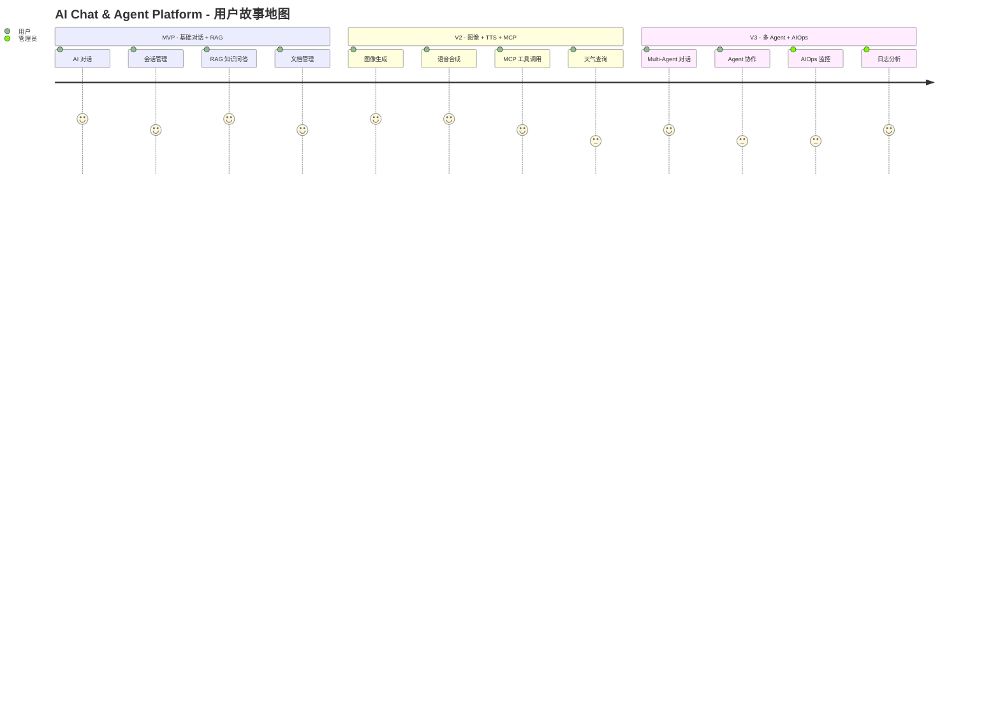
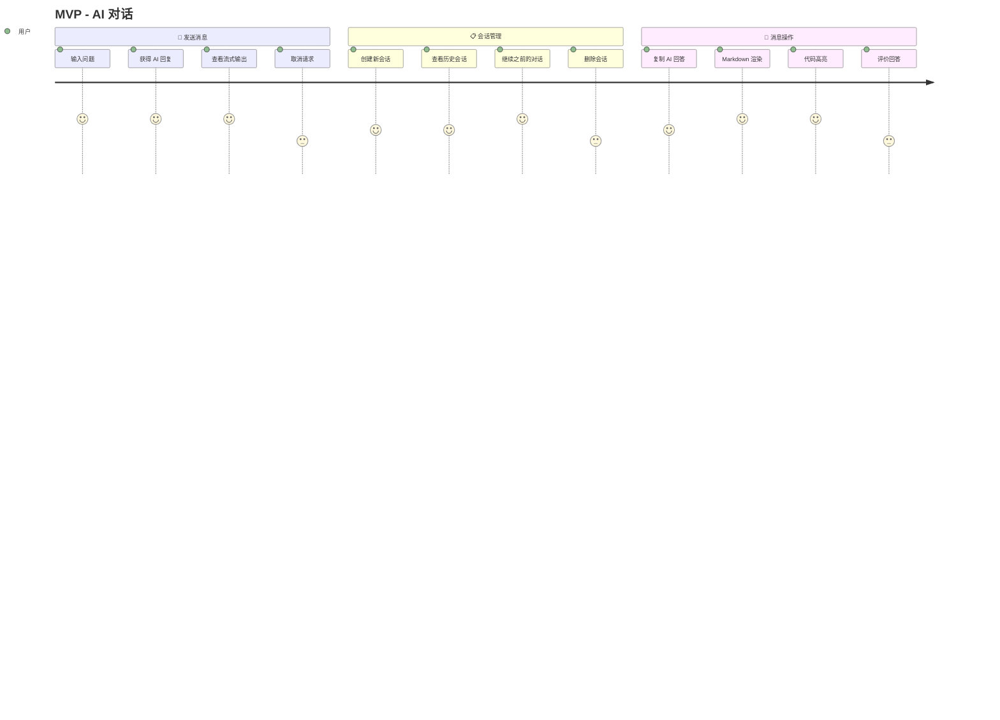
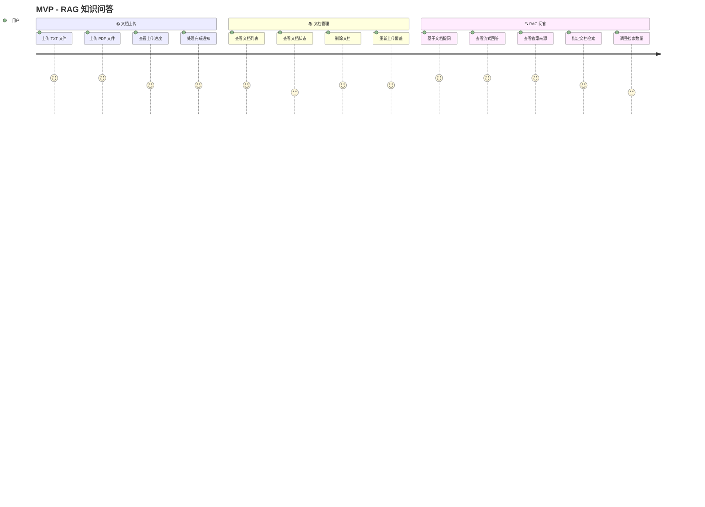
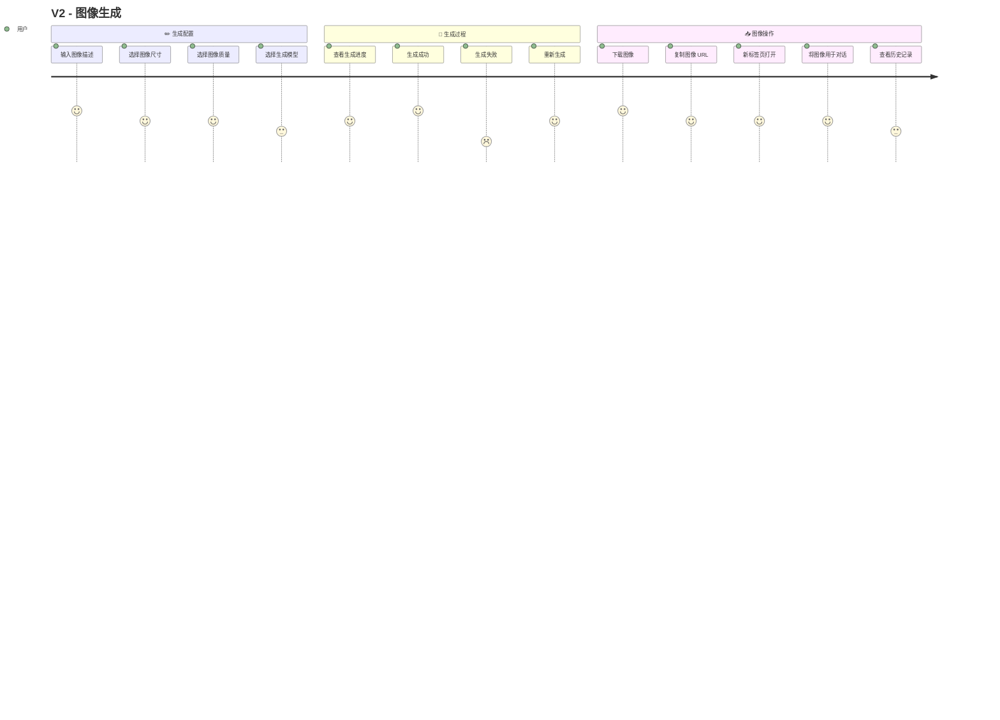
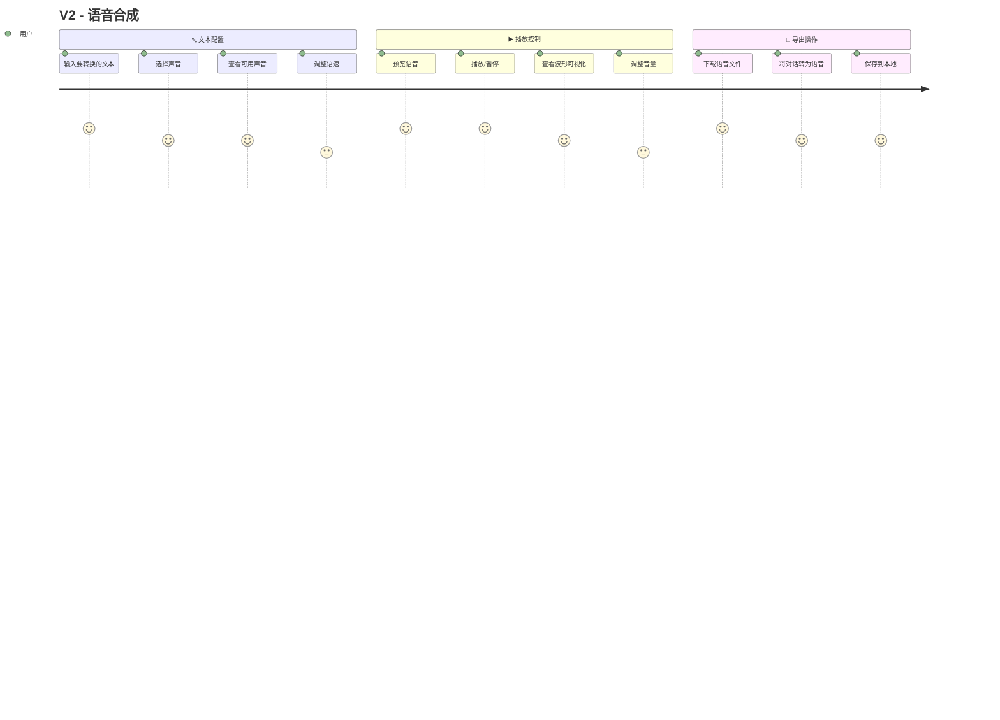
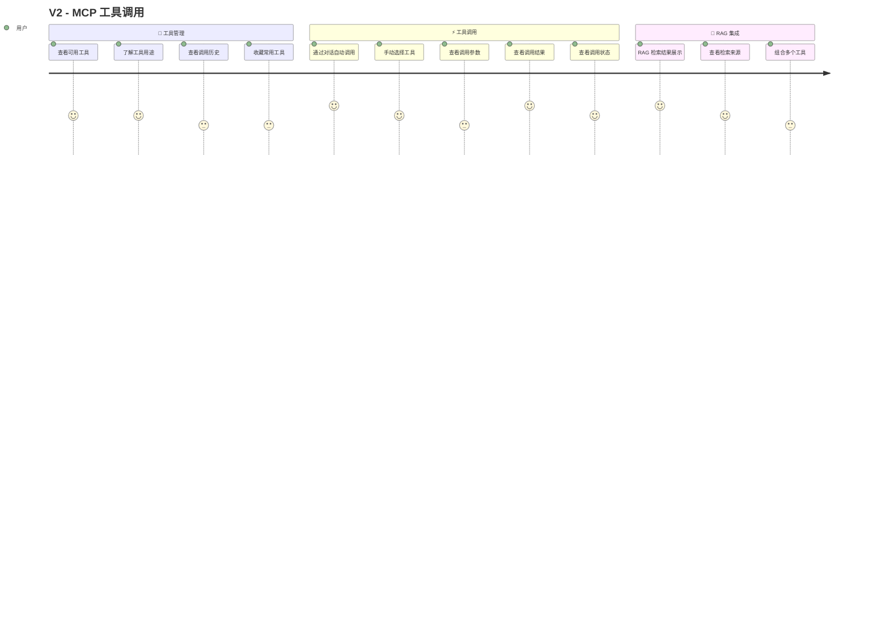

---

## title: AI Chat & Agent Platform - 用户故事地图

## 用户故事地图概览

### 发布计划与用户活动

---

## MVP - 基础对话 + RAG

### 1. AI 对话

### 2. RAG 知识问答

---

## V2 - 图像 + TTS + MCP

### 3. 图像生成

### 4. 语音合成

### 5. MCP 工具调用

---

## V3 - 多 Agent + AIOps

### 6. Multi-Agent 对话

### 7. AIOps 智能运维

---

## 用户角色与故事对照

| 角色       | 用户故事数量               | 优先级   |
| -------- | -------------------- | ----- |
| **最终用户** | 基础对话、RAG 问答、图像生成、TTS | P0-P1 |
| **开发者**  | MCP 工具调用、API 集成      | P1    |
| **管理员**  | AIOps 监控、日志分析        | P2    |

---

## 发布版本功能对照

| 版本      | 交付内容                | 故事数量 |
| ------- | ------------------- | ---- |
| **MVP** | AI 对话 + RAG 知识问答    | ~25  |
| **V2**  | 图像生成 + TTS + MCP 工具 | ~25  |
| **V3**  | Multi-Agent + AIOps | ~20  |

---

## 参考

- [Mermaid User Journey Syntax](https://mermaid.ai/open-source/syntax/userJourney.html)
- [User Story Mapping - Jeff Patton](https://www.jpattonassociates.com/user-story-mapping/)

