# 用户故事地图

> 反映平台实际交付状态：已交付 (Delivered) / 进行中 (In Progress) / 未来 (Future)

## 发布计划概览

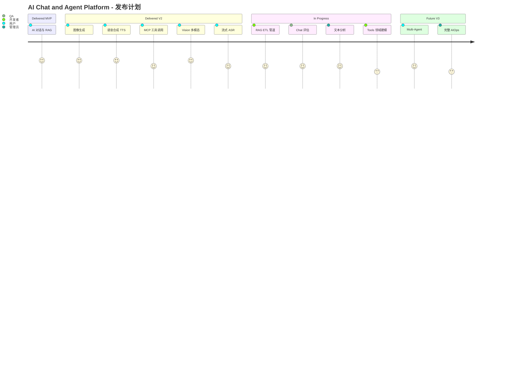
```mermaid
journey
    title AI Chat and Agent Platform - 发布计划
    section Delivered MVP
        AI 对话与 RAG: 5: 用户
    section Delivered V2
        图像生成: 5: 用户
        语音合成 TTS: 5: 用户
        MCP 工具调用: 4: 用户
        Vision 多模态: 5: 用户
        流式 ASR: 4: 用户
    section In Progress
        RAG ETL 管道: 4: 开发者
        Chat 评估: 4: QA
        文本分析: 4: 管理员
        Tools 领域建模: 3: 开发者
    section Future V3
        Multi-Agent: 4: 用户
        完整 AIOps: 3: 管理员
```

---

## Delivered - MVP：基础对话 + RAG

### 1. AI 对话（已交付）

**用户故事**

**As a** 最终用户  
**I want** 与 AI 助手进行流式对话  
**So that** 我可以快速获得智能回答

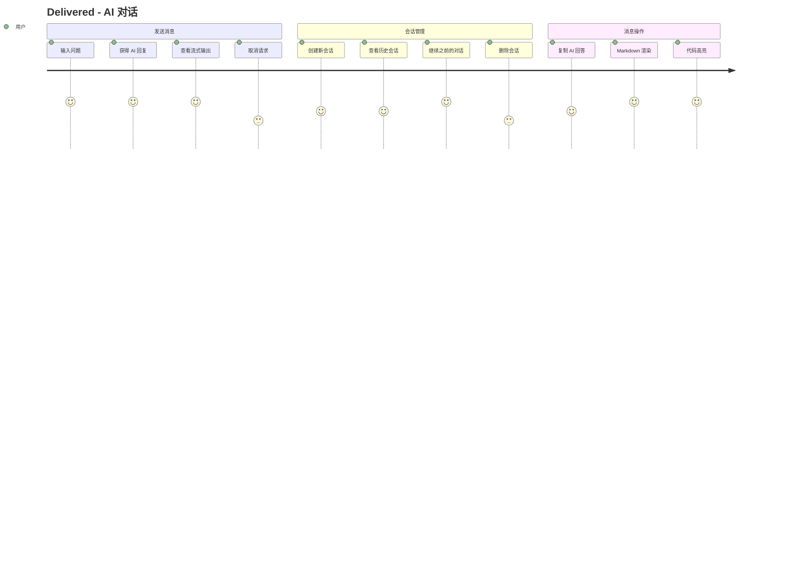
```mermaid
journey
    title Delivered - AI 对话
    section 发送消息
        输入问题: 5: 用户
        获得 AI 回复: 5: 用户
        查看流式输出: 5: 用户
        取消请求: 3: 用户
    section 会话管理
        创建新会话: 4: 用户
        查看历史会话: 4: 用户
        继续之前的对话: 5: 用户
        删除会话: 3: 用户
    section 消息操作
        复制 AI 回答: 4: 用户
        Markdown 渲染: 5: 用户
        代码高亮: 5: 用户
```

**API**: `POST /api/chat`, `GET /api/sessions`  
**实现**: `ChatController`, `ChatFacade`, `SpringAiChatUseCase`

---

### 1.1 Provider/Model 选择（已交付）

**用户故事**

**As a** 最终用户  
**I want** 进入 Chat 页时看到可用的 Provider 与 Model 列表  
**So that** 我可以选择模型且无错误提示

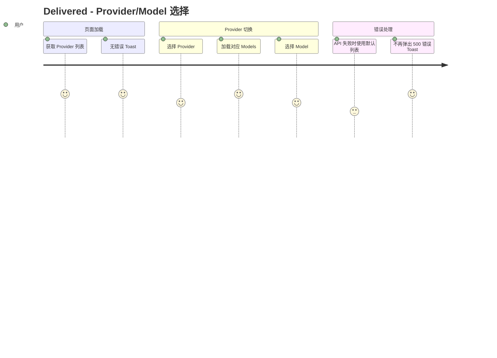
```mermaid
journey
    title Delivered - Provider/Model 选择
    section 页面加载
        获取 Provider 列表: 5: 用户
        无错误 Toast: 5: 用户
    section Provider 切换
        选择 Provider: 4: 用户
        加载对应 Models: 5: 用户
        选择 Model: 4: 用户
    section 错误处理
        API 失败时使用默认列表: 3: 用户
        不再弹出 500 错误 Toast: 5: 用户
```

**Acceptance Criteria**

- **GIVEN** 用户打开 `/chat` 页面 **WHEN** 前端请求 `GET /api/text/providers` **THEN** 返回 200 及 Provider 列表
- **GIVEN** 用户选择 openai Provider **WHEN** 请求 `GET /api/text/models?provider=openai` **THEN** 返回含 `deepseek-v4-flash` 的 models 数组
- **GIVEN** 后端已部署修复版本 **WHEN** 访问生产 Chat 页 **THEN** 不出现 "A server error occurred" Toast

**API**: `GET /api/text/providers`, `GET /api/text/models?provider=`  
**实现**: `TextController`, `TextProviderCatalog`  
**Jira**: [AI-97](https://felixzhu.atlassian.net/browse/AI-97)

---

### 1.2 多轮对话与自动标题（已交付）

**用户故事**

**As a** 最终用户  
**I want** 在同一会话中连续对话并由系统自动生成会话标题  
**So that** 我可以记住上下文并在侧边栏快速找到历史会话

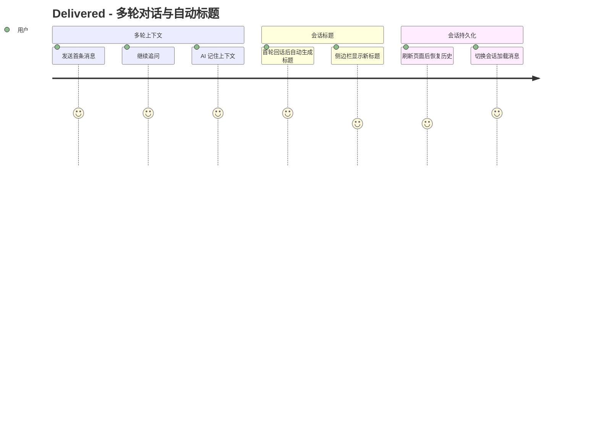
```mermaid
journey
    title Delivered - 多轮对话与自动标题
    section 多轮上下文
        发送首条消息: 5: 用户
        继续追问: 5: 用户
        AI 记住上下文: 5: 用户
    section 会话标题
        首轮回话后自动生成标题: 5: 用户
        侧边栏显示新标题: 4: 用户
    section 会话持久化
        刷新页面后恢复历史: 4: 用户
        切换会话加载消息: 5: 用户
```

**Acceptance Criteria**

- **GIVEN** 用户在同一会话发送 "My name is Felix" **WHEN** 继续问 "What is my name?" **THEN** AI 回答包含 Felix
- **GIVEN** 用户完成首轮回话 **WHEN** 后端异步生成标题 **THEN** 会话标题不再是默认 "New Chat"
- **GIVEN** 用户打开 Chat 页 **WHEN** 页面初始化 **THEN** 不会重复创建空会话
- **GIVEN** 用户发送消息 **WHEN** 消息保存到后端 **THEN** 内容不含 `undefined` 前缀

**API**: `POST /api/text/chat/stream` (含 `session_id`), `GET /api/sessions`, `GET /api/sessions/{id}/messages`, `GET /api/health`  
**实现**: `SpringAiChatUseCase`, `SessionTitleGenerator`, `ChatService`, `TextController`, `ChatController`  
**Jira**: [AI-101](https://felixzhu.atlassian.net/browse/AI-101)

---

### 2. RAG 知识问答（已交付）

**用户故事**

**As a** 最终用户  
**I want** 上传文档并基于文档内容提问  
**So that** AI 回答有据可查

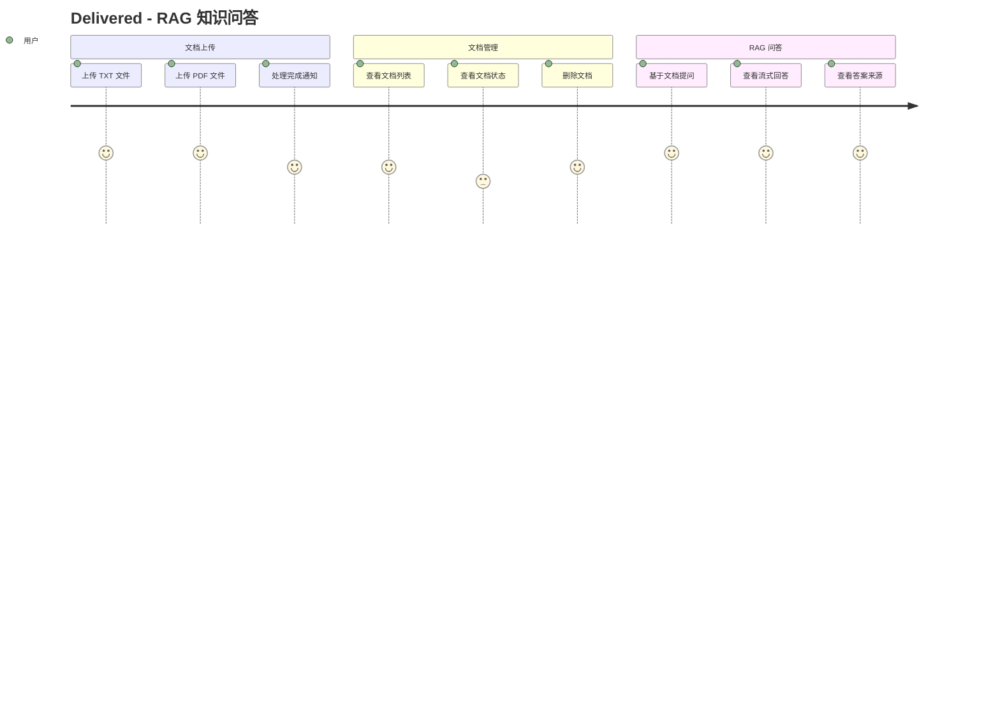
```mermaid
journey
    title Delivered - RAG 知识问答
    section 文档上传
        上传 TXT 文件: 5: 用户
        上传 PDF 文件: 5: 用户
        处理完成通知: 4: 用户
    section 文档管理
        查看文档列表: 4: 用户
        查看文档状态: 3: 用户
        删除文档: 4: 用户
    section RAG 问答
        基于文档提问: 5: 用户
        查看流式回答: 5: 用户
        查看答案来源: 5: 用户
```

**API**: `POST /api/rag/documents/upload`, `POST /api/rag/chat/stream` (字段 `query`)  
**实现**: `RagController`, `RagApplicationService`, `RagChatUseCase`

---

## Delivered - V2：多媒体 + 工具

### 3. 图像生成（已交付）

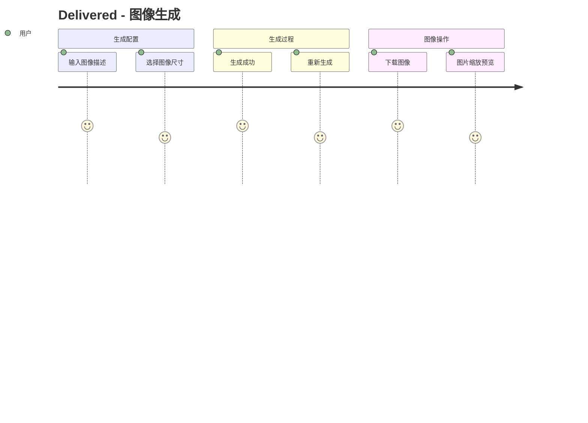
```mermaid
journey
    title Delivered - 图像生成
    section 生成配置
        输入图像描述: 5: 用户
        选择图像尺寸: 4: 用户
    section 生成过程
        生成成功: 5: 用户
        重新生成: 4: 用户
    section 图像操作
        下载图像: 5: 用户
        图片缩放预览: 4: 用户
```

**API**: `POST /api/image/generate`  
**路由**: `/chat/image`  
**实现**: `ImageController`, `ImageFacade`

---

### 4. 语音合成 TTS（已交付）

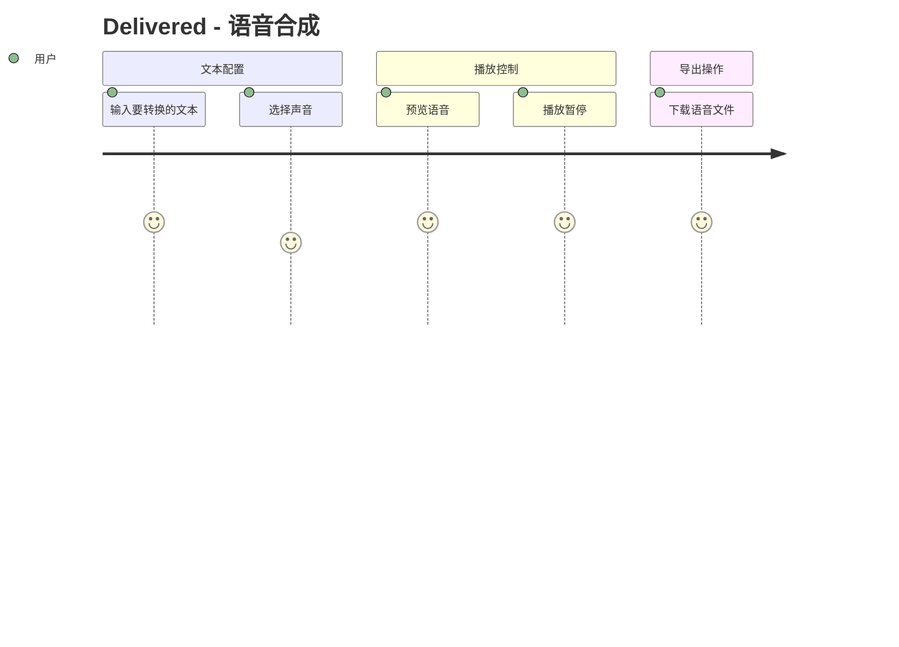
```mermaid
journey
    title Delivered - 语音合成
    section 文本配置
        输入要转换的文本: 5: 用户
        选择声音: 4: 用户
    section 播放控制
        预览语音: 5: 用户
        播放暂停: 5: 用户
    section 导出操作
        下载语音文件: 5: 用户
```

**API**: `POST /api/audio/tts`  
**路由**: `/chat/tts`  
**实现**: `AudioController`, `AudioFacade`

---

### 5. MCP 工具调用（已交付）

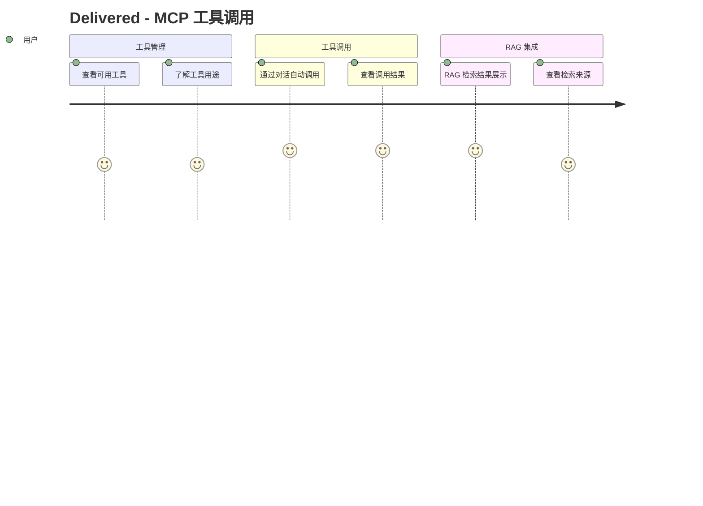
```mermaid
journey
    title Delivered - MCP 工具调用
    section 工具管理
        查看可用工具: 4: 用户
        了解工具用途: 4: 用户
    section 工具调用
        通过对话自动调用: 5: 用户
        查看调用结果: 5: 用户
    section RAG 集成
        RAG 检索结果展示: 5: 用户
        查看检索来源: 4: 用户
```

**API**: `/api/mcp/*`, `/api/mcp-client/*`  
**实现**: `McpController`, `McpClientController`, `McpFacade`

---

### 6. Vision 多模态 RAG（已交付）

**用户故事**

**As a** 最终用户  
**I want** 上传图片并结合文档进行问答  
**So that** 我可以分析图表、截图等视觉内容

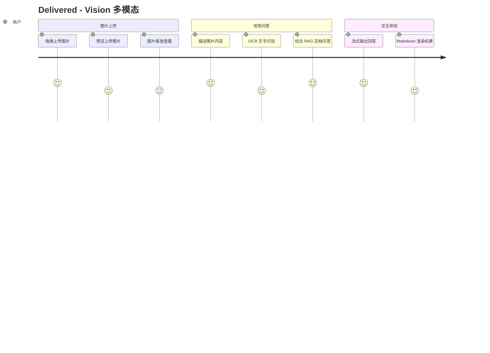
```mermaid
journey
    title Delivered - Vision 多模态
    section 图片上传
        拖拽上传图片: 5: 用户
        预览上传图片: 4: 用户
        图片缩放查看: 4: 用户
    section 视觉问答
        描述图片内容: 5: 用户
        OCR 文字识别: 4: 用户
        结合 RAG 文档问答: 5: 用户
    section 交互体验
        流式输出回答: 5: 用户
        Markdown 渲染结果: 4: 用户
```

**API**: `POST /api/rag/chat/stream` (含 `images` 字段)  
**路由**: `/vision`  
**实现**: `VisionChatUseCase`, Ollama qwen3.5

---

### 7. 流式 ASR 语音识别（已交付）

**用户故事**

**As a** 最终用户  
**I want** 通过麦克风实时转写语音为文字  
**So that** 我可以用语音输入与 AI 交互

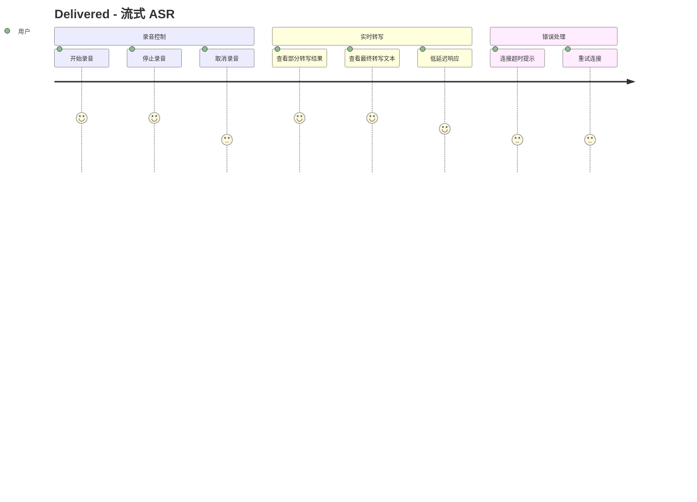
```mermaid
journey
    title Delivered - 流式 ASR
    section 录音控制
        开始录音: 5: 用户
        停止录音: 5: 用户
        取消录音: 3: 用户
    section 实时转写
        查看部分转写结果: 5: 用户
        查看最终转写文本: 5: 用户
        低延迟响应: 4: 用户
    section 错误处理
        连接超时提示: 3: 用户
        重试连接: 3: 用户
```

**API**: WebSocket `/ws/audio/transcribe`  
**实现**: `AudioTranscriptionWebSocketHandler`, `StreamingTranscriptionUseCase`, whisper.cpp `:8178`

---

## In Progress - 进行中

### 8. RAG ETL 管道

**用户故事**

**As a** 平台工程师  
**I want** 通过可插拔的 ETL 端口处理不同格式文档  
**So that** 新增文档类型时无需修改应用层代码

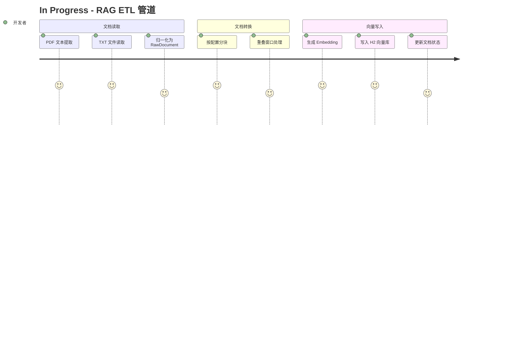
```mermaid
journey
    title In Progress - RAG ETL 管道
    section 文档读取
        PDF 文本提取: 5: 开发者
        TXT 文件读取: 5: 开发者
        归一化为 RawDocument: 4: 开发者
    section 文档转换
        按配置分块: 5: 开发者
        重叠窗口处理: 4: 开发者
    section 向量写入
        生成 Embedding: 5: 开发者
        写入 H2 向量库: 5: 开发者
        更新文档状态: 4: 开发者
```

**实现**: `DocumentReader`, `DocumentTransformer`, `DocumentWriter` ports → `PdfAndTextDocumentReader`, `ChunkingDocumentTransformer`, `EmbeddingDocumentWriter`

**Acceptance Criteria**

- **GIVEN** 用户上传 PDF 或 TXT 文件  
  **WHEN** 文档处理完成  
  **THEN** 文档状态变为 READY 且 chunkCount > 0

- **GIVEN** ETL 管道配置了 chunk size 500  
  **WHEN** 大文档被处理  
  **THEN** 生成多个 DocumentChunk 并写入向量库

---

### 9. Chat Evaluation 质量评估

**用户故事**

**As a** QA 工程师  
**I want** 自动评估 AI 回答的质量  
**So that** 我可以量化对话效果并持续改进

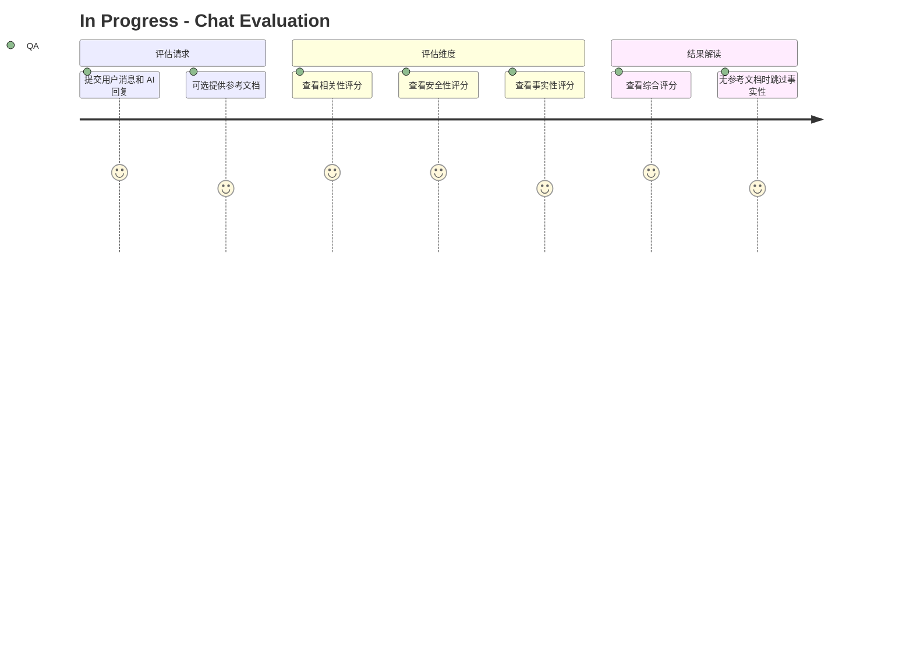
```mermaid
journey
    title In Progress - Chat Evaluation
    section 评估请求
        提交用户消息和 AI 回复: 5: QA
        可选提供参考文档: 4: QA
    section 评估维度
        查看相关性评分: 5: QA
        查看安全性评分: 5: QA
        查看事实性评分: 4: QA
    section 结果解读
        查看综合评分: 5: QA
        无参考文档时跳过事实性: 4: QA
```

**API**: `POST /api/eval/chat` (API-only，前端未接入)  
**实现**: `EvalController`, `ChatQualityEvaluator`

**Acceptance Criteria**

- **GIVEN** 评估请求包含 userMessage 和 assistantMessage  
  **WHEN** 调用 `/api/eval/chat`  
  **THEN** 返回 overallScore 及各维度评分

- **GIVEN** 请求未包含 referenceDocuments  
  **WHEN** 评估完成  
  **THEN** factuality 维度被跳过且 factualityAvailable 为 false

---

### 10. 文本分析

**用户故事**

**As a** 管理员  
**I want** 对文本进行结构化情感分析  
**So that** 我可以了解用户反馈的情绪倾向

```mermaid
journey
    title In Progress - 文本分析
    section 分析请求
        提交待分析文本: 5: 管理员
        指定语言提示: 4: 管理员
    section 分析结果
        查看情感分类: 5: 管理员
        查看结构化输出: 4: 管理员
    section 错误处理
        空文本返回 400: 3: 管理员
```

**API**: `POST /api/chat/analyze`  
**实现**: `AnalysisController`, `AnalysisFacade`, `TextAnalysis`

---

### 11. Tools 天气查询（DDD 领域建模）

**用户故事**

**As a** 开发者  
**I want** 通过充血领域模型封装天气查询逻辑  
**So that** 工具调用遵循 DDD 最佳实践

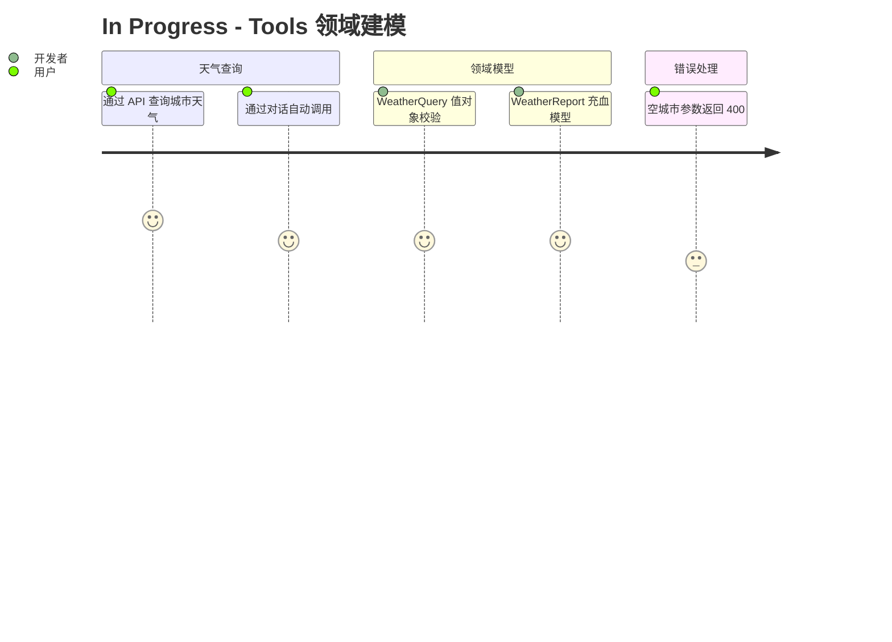
```mermaid
journey
    title In Progress - Tools 领域建模
    section 天气查询
        通过 API 查询城市天气: 5: 用户
        通过对话自动调用: 4: 用户
    section 领域模型
        WeatherQuery 值对象校验: 4: 开发者
        WeatherReport 充血模型: 4: 开发者
    section 错误处理
        空城市参数返回 400: 3: 用户
```

**API**: `GET /api/tools/weather?city=Beijing`  
**实现**: `ToolsController`, `ToolsFacade`, `WeatherReport`, `WeatherQuery`

---

## Future - V3：Multi-Agent + AIOps

### 12. Multi-Agent 对话（规划中）

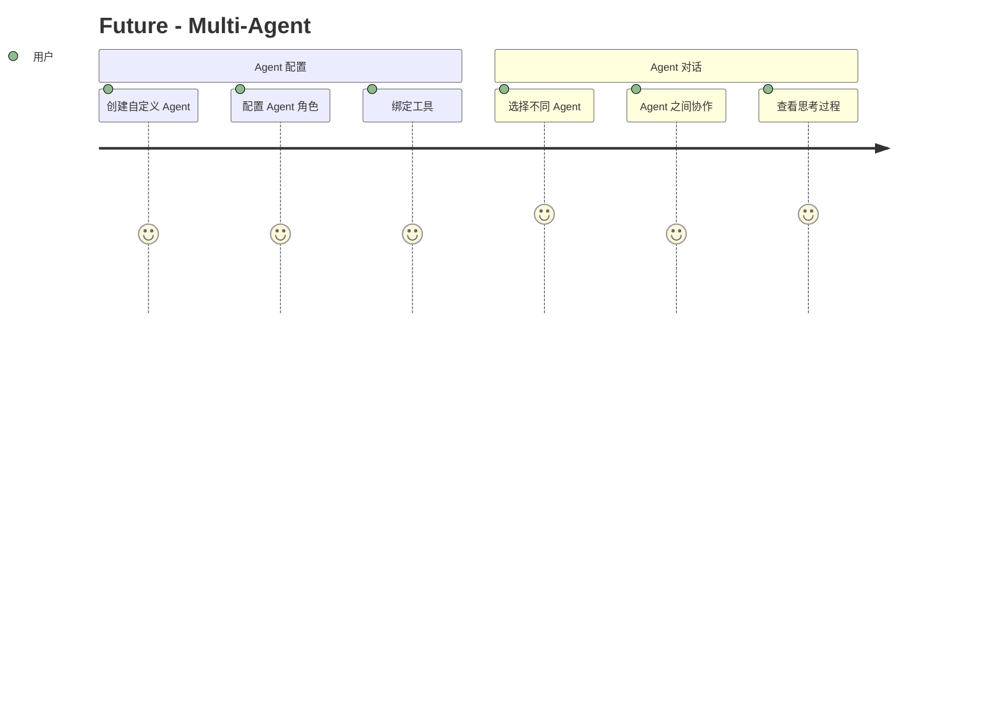
```mermaid
journey
    title Future - Multi-Agent
    section Agent 配置
        创建自定义 Agent: 4: 用户
        配置 Agent 角色: 4: 用户
        绑定工具: 4: 用户
    section Agent 对话
        选择不同 Agent: 5: 用户
        Agent 之间协作: 4: 用户
        查看思考过程: 5: 用户
```

---

### 13. AIOps 智能运维（规划中）

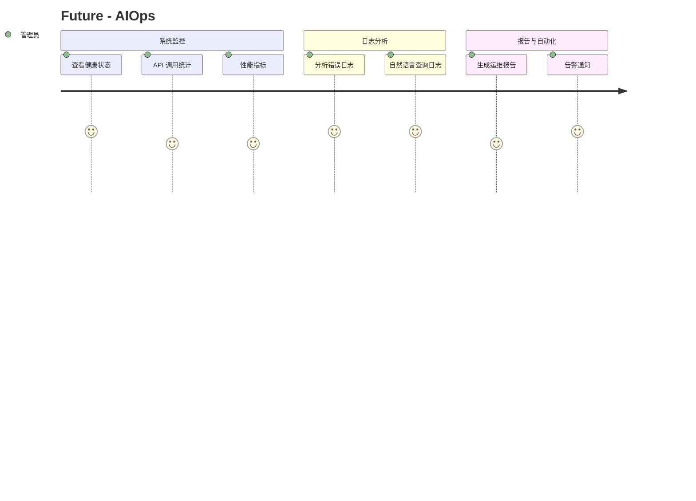
```mermaid
journey
    title Future - AIOps
    section 系统监控
        查看健康状态: 5: 管理员
        API 调用统计: 4: 管理员
        性能指标: 4: 管理员
    section 日志分析
        分析错误日志: 5: 管理员
        自然语言查询日志: 5: 管理员
    section 报告与自动化
        生成运维报告: 4: 管理员
        告警通知: 5: 管理员
```

> 注：文本分析 (`/api/chat/analyze`) 为 AIOps 的部分能力，完整监控与告警尚未实现。

---

## 用户角色与故事对照

| 角色 | 覆盖能力 | 优先级 |
|------|----------|--------|
| **最终用户** | 对话、Provider/Model 选择、RAG、图像、TTS、Vision、ASR | P0 |
| **开发者** | MCP、Tools API、RAG ETL ports | P1 |
| **QA 工程师** | Chat Evaluation API | P1 |
| **管理员** | 文本分析、未来 AIOps | P2 |

---

## 发布版本功能对照

| 阶段 | 状态 | 交付内容 | 故事数 |
|------|------|----------|--------|
| **MVP** | Delivered | AI 对话 + Provider/Model 选择 + RAG 知识问答 | ~21 |
| **V2** | Delivered | 图像 + TTS + MCP + Vision + ASR | ~25 |
| **In Progress** | 进行中 | ETL 管道 + Eval + 文本分析 + Tools DDD | ~15 |
| **V3** | Planned | Multi-Agent + 完整 AIOps | ~15 |

---

## Spring AI 能力补齐（In Progress）

Epic: [AI-102 Spring AI 能力补齐](https://felixzhu.atlassian.net/browse/AI-102)

| Jira | 故事 | SP | 状态 |
|------|------|----|------|
| [AI-103](https://felixzhu.atlassian.net/browse/AI-103) | 运行时 Provider/Model 切换 | 5 | 已交付 |
| [AI-104](https://felixzhu.atlassian.net/browse/AI-104) | 统一 ChatClient 与 Memory Advisor | 5 | 已交付 |
| [AI-105](https://felixzhu.atlassian.net/browse/AI-105) | JdbcChatMemory 消息持久化 | 8 | 已交付 |
| [AI-106](https://felixzhu.atlassian.net/browse/AI-106) | 主 Chat Tool Calling | 5 | 已交付 |
| [AI-107](https://felixzhu.atlassian.net/browse/AI-107) | Structured Output 增强 | 3 | 已交付 |
| [AI-108](https://felixzhu.atlassian.net/browse/AI-108) | VectorStore + RAG Advisor | 8 | 已交付 |
| [AI-109](https://felixzhu.atlassian.net/browse/AI-109) | Observability Advisors | 2 | 已交付 |
| [AI-110](https://felixzhu.atlassian.net/browse/AI-110) | spring-ai-test 与 Anthropic Provider | 5 | 已交付 |

**实现要点**

- `ChatModelResolver` + `TextChatOptions`：前端 provider/model/tools 请求参数生效
- `ChatClientFactory`：`MessageChatMemoryAdvisor` + 可选 `SimpleLoggerAdvisor` + 条件 Tool 注册
- `JdbcChatMemoryRepository` + `JdbcChatSessionMetadataRepository`：会话元数据与消息持久化
- `ChatMemorySessionBridge`：ChatMemory 与领域 `ChatSession` 同步
- 主 Chat 流式接口支持 `tools_enabled`（前端 Tools 开关）
- `SessionTitleGenerator` / `ChatQualityEvaluator`：Native Structured Output + schema 校验
- `H2DocumentVectorStore` + `RetrievalAugmentationAdvisor`：RAG 走 Spring AI Advisor 路径
- 可选 Anthropic Provider（`spring.ai.anthropic.api-key`）

---

## 参考

- [Mermaid User Journey Syntax](https://mermaid.ai/open-source/syntax/userJourney.html)
- [User Story Mapping - Jeff Patton](https://www.jpattonassociates.com/user-story-mapping/)
- [C4 模型文档](./c4/README.md)
- [沃德利地图](./Wardley-Map.md)
- [API 文档](./api.md)
