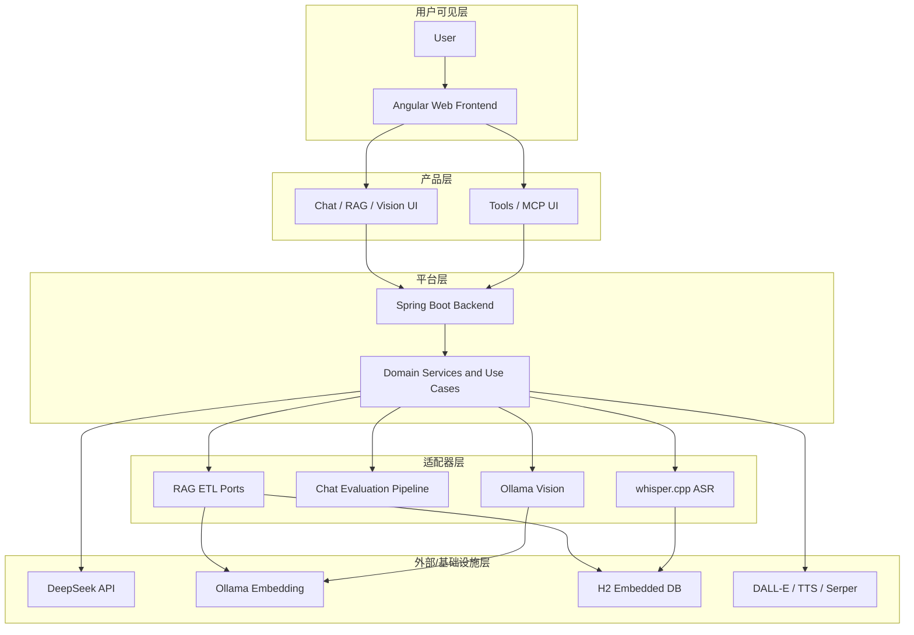
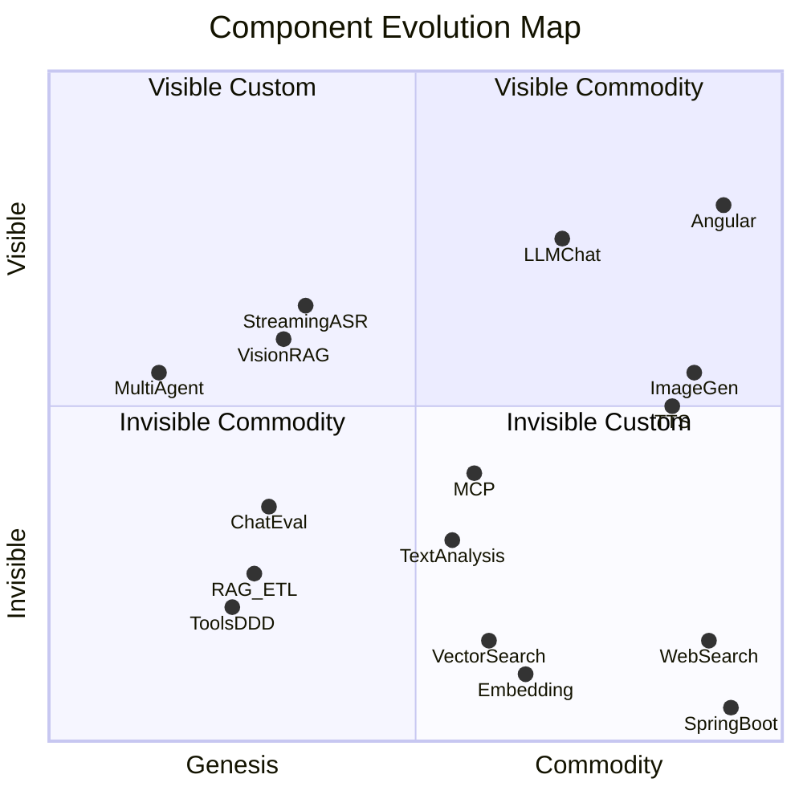

# 沃德利地图 (Wardley Map)

> 基于 Simon Wardley 战略地图方法论，描述 AI Chat & Agent Platform 各组件在价值链上的位置与演化阶段。

## 价值链概览

从用户可见性（Y 轴）到基础设施（底层），平台由以下层次构成：

```
用户 → Web Frontend → REST/SSE/WebSocket API → Domain Services → AI Adapters → External APIs
```



---

## 演化阶段矩阵

X 轴：Genesis（创世）→ Custom Built（定制）→ Product（产品）→ Commodity（商品）

| 组件 | 演化阶段 | 说明 | 策略 |
|------|----------|------|------|
| Multi-Agent 编排 | Genesis | V3 目标，尚未实现 | **Invest** — 差异化方向 |
| Chat Evaluation (LLM-as-Judge) | Custom Built | `/api/eval/chat`，PR #201 | **Invest** — 质量可观测性 |
| RAG ETL Pipeline (ports) | Custom Built | DocumentReader/Transformer/Writer | **Invest** — 可扩展文档管道 |
| Vision RAG (Ollama multimodal) | Custom Built | VisionChatUseCase + qwen3.5 | **Invest** — 本地多模态 |
| Streaming ASR (whisper.cpp) | Custom Built | WebSocket 流式转录 | **Invest** — 低延迟本地 ASR |
| Tools DDD (Weather domain) | Custom Built | WeatherReport 充血模型 | **Invest** — 领域建模示范 |
| Text Analysis (structured output) | Product | AnalysisFacade + Spring AI | **Leverage** — 框架能力 |
| RAG 向量检索 | Product | H2VectorAdapter / pgvector | **Leverage** — 成熟方案 |
| LLM Chat (DeepSeek) | Product | Spring AI ChatClient | **Leverage** — 托管 API |
| Embedding (Ollama) | Product | mxbai-embed-large 1024 维 | **Leverage** — 开源本地模型 |
| MCP 协议集成 | Product | Spring AI MCP Server/Client | **Leverage** — 标准协议 |
| TTS | Commodity | OpenAI gpt-4o-mini-tts | **Outsource** — 按需接入 |
| Image Generation | Commodity | DALL-E 3 | **Outsource** — 非核心 |
| Web Search | Commodity | Serper.dev API | **Outsource** — 信息检索 |
| Angular / Spring Boot | Commodity | 框架与运行时 | **Outsource** — 直接使用 |
| H2 Database | Commodity | 嵌入式默认存储 | **Leverage** — 零运维开发 |

---

## 演化可视化



---

## 战略洞察

### Invest（投资自研）

构建平台差异化能力的组件：

1. **RAG ETL Ports** — 通过 `DocumentReader` / `DocumentTransformer` / `DocumentWriter` 抽象，支持 PDF/TXT 等多格式扩展，保持应用层与基础设施解耦。
2. **Chat Evaluation Pipeline** — LLM-as-a-Judge 质量评估，支持可选 `referenceDocuments` 与 factuality 跳过，为 QA 和持续改进提供可观测性。
3. **Vision + ASR 本地栈** — Ollama qwen3.5 多模态 + whisper.cpp 流式 ASR，降低对外部 API 依赖，保护数据隐私。

### Leverage（借力框架）

减少自研 LLM 基础设施，聚焦业务逻辑：

- **Spring AI 2.0** — ChatClient、Structured Output、MCP、Tool Calling
- **DeepSeek API** — 主力 LLM (deepseek-v4-flash)
- **Ollama** — 本地 Embedding (mxbai-embed-large) 与 Vision
- **H2 + Liquibase** — 零 Docker 开发体验

### Outsource（外包 commodity）

非核心能力直接接入成熟服务：

- **DALL-E 3** — 图像生成
- **OpenAI TTS** — 语音合成
- **Serper.dev** — Web 搜索

---

## 与 C4 模型对照

| 沃德利组件 | C4 子域 | 关键类 |
|-----------|---------|--------|
| RAG ETL Pipeline | RAG Domain | `DocumentUploadService`, ETL ports |
| Chat Evaluation | Eval Domain | `ChatQualityEvaluator`, `EvalController` |
| Vision RAG | RAG Domain | `VisionChatUseCase` |
| Streaming ASR | Audio Domain | `StreamingTranscriptionUseCase`, `WhisperCppTranscriptionAdapter` |
| Tools DDD | Tools Domain | `WeatherReport`, `ToolsFacade` |
| Text Analysis | Analysis Domain | `AnalysisFacade`, `TextAnalysis` |
| Vector Search | RAG Infrastructure | `H2VectorAdapter` |
| MCP Integration | MCP Server/Client | `McpFacade`, `AiMcpServerService` |

---

## 参考

- [Wardley Maps - Simon Wardley](https://wardleymaps.com/)
- [On Wardley Maps - Medium](https://medium.com/wardleymaps)
- [C4 模型文档](./c4/README.md)
- [用户故事地图](./User-Story-Map.md)
