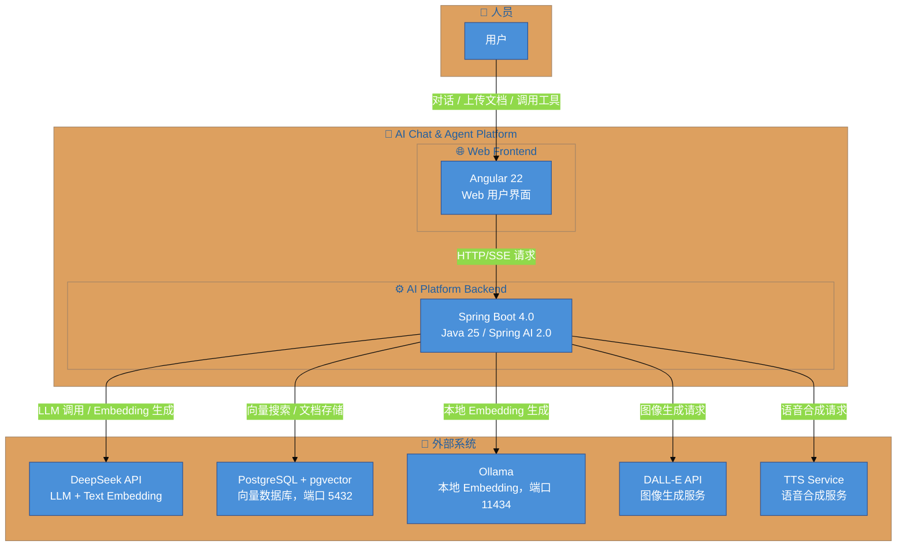
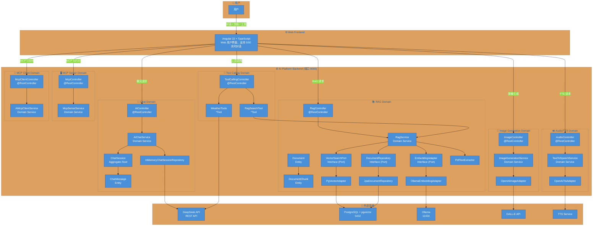
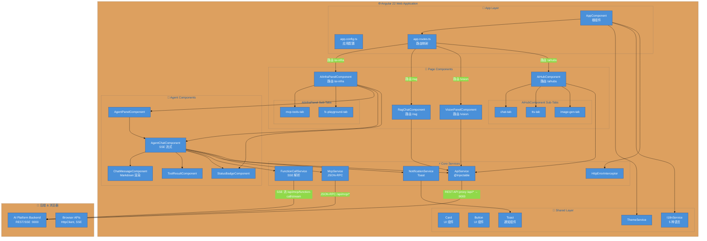
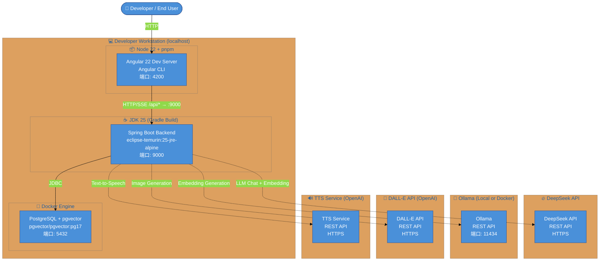

## C1 系统上下文图

**描述**: 系统与用户、外部系统的交互关系

## C2 容器图

**描述**: 后端的 7 个子域容器

## C3 组件图 - 后端 (Spring Boot)

**描述**: 后端三层架构 (Interface / Domain / Infrastructure)

```mermaid
%%{init: {'theme': 'base', 'themeVariables': {'primaryColor': '#4A90D9', 'primaryTextColor': '#fff', 'primaryBorderColor': '#2E5090'}}}%%
flowchart TB
    subgraph BACKEND["⚙️ AI Platform Backend (Spring Boot 4.0 / Java 25 / Spring AI 2.0)"]
        direction LR
        
        subgraph IFACE["📥 Interface Layer (adapter/in)"]
            AI_CTRL["AiController\n@RestController"]
            RAG_CTRL["RagController\n@RestController"]
            TOOL_CTRL["ToolCallingController\n@RestController"]
            IMG_CTRL["ImageController\n@RestController"]
            AUD_CTRL["AudioController\n@RestController"]
            MCP_CTRL["McpController\n@RestController"]
            MCP_CLI_CTRL["McpClientController\n@RestController"]
            EX_HDLR["GlobalExceptionHandler\n@RestControllerAdvice"]
            
            subgraph DTOS["DTOs"]
                CHAT_REQ["ChatRequest"]
                CHAT_RESP["ChatResponse"]
                RAG_REQ["RagChatRequest"]
                RAG_RESP["RagChatResponse"]
                IMG_REQ["ImageGenerationRequest"]
                TTS_REQ["TtsRequest"]
            end
        end
        
        subgraph DOMAIN["🏛️ Domain Layer"]
            subgraph CHAT_D["💬 Chat Domain"]
                CHAT_SESSION["ChatSession\nAggregate Root"]
                CHAT_MSG["ChatMessage\nEntity"]
                AI_SVC["AiChatService\nDomain Service"]
            end
            
            subgraph RAG_D["📚 RAG Domain"]
                DOC["Document\nEntity"]
                DOC_CHUNK["DocumentChunk\nEntity"]
                RAG_SVC["RagService\nDomain Service"]
                LANG_DET["LanguageDetectionService"]
            end
            
            subgraph IMG_D["🎨 Image Domain"]
                IMG_SVC["ImageGenerationService"]
            end
            
            subgraph TTS_D["🔊 TTS Domain"]
                TTS_SVC["TextToSpeechService"]
            end
            
            subgraph MCP_D["📡 MCP Domain"]
                MCP_SRV_SVC["McpServerService"]
                MCP_CLI_SVC["AiMcpClientService"]
            end
            
            subgraph VO["📦 Value Objects"]
                SESSION_ID["ChatSessionId"]
                MSG_ID["MessageId"]
                DOC_ID["DocumentId"]
            end
            
            subgraph EXC["⚠️ Domain Exceptions"]
                AI_EXC["AiServiceException"]
                SESS_EXC["ChatSessionNotFoundException"]
                DOC_EXC["DocumentNotFoundException"]
            end
            
            subgraph PORTS["🔌 Domain Ports"]
                CHAT_REPO_PORT["ChatSessionRepository\nInterface"]
            end
        end
        
        subgraph INFRA["🔧 Infrastructure Layer (adapter/out)"]
            subgraph CFG["Configuration"]
                APP_CFG["ApplicationConfig"]
                PG_CFG["PostgresConfig"]
                OLLAMA_CFG["OllamaConfig"]
                CORS_CFG["WebCorsConfig"]
            end
            
            subgraph PERSIST["💾 Persistence"]
                IN_MEM_REPO["InMemoryChatSessionRepository"]
                JPA_REPO["JpaDocumentRepository"]
                DOC_ENTITY["DocumentEntity"]
                CHUNK_ENTITY["DocumentChunkEntity"]
            end
            
            subgraph AI_ADP["🤖 AI Adapters"]
                OLLAMA_ADP["OllamaEmbeddingAdapter"]
                MOCK_ADP["MockEmbeddingAdapter"]
                EMB_PORT["EmbeddingAdapter\nInterface"]
            end
            
            subgraph VEC_ADP["🔍 Vector Adapters"]
                PG_VEC_ADP["PgVectorAdapter"]
            end
            
            subgraph DOC_ADP["📄 Document Adapters"]
                PDF_EXT["PdfTextExtractor"]
            end
            
            subgraph IMG_ADP["🎨 Image Adapters"]
                OPENAI_IMG["OpenAiImageAdapter"]
            end
            
            subgraph TTS_ADP["🔊 TTS Adapters"]
                OPENAI_TTS["OpenAiTtsAdapter"]
            end
            
            subgraph TOOL_IMPL["🔧 Tool Implementations"]
                RAG_TOOL["RagSearchTool"]
                WEATHER["WeatherTools"]
            end
        end
    end

    subgraph EXTERNAL["🔌 外部系统"]
        DS_API["DeepSeek API"]
        PG_DB["PostgreSQL + pgvector"]
        OM_SVC["Ollama"]
        DALLE_API["DALL-E API"]
        TTS_API["TTS Service"]
    end

    %% Interface -> Domain
    AI_CTRL --> AI_SVC
    RAG_CTRL --> RAG_SVC
    TOOL_CTRL --> RAG_TOOL
    TOOL_CTRL --> WEATHER
    IMG_CTRL --> IMG_SVC
    AUD_CTRL --> TTS_SVC
    MCP_CTRL --> MCP_SRV_SVC
    MCP_CLI_CTRL --> MCP_CLI_SVC
    AI_CTRL --> EX_HDLR
    RAG_CTRL --> EX_HDLR

    %% Domain Internal
    AI_SVC --> CHAT_SESSION
    CHAT_SESSION --> CHAT_MSG
    AI_SVC --> CHAT_REPO_PORT
    CHAT_REPO_PORT --> IN_MEM_REPO
    
    RAG_SVC --> DOC
    DOC --> DOC_CHUNK
    RAG_SVC --> LANG_DET
    RAG_SVC --> EMB_PORT
    
    IMG_SVC --> OPENAI_IMG
    TTS_SVC --> OPENAI_TTS

    %% Infrastructure -> External
    IN_MEM_REPO --> DS_API
    OLLAMA_ADP --> OM_SVC
    PG_VEC_ADP --> PG_DB
    JPA_REPO --> PG_DB
    OPENAI_IMG --> DALLE_API
    OPENAI_TTS --> TTS_API
    WEATHER --> DS_API

    %% Tool -> Domain Service
    RAG_TOOL --> RAG_SVC
```

## C3 组件图 - 前端 (Angular 22)

**描述**: Angular 前端的组件层级结构

## C4 部署图

**描述**: 本地开发环境部署架构

## 部署端口汇总

| 服务 | 端口 | 技术栈 |
|------|------|--------|
| Spring Boot Backend | **9000** | Java 25 / Spring Boot 4.0 / Spring AI 2.0 |
| PostgreSQL + pgvector | 5432 | PostgreSQL 17 / pgvector |
| Ollama (Embedding) | 11434 | nomic-embed-text |
| Angular Dev Server | 4200 | Angular 22 + TypeScript |
| DeepSeek API | HTTPS | LLM + Text Embedding |
| DALL-E API | HTTPS | 图像生成 |
| TTS Service | HTTPS | 语音合成 |
