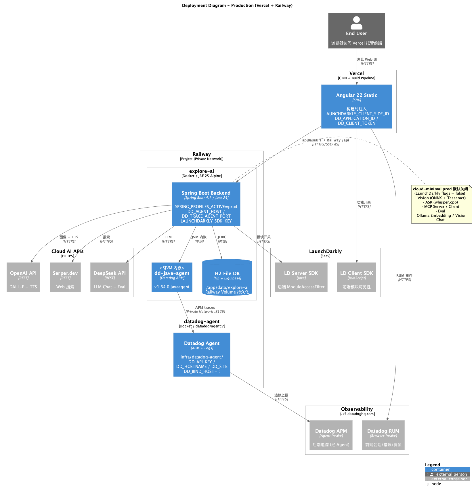

# C4 模型文档

使用 PlantUML 绘制的 C4 架构模型，描述 AI Chat & Agent Platform 的完整架构。

## 文件

| 文件 | 层级 | 说明 |
| --- | --- | --- |
| `C1-Context.puml` | C1 | 系统上下文图（含 LaunchDarkly、Datadog、cloud-minimal prod） |
| `C2-Container.puml` | C2 | 容器图（10 个子域 + 功能开关横切） |
| `C3-Component-Backend.puml` | C3 | 后端组件图（Clean Architecture 四层） |
| `C3-Component-Frontend.puml` | C3 | 前端组件图（路由守卫、分解 API 服务、RUM） |
| `C4-Deployment.puml` | C4 | 本地开发环境部署图（:4200 → :9000） |
| `C4-Deployment-Production.puml` | C4 | 生产部署图（Vercel + Railway explore-ai + datadog-agent + Datadog + LaunchDarkly） |

---

## C1 - 系统上下文图


---

## C2 - 容器图


---

## C3 - 后端组件图


---

## C3 - 前端组件图


---

## C4 - 部署图

### 本地开发


### 生产环境



---

## 技术栈

### 后端 (AI Platform Backend)

- **运行时**: Spring Boot 4.1 / Java 25 / Spring AI 2.0
- **架构**: Clean Architecture（`domain/repository/`，非 Hexagonal `domain/port/`）
- **端口**: dev **9000** / prod **8080** (Railway `PORT`)
- **子域**: Chat / RAG / Tools / Analysis / Eval / Image / Vision / Audio (TTS+ASR) / MCP Server / MCP Client
- **持久化**: H2 嵌入式（会话元数据 `JdbcChatSessionMetadataRepository` + 消息 `JdbcChatMemoryRepository` + 向量）
- **功能开关**: LaunchDarkly（`ModuleAccessFilter` + `FeatureFlagService`，4 个模块 flag）
- **可观测性**: Datadog APM（`dd-java-agent` v1.64.0 → Railway `datadog-agent` `:8126`；应用侧 `DD_AGENT_HOST`，Agent 侧 `DD_API_KEY`）。应用指标走 Micrometer/Prometheus（actuator），不上报 Datadog Metrics
- **外部服务 (cloud)**: DeepSeek API (LLM) / OpenAI API (DALL-E + TTS) / Serper.dev (Web 搜索)
- **本地服务 (dev / prod 默认关闭)**: Ollama / whisper.cpp / Tesseract / ONNX Vision

### Vision 子域（图像分析）

独立 `/vision` 页面，**不经过 Ollama**（受 `module-vision` flag 守卫）：

| 能力 | API | 适配器 | 依赖 |
| --- | --- | --- | --- |
| Caption | `POST /api/vision/caption` | `OnnxBlipCaptioner` | `models/blip_*.onnx` |
| Detect | `POST /api/vision/detect` | `OnnxYoloDetector` | `models/yolov8n.onnx` |
| OCR | `POST /api/vision/ocr` | `Tess4jOcrEngine` | Tesseract + `models/tessdata/` |
| Health | `GET /api/vision/health` | — | 各 Provider 就绪状态 |

> **区分**: **Image Analysis** (`/vision`, `/api/vision/*`) vs **Vision Chat** (RAG 流式多模态，Ollama qwen3.5)

### 前端 (Web Frontend)

- **框架**: Angular 22 + TypeScript
- **路由**: `/chat` / `/generate` (image, tts) / `/rag` + flag 守卫 `/vision` `/mcp` `/eval` `/asr`
- **API 服务**: `ApiChatService` / `ApiRagService` / `ApiMediaService` + `sse-client.ts`
- **功能开关**: `FeatureFlagService` + `moduleEnabledGuard`（LaunchDarkly Client SDK）
- **可观测性**: `datadog-rum.config.ts`（构建时注入 `DD_*` 环境变量）
- **端口**: dev 4200 (proxy `/api` → `:9000`) / prod Vercel 静态托管

### Chat 流式 API

| 端点 | 说明 |
| --- | --- |
| `POST /api/text/chat/stream` | SSE 流式对话（`TextController`） |
| `GET /api/text/providers` | 可用 LLM Provider |
| `GET /api/text/models` | 模型列表 |
| `POST /api/chat` | 非流式对话（`ChatController`） |
| `GET/POST /api/sessions` | 会话 CRUD |

---

## 部署拓扑

### 本地开发

```
Browser :4200 → Angular Dev Server → proxy /api/* → Spring Boot :9000
                                              ↘ H2 ./data/explore-ai
                                              ↘ Ollama :11434 / whisper :8178 / Tesseract
                                              ↘ DeepSeek / OpenAI / Serper
```

### 生产 (cloud-minimal)

```
Browser → Vercel (Angular static) → Railway explore-ai (:8080 + H2 + dd-java-agent v1.64.0)
        ↘ Datadog RUM (us5)              ↘ Private Network :8126 → datadog-agent → Datadog APM
        ↘ LaunchDarkly Client            ↘ LaunchDarkly Server
                                         → DeepSeek / OpenAI / Serper
```

**Prod API**: `https://explore-ai-production.up.railway.app/api`

**cloud-minimal 默认关闭** (LaunchDarkly flags = `false`): Vision, ASR, MCP, Eval, Ollama

---

## 部署端口汇总

| 服务 | 端口 / 说明 |
| --- | --- |
| Spring Boot Backend (dev) | **9000** |
| Spring Boot Backend (prod) | **8080** |
| H2 Embedded | 内嵌 (dev `./data` / prod `/app/data` volume) |
| Ollama (Embedding/RAG Vision) | 11434 [local] |
| whisper.cpp (ASR) | 8178 [local] |
| Tesseract OCR | 系统安装 (JNA) [local] |
| Vision ONNX Models | `models/` 本地文件 [local] |
| Angular Dev Server | 4200 |
| Vercel (prod frontend) | HTTPS |
| Railway explore-ai (prod backend) | HTTPS → :8080 |
| Railway datadog-agent | Private Network :8126（APM intake） |
| DeepSeek / OpenAI / Serper | HTTPS |
| LaunchDarkly / Datadog us5 | HTTPS |

---

## 功能开关 (LaunchDarkly)

| Flag Key | 模块 | 前端路由 | 后端路径前缀 |
| --- | --- | --- | --- |
| `module-vision` | Vision | `/vision` | `/api/vision` |
| `module-audio-asr` | ASR | `/asr` | `/ws/audio` |
| `module-mcp` | MCP | `/mcp` | `/api/mcp` |
| `module-eval` | Eval | `/eval` | `/api/eval` |

prod `featureFlagFallback` 默认全部为 `false`。

---

## 模型配置

| 用途 | 模型 | 维度/说明 |
| --- | --- | --- |
| LLM Chat | deepseek-v4-flash | DeepSeek API |
| Embedding | mxbai-embed-large | 1024 维 (Ollama, local) |
| Vision Chat (RAG) | qwen3.5 | Ollama 多模态对话 (local) |
| Caption | BLIP base ONNX | ONNX Runtime 本地 |
| Detect | YOLOv8n ONNX | COCO 80 类 |
| OCR | eng + chi_sim | Tesseract tessdata |
| ASR | whisper-base | whisper.cpp 本地 |
| Image Gen | dall-e-3 | OpenAI API |
| TTS | gpt-4o-mini-tts | OpenAI API |

---

## 查看与更新

- [PlantUML Online Editor](https://www.plantuml.com/plantuml/uml/)
- VS Code PlantUML 插件
- 重新生成 PNG：

```bash
cd docs/c4 && mkdir -p png && plantuml -o png *.puml
```

## 相关文档

- [领域术语表](../Domain-Glossary.md) — Ubiquitous Language 与代码映射
- [沃德利地图](../Wardley-Map.md)
- [用户故事地图](../User-Story-Map.md)
- [API 文档](../api.md)
