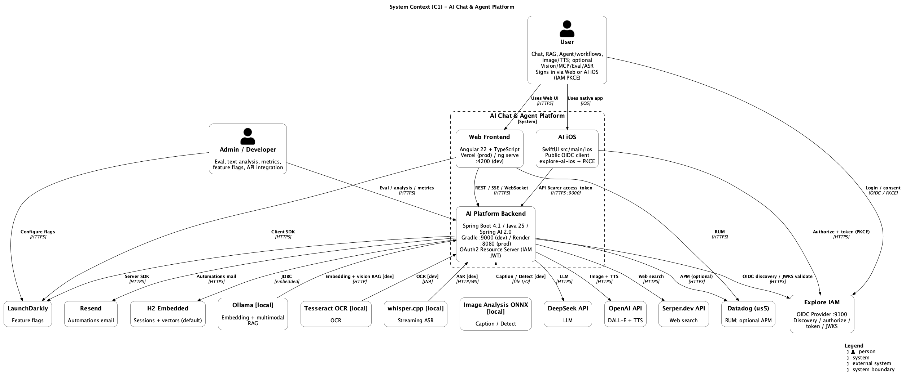
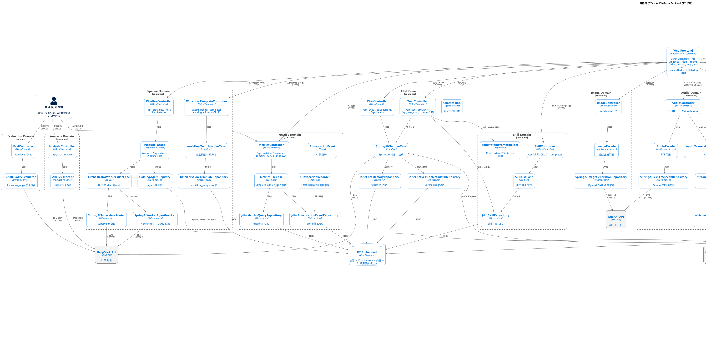
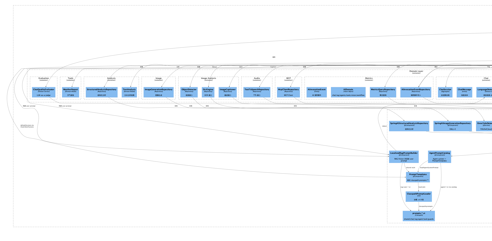
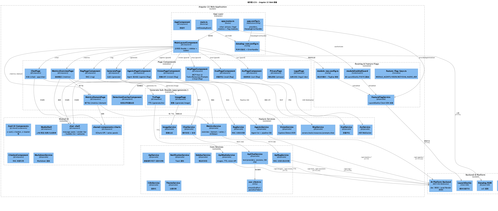
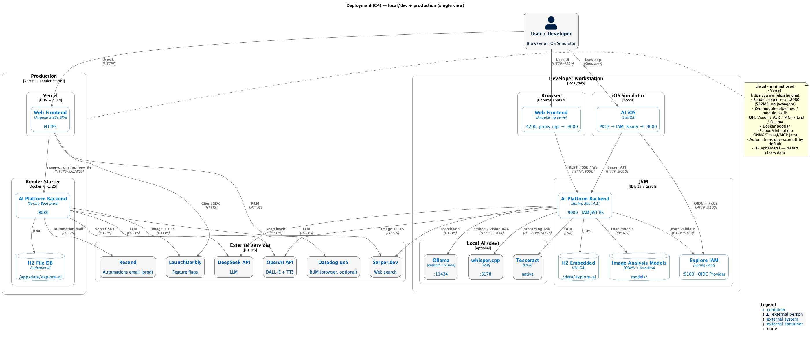
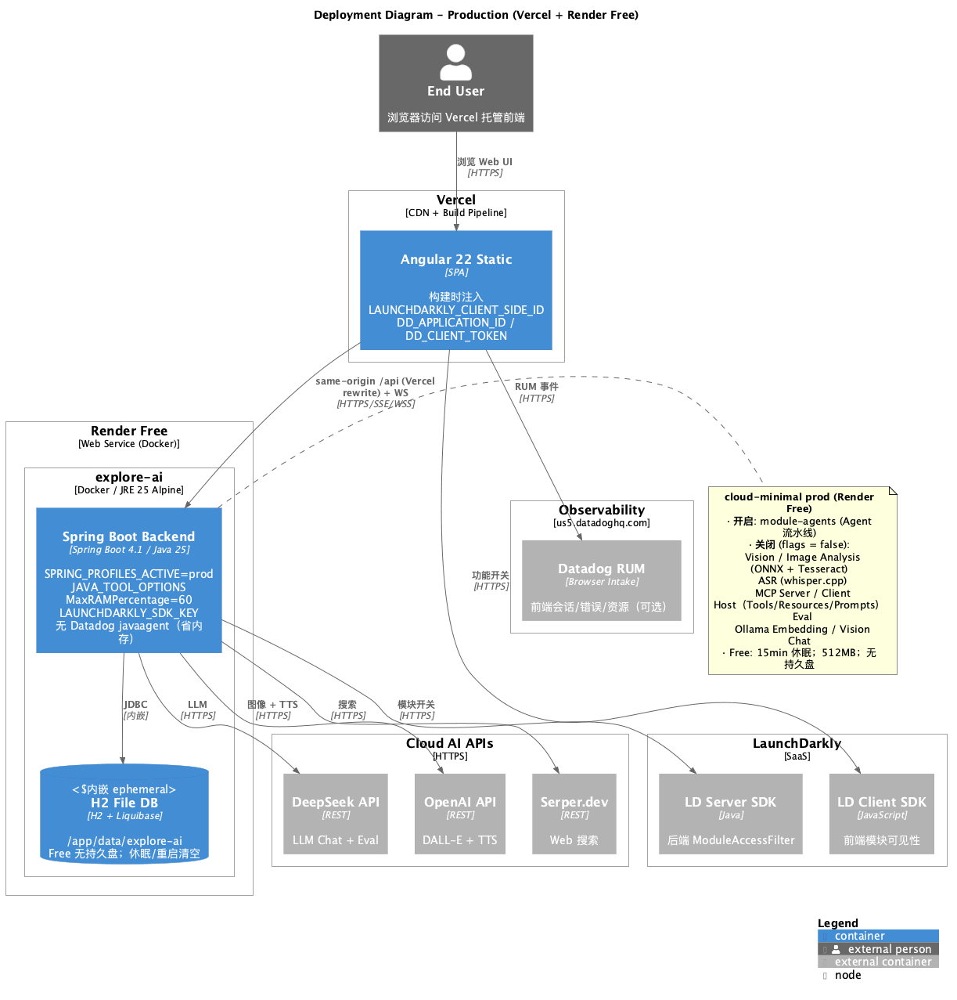

# C4 模型文档

使用 PlantUML 绘制的 C4 架构模型，描述 AI Chat & Agent Platform 的完整架构。

## 文件

| 文件 | 层级 | 说明 |
| --- | --- | --- |
| `C1-Context.puml` | C1 | 系统上下文图（含 LaunchDarkly、Datadog、cloud-minimal prod） |
| `C2-Container.puml` | C2 | 容器图（12 个子域 + 功能开关横切） |
| `C3-Component-Backend.puml` | C3 | 后端组件图（Clean Architecture 四层） |
| `C3-Component-Frontend.puml` | C3 | 前端组件图（路由守卫、chat-shell、分解 API 服务、RUM） |
| `C4-Deployment.puml` | C4 | 本地开发环境部署图（:4200 → :9000） |
| `C4-Deployment-Production.puml` | C4 | 生产部署图（Vercel + Render Free + Datadog RUM + LaunchDarkly） |

---

## C1 - 系统上下文图



---

## C2 - 容器图



---

## C3 - 后端组件图



---

## C3 - 前端组件图



---

## C4 - 部署图

### 本地开发



### 生产环境



---

## 技术栈

### 后端 (AI Platform Backend)

- **运行时**: Spring Boot 4.1 / Java 25 / Spring AI 2.0
- **架构**: Clean Architecture（`domain/repository/`，非 Hexagonal `domain/port/`）
- **端口**: dev **9000** / prod **8080** (Render `PORT`)
- **子域 (12)**: Chat / Agent / RAG / Tools / Analysis / Eval / Image / Image Analysis (`vision`) / Audio (TTS+ASR) / MCP Server / MCP Client / Metrics
- **持久化**: H2 嵌入式（会话元数据 `JdbcChatSessionMetadataRepository` + 消息 `JdbcChatMemoryRepository` + 向量 + AI 调用事件 `ai_invocation_events`）
- **功能开关**: LaunchDarkly（`ModuleAccessFilter` + `FeatureFlagService`，5 个模块 flag）
- **可观测性**: Datadog RUM（前端，可选）；APM javaagent 可选（Render Free 默认关闭）
- **外部服务 (cloud)**: DeepSeek API (LLM) / OpenAI API (DALL-E + TTS) / Serper.dev (Web 搜索)
- **本地服务 (dev / prod 默认关闭)**: Ollama / whisper.cpp / Tesseract / ONNX Image Analysis

### Agent 子域

路由 `/agents`（`module-agents`），API `/api/agents/*`：

| 能力 | API | 主要组件 |
| --- | --- | --- |
| 列表 / 健康 | `GET /api/agents`, `GET /api/agents/health` | `AgentController`, `AgentFacade` |
| 单 Agent SSE | `POST /api/agents/{type}/invoke/sse` | `SpringAiWorkerAgentInvoker` |
| Supervisor SSE | `POST /api/agents/supervisor/invoke/sse` | `SpringAiSupervisorRouter` |
| Pipeline SSE | `POST /api/agents/pipeline/invoke/sse` | `OrchestratorWorkersUseCase` |

Agent system prompt 来自 `AgentPromptCatalog` → `PromptTemplates.loadAgentSystemPrompt` → `classpath:prompts/agent/*.st`，并追加共享风格片段。

### Prompt Catalog（横切）

提示词作为工程资产外置到 `src/main/resources/prompts/`：

| 路径 | 用途 |
| --- | --- |
| `shared/style-minimal.st` / `format-gfm.st` | 极简风格 + GFM（单一事实源） |
| `chat/` | 默认 system 角色、工具策略、A2UI |
| `rag/` | RAG system + 多语言 user / no-context |
| `agent/` | Supervisor / Worker system |
| `task/` | 摘要 / 翻译 / Q&A |
| `guards/after-tools.st` | 工具调用后最终作答提醒 |

组合入口：`PromptTemplates` + `ClasspathPromptTemplate`；RAG/Vision user：`LocalizedRagPromptBuilder`。

### Image Analysis 子域（包名 `com.ai.vision`）

独立 `/vision` 页面，**不经过 Ollama**（受 `module-vision` flag 守卫）：

| 能力 | API | 适配器 | 依赖 |
| --- | --- | --- | --- |
| Caption | `POST /api/vision/caption` | `OnnxBlipCaptioner` | `models/blip_*.onnx` |
| Detect | `POST /api/vision/detect` | `OnnxYoloDetector` | `models/yolov8n.onnx` |
| OCR | `POST /api/vision/ocr` | `Tess4jOcrEngine` | Tesseract + `models/tessdata/` |
| Health | `GET /api/vision/health` | — | 各 Provider 就绪状态 |

> **区分**: **Image Analysis** (`/vision`, `/api/vision/*`) vs **Vision Chat** (RAG 流式多模态，Ollama qwen3.5)

### Metrics 子域（包名 `com.ai.metrics`）

路由 `/metrics`（Work 导航，无 feature flag），API `/api/metrics/*`：

| 能力 | API | 主要组件 |
| --- | --- | --- |
| 概览 | `GET /api/metrics/overview` | `MetricsController`, `MetricsUseCase` |
| 域快照 | `GET /api/metrics/domains/{domain}` | `JdbcMetricsQueryRepository` |
| 时序 | `GET /api/metrics/series` | `SeriesSnapshot` |
| 下钻 | `GET /api/metrics/drilldown` | `AiInvocationEvent`, `JdbcAiInvocationEventRepository` |

业务路径通过 `AiInvocationRecorder` 旁路写入 `ai_invocation_events`（Chat / RAG / Agents / Tools / Vision）。
LLM 调用另由 Spring AI Micrometer Observation 导出 GenAI 语义指标（`/actuator/prometheus`）；业务域计数仍以 `AiInvocationRecorder` 为准。
RAG 检索经 `H2SpringAiVectorStore`（Spring AI `VectorStore` SPI）+ `VectorStoreDocumentRetriever`；本地 profile 默认关闭 MCP client，避免 STDIO 阻断启动（生产用 Streamable HTTP）。

### 前端 (Web Frontend)

- **框架**: Angular 22 + TypeScript
- **路由**: `/chat` / `/generate` (image, tts) / `/rag` / `/metrics` + flag 守卫 `/agents` `/vision` `/mcp` `/eval` `/asr`
- **对话壳**: `shared/components/chat-shell`（message-pane / sender-bar / bubble-list / welcome），供 Chat / RAG / Agents 共用
- **实现目录**: `app/chat/`、`app/generate/{image,tts}/`、`app/metrics/`（与业务域 / 路由对齐）
- **API 服务**: `ApiChatService` / `ApiRagService` / `ApiMediaService` / `AgentsService` / `MetricsService` + `sse-client.ts` + shared ECharts panels
- **功能开关**: `FeatureFlagService` + `moduleEnabledGuard`（LaunchDarkly Client SDK）
- **可观测性**: `datadog-rum.config.ts`
- **端口**: dev 4200 (proxy `/api` → `:9000`) / prod Vercel 静态托管

### Chat 流式 API

| 端点 | 说明 |
| --- | --- |
| `POST /api/text/chat/stream` | SSE 流式对话（`TextController`） |
| `GET /api/text/providers` | 可用 LLM Provider |
| `GET /api/text/models` | 模型列表 |
| `POST /api/chat` | 非流式对话（`ChatController`） |
| `GET/POST /api/sessions` | 会话 CRUD |

---

## 部署拓扑

### 本地开发

```
Browser :4200 → Angular Dev Server → proxy /api/* → Spring Boot :9000
                                              ↘ H2 ./data/explore-ai
                                              ↘ Ollama :11434 / whisper :8178 / Tesseract
                                              ↘ DeepSeek / OpenAI / Serper
```

### 生产 (cloud-minimal)

```
Browser → Vercel (Angular static) → Render Free explore-ai (:8080 + H2 ephemeral)
        ↘ Datadog RUM (us5, 可选)        ↘ 无 APM sidecar（Free 省内存，不启 javaagent）
        ↘ LaunchDarkly Client            ↘ LaunchDarkly Server
                                         → DeepSeek / OpenAI / Serper
```

**Prod frontend**: `https://www.felixzhu.chat` (Vercel)  
**Prod API (browser)**: same-origin `/api` → Vercel rewrite → Render  
**Prod API (direct)**: `https://explore-ai-3krr.onrender.com/api`


**cloud-minimal**: `module-agents` **开启**；Vision / ASR / MCP / Eval / Ollama **关闭**

---

## 部署端口汇总

| 服务 | 端口 / 说明 |
| --- | --- |
| Spring Boot Backend (dev) | **9000** |
| Spring Boot Backend (prod) | **8080** |
| H2 Embedded | 内嵌 (dev `./data` / prod `/app/data` volume) |
| Ollama (Embedding/RAG Vision) | 11434 [local] |
| whisper.cpp (ASR) | 8178 [local] |
| Tesseract OCR | 系统安装 (JNA) [local] |
| Image Analysis ONNX Models | `models/` 本地文件 [local] |
| Angular Dev Server | 4200 |
| Vercel (prod frontend) | HTTPS |
| Render explore-ai (prod backend) | HTTPS → :8080（Free：休眠 / 无持久盘） |
| DeepSeek / OpenAI / Serper | HTTPS |
| LaunchDarkly / Datadog us5 | HTTPS |

---

## 功能开关 (LaunchDarkly)

| Flag Key | 模块 | 前端路由 | 后端路径前缀 | prod fallback |
| --- | --- | --- | --- | --- |
| `module-agents` | Agent | `/agents` | `/api/agents` | `true` |
| `module-vision` | Image Analysis | `/vision` | `/api/vision` | `false` |
| `module-audio-asr` | ASR | `/asr` | `/ws/audio` | `false` |
| `module-mcp` | MCP | `/mcp` | `/api/mcp` | `false` |
| `module-eval` | Eval | `/eval` | `/api/eval` | `false` |

---

## 模型配置

| 用途 | 模型 | 维度/说明 |
| --- | --- | --- |
| LLM Chat / Agent | deepseek-v4-flash | DeepSeek API |
| Embedding | mxbai-embed-large | 1024 维 (Ollama, local) |
| Vision Chat (RAG) | qwen3.5 | Ollama 多模态对话 (local) |
| Caption | BLIP base ONNX | ONNX Runtime 本地 |
| Detect | YOLOv8n ONNX | COCO 80 类 |
| OCR | eng + chi_sim | Tesseract tessdata |
| ASR | whisper-base | whisper.cpp 本地 |
| Image Gen | dall-e-3 | OpenAI API |
| TTS | gpt-4o-mini-tts | OpenAI API |

---

## 查看与更新

- [PlantUML Online Editor](https://www.plantuml.com/plantuml/uml/)
- VS Code PlantUML 插件
- 重新生成 PNG：

```bash
cd docs/c4-model && mkdir -p png && plantuml -o png *.puml
```

若本机无 `plantuml` CLI：

```bash
cd docs/c4-model && docker run --rm -v "$PWD":/data plantuml/plantuml -o png '*.puml'
```

## 相关文档

- [术语表](../../Glossary.md) — Ubiquitous Language 与代码映射
- [API 文档](../api.md) — REST / SSE 与 JSON 字段约定
- [TOGAF Business Architecture](../../product-owner/togaf/README.md) — Phase A/B Catalog / Matrix / Diagram（业务能力与价值流；解决方案/技术视图仍以本 C4 为准）
- [用户故事地图](../../product-owner/User-Story-Map.md)
