# 用户故事地图

> 反映平台实际交付状态：已交付 (Delivered) / 进行中 (In Progress) / 未来 (Future)

## 发布计划概览

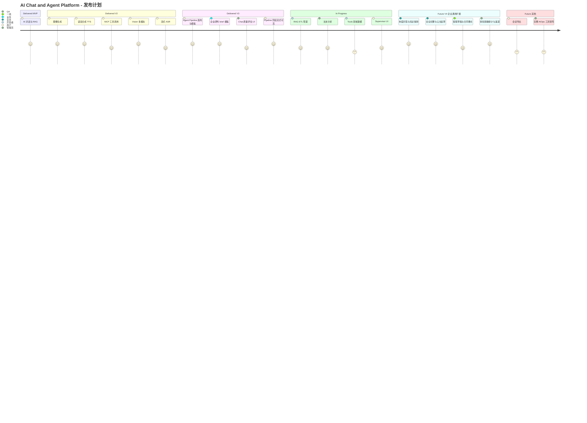
```mermaid
journey
    title AI Chat and Agent Platform - 发布计划
    section Delivered MVP
        AI 对话与 RAG: 5: 用户
    section Delivered V2
        图像生成: 5: 用户
        语音合成 TTS: 5: 用户
        MCP 工具调用: 4: 用户
        Vision 多模态: 5: 用户
        流式 ASR: 4: 用户
    section Delivered V3
        Agent Pipeline 画布与模板: 5: 用户
        企业研判 brief 模板: 5: 业务
        Chat 质量评估 UI: 4: QA
        Pipeline 阶段流式可见: 5: 用户
    section In Progress
        RAG ETL 管道: 4: 开发者
        文本分析: 4: 管理员
        Tools 领域建模: 3: 开发者
        Supervisor UI: 4: 用户
    section Future V4 企业通用扩展
        制度问答与知识保鲜: 5: 全员
        会议纪要与公文起草: 5: 全员
        客服草稿与合同要点: 4: 一线
        审批脱敏审计与渠道: 5: 管理员
    section Future 其他
        会话导出: 3: 用户
        完整 AIOps 工具矩阵: 3: 管理员
```

> 企业工作流优化以 **Agent Pipeline 模板 + RAG + Tools Chat** 为主路径；Future V4 覆盖所有企业通用扩展（Epic [AI-201](https://felixzhu.atlassian.net/browse/AI-201)）。

---

## Delivered - MVP：基础对话 + RAG

### 1. AI 对话（已交付）

**用户故事**

**As a** 最终用户  
**I want** 与 AI 助手进行流式对话  
**So that** 我可以快速获得智能回答

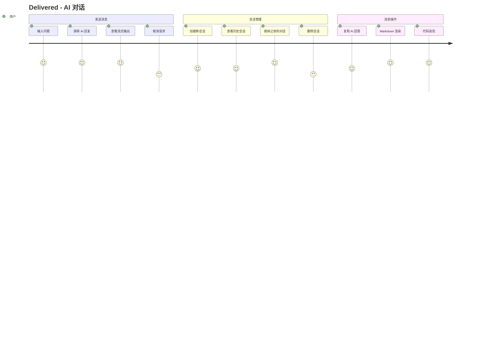
```mermaid
journey
    title Delivered - AI 对话
    section 发送消息
        输入问题: 5: 用户
        获得 AI 回复: 5: 用户
        查看流式输出: 5: 用户
        取消请求: 3: 用户
    section 会话管理
        创建新会话: 4: 用户
        查看历史会话: 4: 用户
        继续之前的对话: 5: 用户
        删除会话: 3: 用户
    section 消息操作
        复制 AI 回答: 4: 用户
        Markdown 渲染: 5: 用户
        代码高亮: 5: 用户
```

**API**: `POST /api/chat`, `GET /api/sessions`  
**实现**: `ChatController`, `ChatFacade`, `SpringAiChatUseCase`

---

### 1.1 Provider/Model 选择（已交付）

**用户故事**

**As a** 最终用户  
**I want** 进入 Chat 页时看到可用的 Provider 与 Model 列表  
**So that** 我可以选择模型且无错误提示

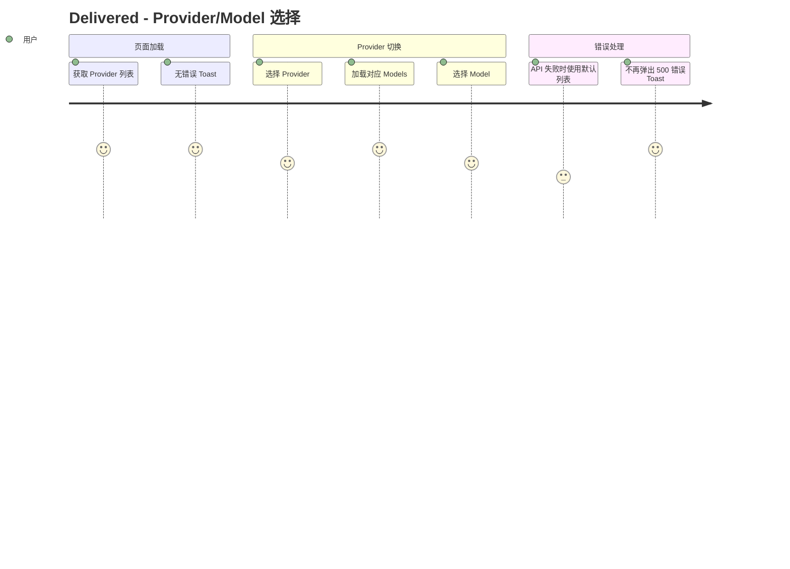
```mermaid
journey
    title Delivered - Provider/Model 选择
    section 页面加载
        获取 Provider 列表: 5: 用户
        无错误 Toast: 5: 用户
    section Provider 切换
        选择 Provider: 4: 用户
        加载对应 Models: 5: 用户
        选择 Model: 4: 用户
    section 错误处理
        API 失败时使用默认列表: 3: 用户
        不再弹出 500 错误 Toast: 5: 用户
```

**Acceptance Criteria**

- **GIVEN** 用户打开 `/chat` 页面 **WHEN** 前端请求 `GET /api/text/providers` **THEN** 返回 200 及 Provider 列表
- **GIVEN** 用户选择 openai Provider **WHEN** 请求 `GET /api/text/models?provider=openai` **THEN** 返回含 `deepseek-v4-flash` 的 models 数组
- **GIVEN** 后端已部署修复版本 **WHEN** 访问生产 Chat 页 **THEN** 不出现 "A server error occurred" Toast

**API**: `GET /api/text/providers`, `GET /api/text/models?provider=`  
**实现**: `TextController`, `TextProviderCatalog`  
**Jira**: [AI-97](https://felixzhu.atlassian.net/browse/AI-97)

---

### 1.2 多轮对话与自动标题（已交付）

**用户故事**

**As a** 最终用户  
**I want** 在同一会话中连续对话并由系统自动生成会话标题  
**So that** 我可以记住上下文并在侧边栏快速找到历史会话

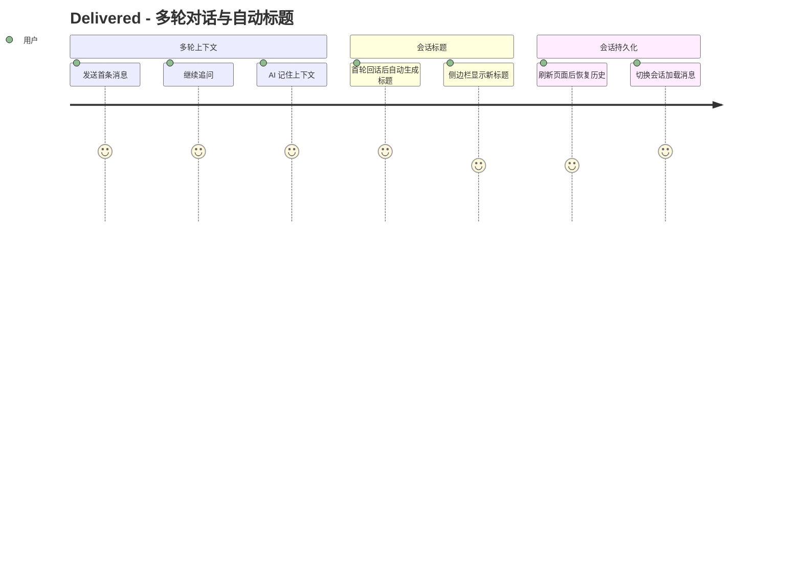
```mermaid
journey
    title Delivered - 多轮对话与自动标题
    section 多轮上下文
        发送首条消息: 5: 用户
        继续追问: 5: 用户
        AI 记住上下文: 5: 用户
    section 会话标题
        首轮回话后自动生成标题: 5: 用户
        侧边栏显示新标题: 4: 用户
    section 会话持久化
        刷新页面后恢复历史: 4: 用户
        切换会话加载消息: 5: 用户
```

**Acceptance Criteria**

- **GIVEN** 用户在同一会话发送 "My name is Felix" **WHEN** 继续问 "What is my name?" **THEN** AI 回答包含 Felix
- **GIVEN** 用户完成首轮回话 **WHEN** 后端异步生成标题 **THEN** 会话标题不再是默认 "New Chat"
- **GIVEN** 用户打开 Chat 页 **WHEN** 页面初始化 **THEN** 不会重复创建空会话
- **GIVEN** 用户发送消息 **WHEN** 消息保存到后端 **THEN** 内容不含 `undefined` 前缀

**API**: `POST /api/text/chat/stream` (含 `session_id`), `GET /api/sessions`, `GET /api/sessions/{id}/messages`, `GET /api/health`  
**实现**: `SpringAiChatUseCase`, `SessionTitleGenerator`, `ChatService`, `TextController`, `ChatController`  
**Jira**: [AI-101](https://felixzhu.atlassian.net/browse/AI-101)

---

### 2. RAG 知识问答（已交付）

**用户故事**

**As a** 最终用户  
**I want** 上传文档并基于文档内容提问  
**So that** AI 回答有据可查

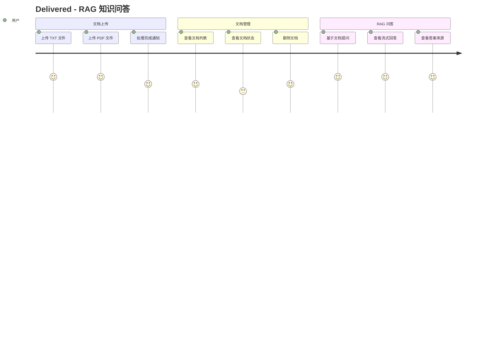
```mermaid
journey
    title Delivered - RAG 知识问答
    section 文档上传
        上传 TXT 文件: 5: 用户
        上传 PDF 文件: 5: 用户
        处理完成通知: 4: 用户
    section 文档管理
        查看文档列表: 4: 用户
        查看文档状态: 3: 用户
        删除文档: 4: 用户
    section RAG 问答
        基于文档提问: 5: 用户
        查看流式回答: 5: 用户
        查看答案来源: 5: 用户
```

**API**: `POST /api/rag/documents/upload`, `POST /api/rag/chat/stream` (字段 `query`)  
**实现**: `RagController`, `RagApplicationService`, `RagChatUseCase`

---

## Delivered - V2：多媒体 + 工具

### 3. 图像生成（已交付）

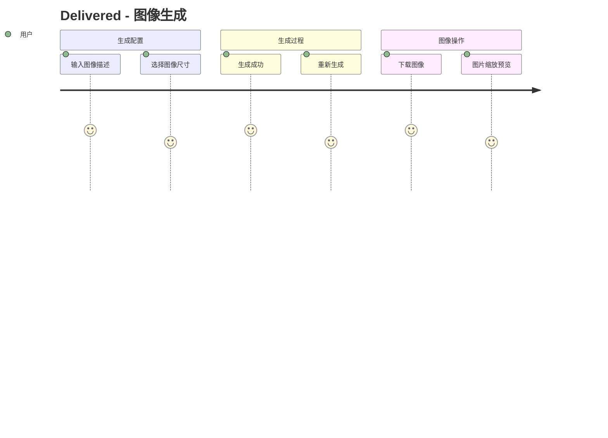
```mermaid
journey
    title Delivered - 图像生成
    section 生成配置
        输入图像描述: 5: 用户
        选择图像尺寸: 4: 用户
    section 生成过程
        生成成功: 5: 用户
        重新生成: 4: 用户
    section 图像操作
        下载图像: 5: 用户
        图片缩放预览: 4: 用户
```

**API**: `POST /api/images/generate`  
**路由**: `/generate/image`  
**实现**: `ImageController`, `ImageFacade`

---

### 4. 语音合成 TTS（已交付）

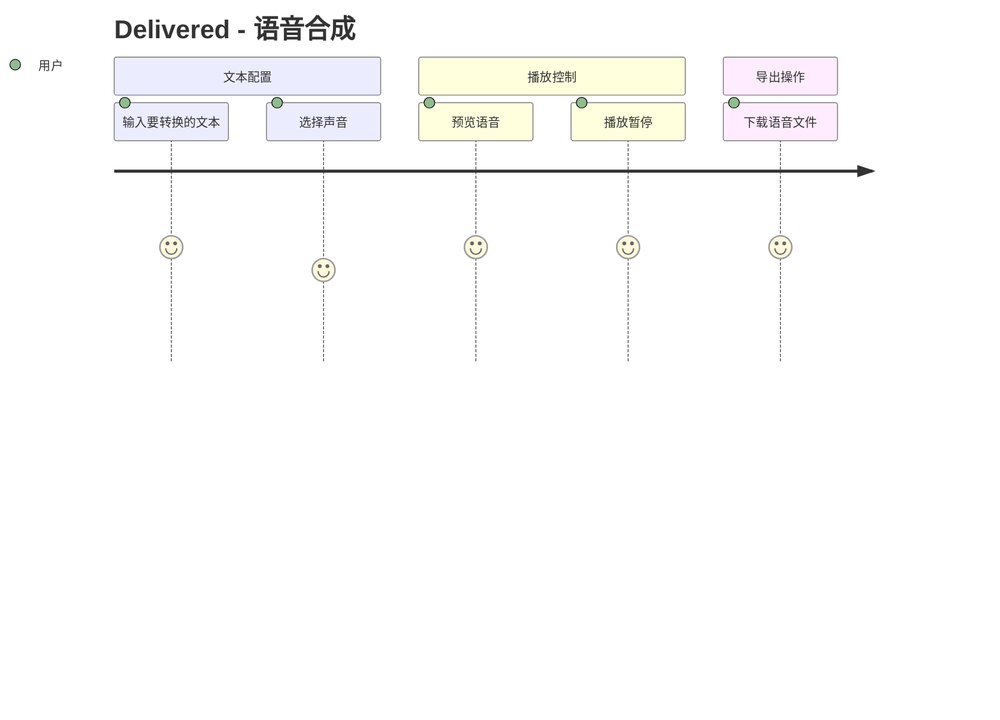
```mermaid
journey
    title Delivered - 语音合成
    section 文本配置
        输入要转换的文本: 5: 用户
        选择声音: 4: 用户
    section 播放控制
        预览语音: 5: 用户
        播放暂停: 5: 用户
    section 导出操作
        下载语音文件: 5: 用户
```

**API**: `POST /api/audio/tts`  
**路由**: `/generate/tts`  
**实现**: `AudioController`, `AudioFacade`

---

### 5. MCP 工具调用（已交付）

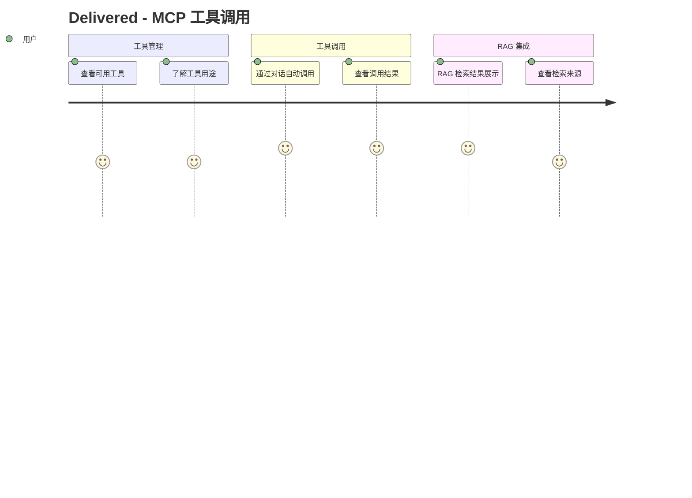
```mermaid
journey
    title Delivered - MCP 工具调用
    section 工具管理
        查看可用工具: 4: 用户
        了解工具用途: 4: 用户
    section 工具调用
        通过对话自动调用: 5: 用户
        查看调用结果: 5: 用户
    section RAG 集成
        RAG 检索结果展示: 5: 用户
        查看检索来源: 4: 用户
```

**API**: `/api/mcp/*`, `/api/mcp-client/*`  
**实现**: `McpController`, `McpClientController`, `McpFacade`

---

### 6. Vision 多模态 RAG（已交付）

**用户故事**

**As a** 最终用户  
**I want** 上传图片并结合文档进行问答  
**So that** 我可以分析图表、截图等视觉内容

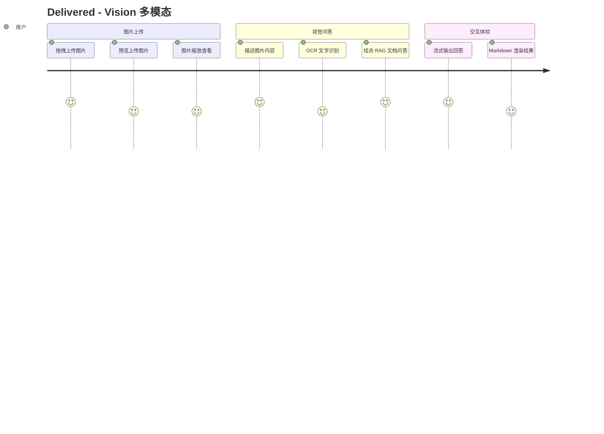
```mermaid
journey
    title Delivered - Vision 多模态
    section 图片上传
        拖拽上传图片: 5: 用户
        预览上传图片: 4: 用户
        图片缩放查看: 4: 用户
    section 视觉问答
        描述图片内容: 5: 用户
        OCR 文字识别: 4: 用户
        结合 RAG 文档问答: 5: 用户
    section 交互体验
        流式输出回答: 5: 用户
        Markdown 渲染结果: 4: 用户
```

**API**: `POST /api/rag/chat/stream` (含 `images` 字段)  
**实现**: `VisionChatUseCase`, Ollama qwen3.5

---

### 6a. 图像分析（独立）（已交付）

**用户故事**

**As a** 最终用户  
**I want** 在独立页面完成图像描述、目标检测与 OCR  
**So that** 无需进入 RAG 对话即可获得结构化视觉分析结果

| 能力 | API | 技术栈 |
|------|-----|--------|
| Caption | `POST /api/vision/caption` | ONNX Runtime + BLIP ONNX |
| Detect | `POST /api/vision/detect` | ONNX Runtime + YOLOv8 ONNX |
| OCR | `POST /api/vision/ocr` | Tess4J + Tesseract |

**路由**: `/vision`  
**健康检查**: `GET /api/vision/health`  
**实现**: `VisionAnalysisUseCase`, `OnnxBlipCaptioner`, `OnnxYoloDetector`, `Tess4jOcrEngine`

**本地模型准备**:

```bash
pnpm vision:models      # 下载 ONNX / tessdata
pnpm vision:fixtures    # 生成测试样例图
pnpm vision:verify      # API smoke（需先启动后端）
```

---

### 7. 流式 ASR 语音识别（已交付）

**用户故事**

**As a** 最终用户  
**I want** 通过麦克风实时转写语音为文字  
**So that** 我可以用语音输入与 AI 交互

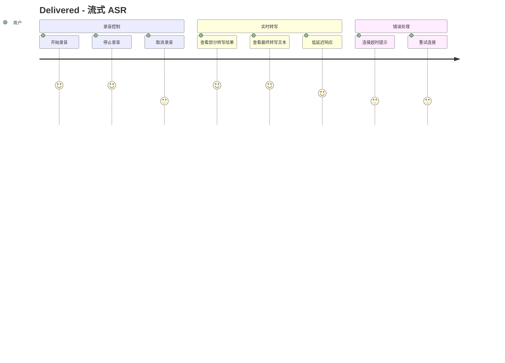
```mermaid
journey
    title Delivered - 流式 ASR
    section 录音控制
        开始录音: 5: 用户
        停止录音: 5: 用户
        取消录音: 3: 用户
    section 实时转写
        查看部分转写结果: 5: 用户
        查看最终转写文本: 5: 用户
        低延迟响应: 4: 用户
    section 错误处理
        连接超时提示: 3: 用户
        重试连接: 3: 用户
```

**API**: WebSocket `/ws/audio/transcribe`  
**实现**: `AudioTranscriptionWebSocketHandler`, `StreamingTranscriptionUseCase`, whisper.cpp `:8178`

---

## Delivered - 质量评估

### 9. Chat Evaluation 质量评估（已交付）

**用户故事**

**As a** QA 工程师  
**I want** 在 Eval 页自动评估 AI 回答的质量  
**So that** 我可以量化对话效果并持续改进

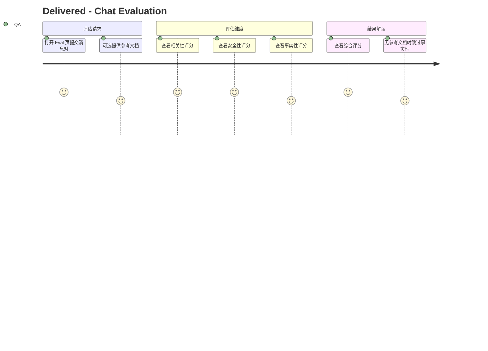
```mermaid
journey
    title Delivered - Chat Evaluation
    section 评估请求
        打开 Eval 页提交消息对: 5: QA
        可选提供参考文档: 4: QA
    section 评估维度
        查看相关性评分: 5: QA
        查看安全性评分: 5: QA
        查看事实性评分: 4: QA
    section 结果解读
        查看综合评分: 5: QA
        无参考文档时跳过事实性: 4: QA
```

**API**: `POST /api/eval/chat`  
**路由**: `/eval`（feature flag `module-eval`）  
**实现**: `EvalPageComponent`, `EvalController`, `ChatQualityEvaluator`

**Acceptance Criteria**

- **GIVEN** 评估请求包含 userMessage 和 assistantMessage  
  **WHEN** 调用 `/api/eval/chat`  
  **THEN** 返回 overallScore 及各维度评分

- **GIVEN** 请求未包含 referenceDocuments  
  **WHEN** 评估完成  
  **THEN** factuality 维度被跳过且 factualityAvailable 为 false

---

## In Progress - 进行中

### 8. RAG ETL 管道

**用户故事**

**As a** 平台工程师  
**I want** 通过可插拔的 ETL 端口处理不同格式文档  
**So that** 新增文档类型时无需修改应用层代码

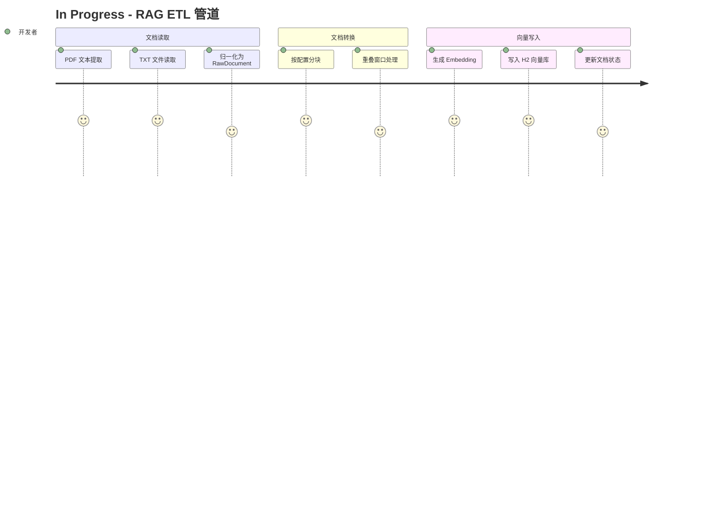
```mermaid
journey
    title In Progress - RAG ETL 管道
    section 文档读取
        PDF 文本提取: 5: 开发者
        TXT 文件读取: 5: 开发者
        归一化为 RawDocument: 4: 开发者
    section 文档转换
        按配置分块: 5: 开发者
        重叠窗口处理: 4: 开发者
    section 向量写入
        生成 Embedding: 5: 开发者
        写入 H2 向量库: 5: 开发者
        更新文档状态: 4: 开发者
```

**实现**: `DocumentReader`, `DocumentTransformer`, `DocumentWriter` ports → `PdfAndTextDocumentReader`, `ChunkingDocumentTransformer`, `EmbeddingDocumentWriter`

**Acceptance Criteria**

- **GIVEN** 用户上传 PDF 或 TXT 文件  
  **WHEN** 文档处理完成  
  **THEN** 文档状态变为 READY 且 chunkCount > 0

- **GIVEN** ETL 管道配置了 chunk size 500  
  **WHEN** 大文档被处理  
  **THEN** 生成多个 DocumentChunk 并写入向量库

---

### 10. 文本分析

**用户故事**

**As a** 管理员  
**I want** 对文本进行结构化情感分析  
**So that** 我可以了解用户反馈的情绪倾向


```mermaid
journey
    title In Progress - 文本分析
    section 分析请求
        提交待分析文本: 5: 管理员
        指定语言提示: 4: 管理员
    section 分析结果
        查看情感分类: 5: 管理员
        查看结构化输出: 4: 管理员
    section 错误处理
        空文本返回 400: 3: 管理员
```

**API**: `POST /api/chat/analyze`  
**实现**: `AnalysisController`, `AnalysisFacade`, `TextAnalysis`

---

### 11. Tools 天气查询（DDD 领域建模）

**用户故事**

**As a** 开发者  
**I want** 通过充血领域模型封装天气查询逻辑  
**So that** 工具调用遵循 DDD 最佳实践

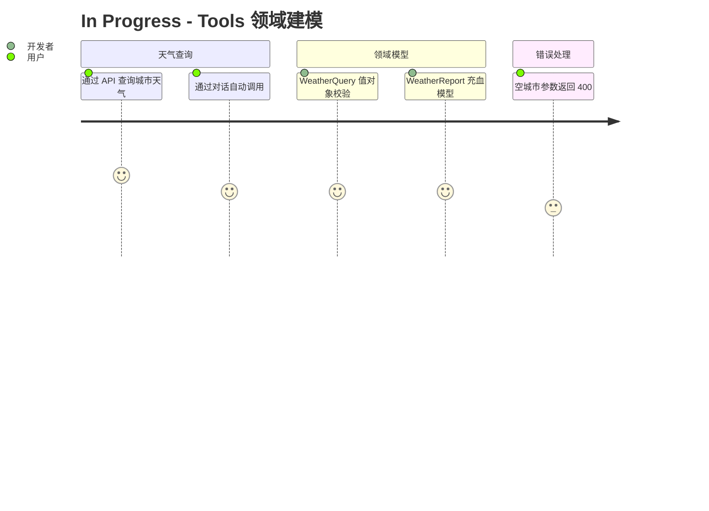
```mermaid
journey
    title In Progress - Tools 领域建模
    section 天气查询
        通过 API 查询城市天气: 5: 用户
        通过对话自动调用: 4: 用户
    section 领域模型
        WeatherQuery 值对象校验: 4: 开发者
        WeatherReport 充血模型: 4: 开发者
    section 错误处理
        空城市参数返回 400: 3: 用户
```

**API**: `GET /api/tools/weather?city=Beijing`  
**实现**: `ToolsController`, `ToolsFacade`, `WeatherReport`, `WeatherQuery`

---

## Delivered / Future - 企业工作流与 Multi-Agent

### 企业工作流场景对照

| 场景 | 角色 | 主路径 | 状态 | Jira |
|------|------|--------|------|------|
| 联网调研简报 | 业务/产品 | 模板 `webResearch` | 已交付 | — |
| 内部知识问答 | 全员 | `knowledgeAnswer` + `/rag` | 已交付 | — |
| 商业研判 brief | 业务分析师 | 模板 `businessAnalysis` | 已交付 | — |
| 技术可行性 brief | 技术负责人 | 模板 `techAnalysis` | 已交付 | — |
| 差旅/现场天气简报 | 运营 | 模板 `weatherBrief` | 已交付 | — |
| 自定义多步流水线 | 业务配置者 | `/agents` 画布 | 已交付 | AI-148 |
| 单助手工具增强 | 最终用户 | `/chat` Tools | 已交付 | AI-106 |
| 答复质量门禁 | QA | `/eval` | 已交付 | — |
| Supervisor 自动路由 | 最终用户 | API 有 / UI 无 | API 已交付 | — |
| 制度/入职/知识保鲜 | 全员 | Future | Future | [AI-203](https://felixzhu.atlassian.net/browse/AI-203) |
| 会议纪要/公文/本地化 | 知识工作者 | Future | Future | [AI-204](https://felixzhu.atlassian.net/browse/AI-204) |
| 对比/客服/合同/复盘 | 一线与法务 | Future | Future | [AI-205](https://felixzhu.atlassian.net/browse/AI-205) |
| 审批/脱敏/审计/渠道 | 管理员 | Future | Future | [AI-206](https://felixzhu.atlassian.net/browse/AI-206) |
| Workflow 原语产品化 | 平台工程师 | `/api/workflows/*` | API only | — |
| 完整 AIOps 监控告警 | 管理员 | §13 | Future | — |

Epic: [AI-201 企业通用工作流扩展（V4）](https://felixzhu.atlassian.net/browse/AI-201)

---

## Delivered - V3：Agent Pipeline 工作台

详细 backlog 见 [docs/backlog/multi-agent-orchestration.md](backlog/multi-agent-orchestration.md)。地图更新交付故事：[AI-202](https://felixzhu.atlassian.net/browse/AI-202)。

### 12. Multi-Agent Pipeline 工作台（已交付）

**用户故事**

**As a** 业务分析师  
**I want** 在画布上编排 Agent 流水线并流式审阅阶段与结果  
**So that** 我可以按企业流程定制多步 AI 工作流

| Story | SP | 状态 |
|-------|----|------|
| A 列出 Agent + health | 3 | 已交付 |
| B Supervisor 路由 + SSE | 5 | API 已交付（UI 后续） |
| C 直调专业 Agent + SSE | 5 | API 已交付 |
| D Pipeline 画布 + 流式结果 | 5 | 已交付（替代旧「选 Agent 面板」） |
| E 会话保存与导出 | 3 | 后续 |
| F 可插拔真工具（K8s/AIOps…） | 8 | 后续 |

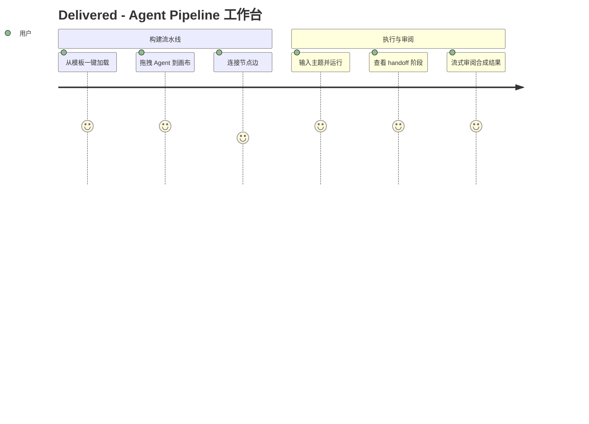
```mermaid
journey
    title Delivered - Agent Pipeline 工作台
    section 构建流水线
        从模板一键加载: 5: 用户
        拖拽 Agent 到画布: 5: 用户
        连接节点边: 4: 用户
    section 执行与审阅
        输入主题并运行: 5: 用户
        查看 handoff 阶段: 5: 用户
        流式审阅合成结果: 5: 用户
```

**API**: `GET /api/agents/list`, `POST /api/agents/pipeline/invoke/sse`（另：`supervisor/invoke/sse`、`/{type}/invoke/sse`）  
**路由**: `/agents`（feature flag `module-agents`）  
**实现**: `AgentsPipelineCanvasComponent`, `AgentPipeline`, `OrchestratorWorkersUseCase`, `AgentsPageComponent`  
**Jira**: [AI-148](https://felixzhu.atlassian.net/browse/AI-148)

---

### 12.1 内置企业工作流模板（已交付）

**用户故事**

**As a** 产品经理  
**I want** 一键选用预置编排模板  
**So that** 常见商业/技术研判无需从零搭图

| 模板 | Agent 链 | 企业用途 |
|------|----------|----------|
| `webResearch` | research → analyst | 联网调研简报 |
| `knowledgeAnswer` | vectordb → analyst | 内部知识问答合成 |
| `weatherBrief` | weather → analyst | 现场/差旅简报 |
| `businessAnalysis` | research ×2 → vectordb → analyst | 商业策略 brief |
| `techAnalysis` | research ×2 → vectordb → analyst | 技术可行性 brief |

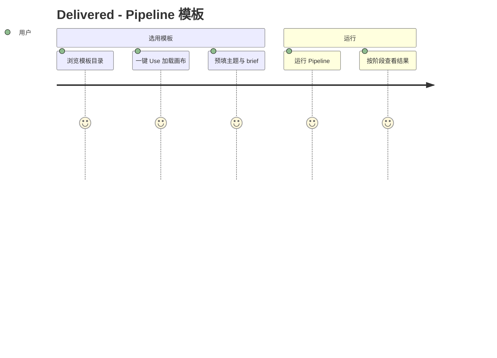
```mermaid
journey
    title Delivered - Pipeline 模板
    section 选用模板
        浏览模板目录: 5: 用户
        一键 Use 加载画布: 5: 用户
        预填主题与 brief: 5: 用户
    section 运行
        运行 Pipeline: 5: 用户
        按阶段查看结果: 5: 用户
```

**实现**: `agents-pipeline.templates.ts`, i18n `agents.pipeline.templates`  
**Jira**: [AI-163](https://felixzhu.atlassian.net/browse/AI-163)

---

### 12.2 企业研判标准化输出（已交付）

**用户故事**

**As a** 业务或技术负责人  
**I want** Analyst 以 Fact / Inference / Recommendation 结构输出 brief  
**So that** 研判结果可复核、可汇报

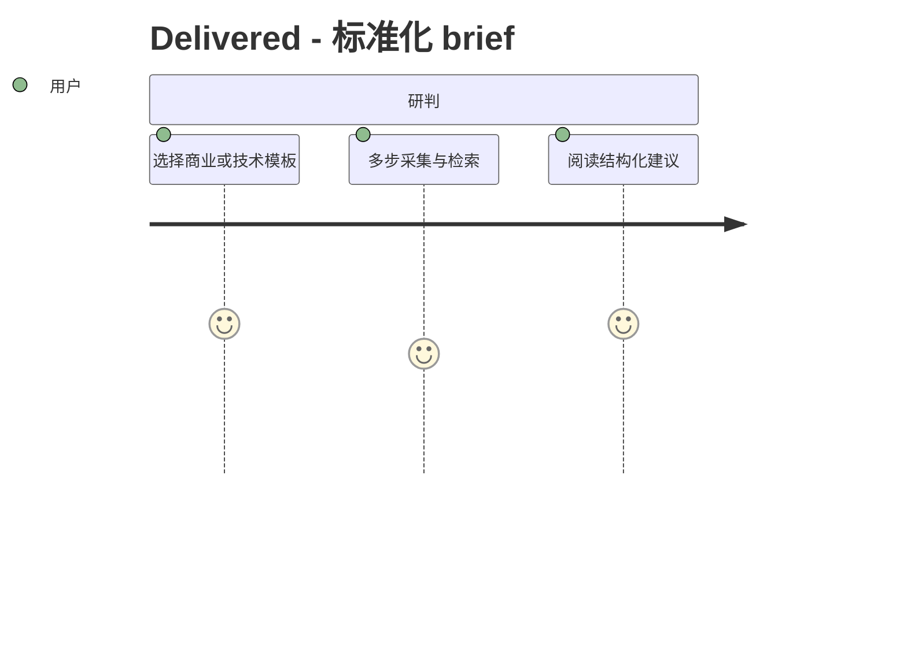
```mermaid
journey
    title Delivered - 标准化 brief
    section 研判
        选择商业或技术模板: 5: 用户
        多步采集与检索: 4: 用户
        阅读结构化建议: 5: 用户
```

**实现**: `analyst` system prompt、`businessAnalysis` / `techAnalysis` briefPrompts

---

### 12.3 Supervisor 自动路由（API 已交付，UI 后续）

**用户故事**

**As a** 最终用户  
**I want** 描述任务后由 Supervisor 自动分派专家 Agent  
**So that** 我不必手动设计流水线

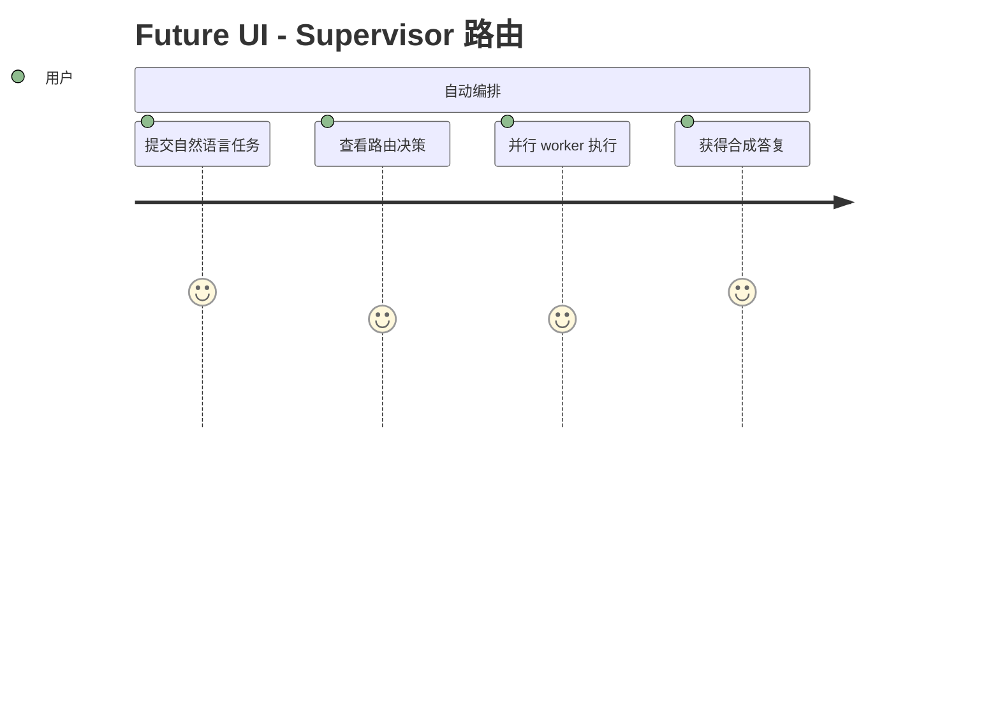
```mermaid
journey
    title Future UI - Supervisor 路由
    section 自动编排
        提交自然语言任务: 5: 用户
        查看路由决策: 4: 用户
        并行 worker 执行: 4: 用户
        获得合成答复: 5: 用户
```

**API**: `POST /api/agents/supervisor/invoke/sse`  
**实现**: `SpringAiSupervisorRouter`, `RoutingPlan`  
**缺口**: 当前 `/agents` UI 仅 Pipeline，未暴露 Supervisor 选择器

---

### 13. AIOps 智能运维（规划中）

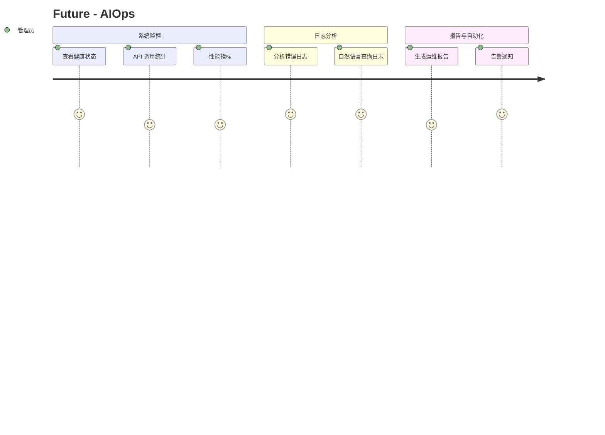
```mermaid
journey
    title Future - AIOps
    section 系统监控
        查看健康状态: 5: 管理员
        API 调用统计: 4: 管理员
        性能指标: 4: 管理员
    section 日志分析
        分析错误日志: 5: 管理员
        自然语言查询日志: 5: 管理员
    section 报告与自动化
        生成运维报告: 4: 管理员
        告警通知: 5: 管理员
```

> 注：文本分析 (`/api/chat/analyze`) 为 AIOps 的部分能力；完整监控与告警尚未实现。与 Future V4「事故复盘初稿」区分——后者是轻量 RCA 骨架，不是监控平台。

---

## Future V4：企业通用工作流扩展

跨行业共性能力，供后续排期。Epic [AI-201](https://felixzhu.atlassian.net/browse/AI-201)。

### 14. 知识与制度（Future）

**Jira**: [AI-203](https://felixzhu.atlassian.net/browse/AI-203)

**As a** 企业员工  
**I want** 按权限查制度、使用入职知识包，并提醒过期文档  
**So that** 口径一致且知识不过期

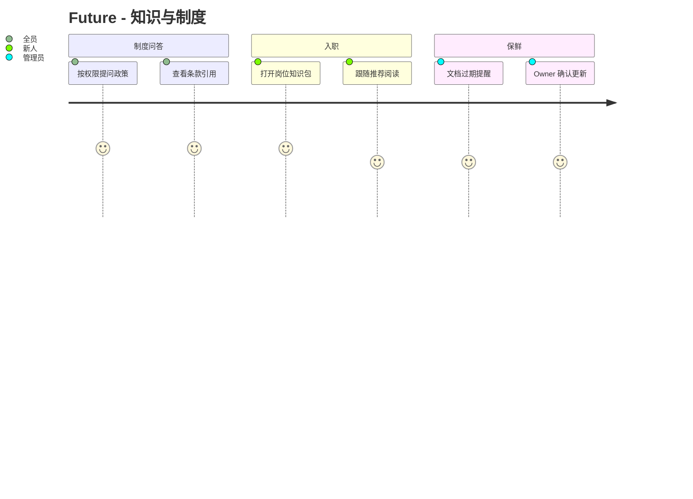
```mermaid
journey
    title Future - 知识与制度
    section 制度问答
        按权限提问政策: 5: 全员
        查看条款引用: 5: 全员
    section 入职
        打开岗位知识包: 5: 新人
        跟随推荐阅读: 4: 新人
    section 保鲜
        文档过期提醒: 4: 管理员
        Owner 确认更新: 4: 管理员
```

**扩展点**: RAG 多库/权限分区；文档元数据 owner/expiry

---

### 15. 沟通与内容生产（Future）

**Jira**: [AI-204](https://felixzhu.atlassian.net/browse/AI-204)

**As a** 知识工作者  
**I want** 会议纪要生成行动项、按受众起草公文，并做术语约束本地化  
**So that** 沟通可闭环且口径统一

```mermaid
journey
    title Future - 沟通与内容
    section 会议闭环
        上传笔记或转录: 5: 用户
        生成纪要与行动项: 5: 用户
    section 起草
        选择语气与受众: 4: 用户
        审阅可编辑草稿: 5: 用户
    section 本地化
        应用术语表: 4: 用户
        人工确认译文: 5: 用户
```

**扩展点**: ASR/笔记导入；公文模板；术语表

---

### 16. 决策支持与运营轻量（Future）

**Jira**: [AI-205](https://felixzhu.atlassian.net/browse/AI-205)

**As a** 业务或一线人员  
**I want** 竞品/供应商对比、客服答复草稿、合同要点与复盘初稿  
**So that** 决策与响应更快且可人工确认

```mermaid
journey
    title Future - 决策支持
    section 对比与客服
        运行对比简报: 5: 业务
        生成待确认答复草稿: 5: 客服
    section 文档与复盘
        提取合同风险条款: 4: 法务
        生成 RCA 骨架: 4: 研发
```

**扩展点**: 在 `webResearch`/`businessAnalysis` 上增强对比维度；默认禁止自动外发

---

### 17. 治理与人机协同（Future）

**Jira**: [AI-206](https://felixzhu.atlassian.net/browse/AI-206)

**As a** 合规与平台管理员  
**I want** 审批节点、入模前脱敏、审计用量，以及 IM/邮件与定时触发  
**So that** AI 工作流可安全嵌入日常企业流程

```mermaid
journey
    title Future - 治理
    section 人机协同
        高风险步骤人工审批: 5: 管理员
        入模前 PII 脱敏: 5: 系统
    section 可观测
        审计谁何时跑了流水线: 5: 管理员
        用量与成本看板: 4: 管理员
    section 嵌入日常
        IM 或邮件触发 Pipeline: 4: 用户
        订阅定时简报: 5: 管理层
```

**扩展点**: human-in-the-loop；OWASP LLM 安全默认；渠道适配器

---

### 18. Spring AI Workflow 原语产品化（Future）

**As a** 平台工程师  
**I want** 在 Lab 中组合 Chain / Parallel / Route / Evaluator-Optimizer  
**So that** 无 Agent 注册表时也能编排 LLM 工作流

| 能力 | API |
|------|-----|
| 链式提示 | `POST /api/workflows/chain` |
| 并行扇出 | `POST /api/workflows/parallel` |
| 分类路由 | `POST /api/workflows/route` |
| 编排工人 | `POST /api/workflows/orchestrator-workers` |
| 评估优化 | `POST /api/workflows/evaluator-optimizer` |

> 与 `com.ai.agent` Pipeline 区分：Workflow API 为通用原语，当前无产品 UI。

---

## 用户角色与故事对照

| 角色 | 覆盖能力 | 优先级 |
|------|----------|--------|
| **最终用户** | 对话、Provider/Model、RAG、图像、TTS、Vision、ASR、Pipeline 模板 | P0 |
| **业务分析师 / 产品经理** | 商业/技术研判模板、自定义画布 | P0 |
| **开发者** | MCP、Tools API、RAG ETL、Workflow API | P1 |
| **QA 工程师** | Chat Evaluation（`/eval`） | P1 |
| **客服 / 销售 / HR / 法务** | Future V4 沟通与决策故事 | P2 |
| **管理员 / 合规** | 文本分析、Future 治理、未来 AIOps | P2 |

---

## 发布版本功能对照

| 阶段 | 状态 | 交付内容 | 故事数 |
|------|------|----------|--------|
| **MVP** | Delivered | AI 对话 + Provider/Model + RAG | ~21 |
| **V2** | Delivered | 图像 + TTS + MCP + Vision + ASR | ~25 |
| **V3** | Delivered（部分 In Progress） | Agent Pipeline 画布/模板、Eval UI、流式阶段；ETL/文本分析/Tools DDD/Supervisor UI 仍进行中 | ~25 |
| **V4** | Planned | 企业通用工作流：知识、沟通、决策、治理（AI-201） | ~15 |
| **后续** | Planned | 会话导出 + 完整 AIOps | ~10 |

---

## Spring AI 能力补齐（In Progress）

Epic: [AI-102 Spring AI 能力补齐](https://felixzhu.atlassian.net/browse/AI-102)

| Jira | 故事 | SP | 状态 |
|------|------|----|------|
| [AI-103](https://felixzhu.atlassian.net/browse/AI-103) | 运行时 Provider/Model 切换 | 5 | 已交付 |
| [AI-104](https://felixzhu.atlassian.net/browse/AI-104) | 统一 ChatClient 与 Memory Advisor | 5 | 已交付 |
| [AI-105](https://felixzhu.atlassian.net/browse/AI-105) | JdbcChatMemory 消息持久化 | 8 | 已交付 |
| [AI-106](https://felixzhu.atlassian.net/browse/AI-106) | 主 Chat Tool Calling | 5 | 已交付 |
| [AI-107](https://felixzhu.atlassian.net/browse/AI-107) | Structured Output 增强 | 3 | 已交付 |
| [AI-108](https://felixzhu.atlassian.net/browse/AI-108) | VectorStore + RAG Advisor | 8 | 已交付 |
| [AI-109](https://felixzhu.atlassian.net/browse/AI-109) | Observability Advisors | 2 | 已交付 |
| [AI-110](https://felixzhu.atlassian.net/browse/AI-110) | spring-ai-test 与 Anthropic Provider | 5 | 已交付 |

**实现要点**

- `ChatModelResolver` + `TextChatOptions`：前端 provider/model/tools 请求参数生效
- `ChatClientFactory`：`MessageChatMemoryAdvisor` + 可选 `SimpleLoggerAdvisor` + 条件 Tool 注册
- `JdbcChatMemoryRepository` + `JdbcChatSessionMetadataRepository`：会话元数据与消息持久化
- `ChatMemorySessionBridge`：ChatMemory 与领域 `ChatSession` 同步
- 主 Chat 流式接口支持 `tools_enabled`（前端 Tools 开关）
- `SessionTitleGenerator` / `ChatQualityEvaluator`：Native Structured Output + schema 校验
- `H2DocumentVectorStore` + `RetrievalAugmentationAdvisor`：RAG 走 Spring AI Advisor 路径
- 可选 Anthropic Provider（`spring.ai.anthropic.api-key`）

---

## 参考

- [Mermaid User Journey Syntax](https://mermaid.ai/open-source/syntax/userJourney.html)
- [User Story Mapping - Jeff Patton](https://www.jpattonassociates.com/user-story-mapping/)
- [C4 模型文档](../developer/c4-model/README.md)
- [沃德利地图](../Wardley-Map.md)
- [API 文档](../developer/api.md)
- Epic [AI-201 企业通用工作流扩展（V4）](https://felixzhu.atlassian.net/browse/AI-201)
- Story [AI-202 更新用户故事地图](https://felixzhu.atlassian.net/browse/AI-202)
