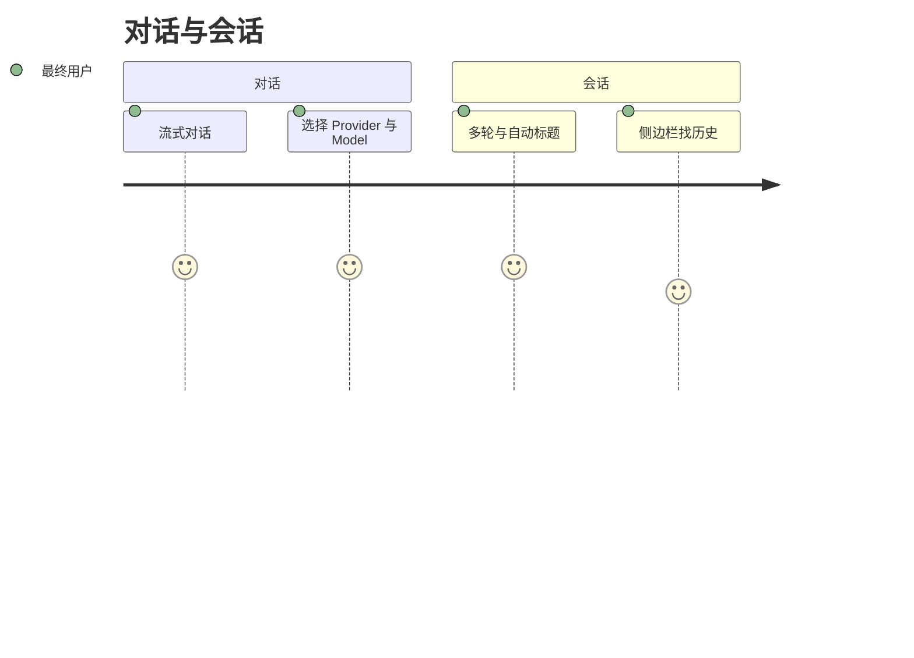
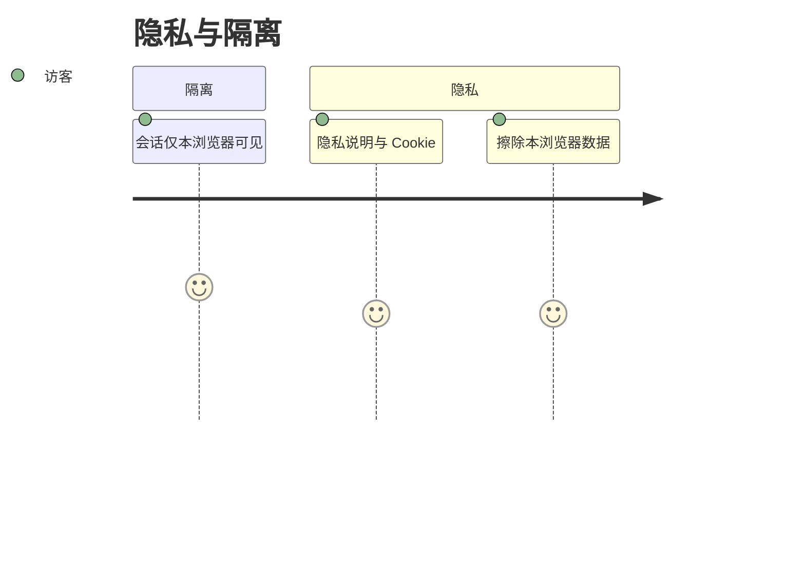
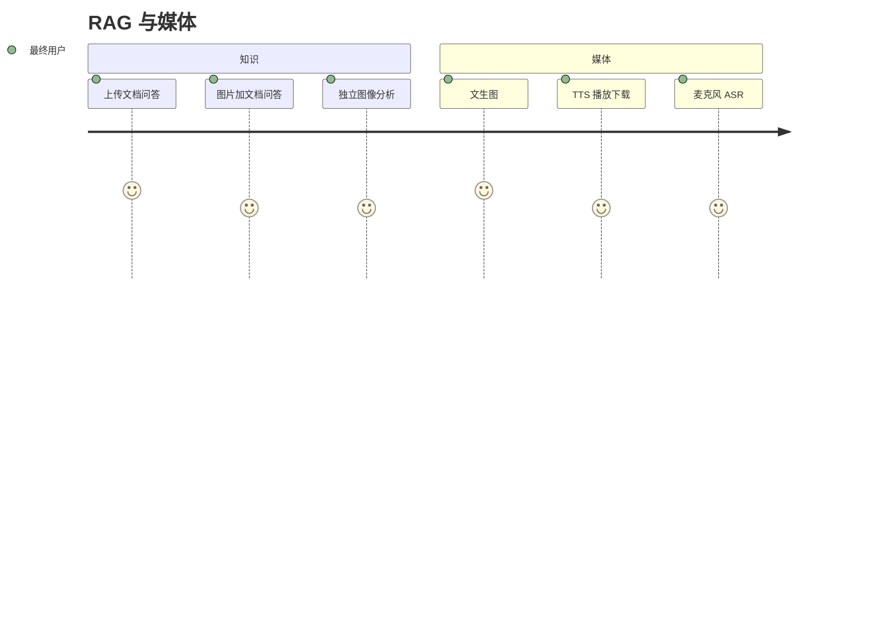
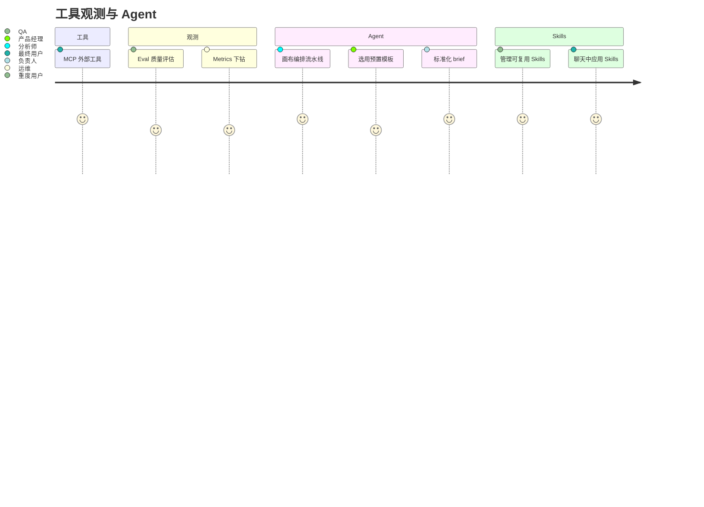

# 用户故事地图

> 格式：Jeff Patton 故事地图 + Mermaid journey + GWT（Epic 分文件）。  
> 故事正文与验收标准见 [user-stories/](./user-stories/)；本页只做索引，避免双源。

## 用户画像

| 角色 | 说明 |
|------|------|
| 最终用户 | 在浏览器中使用对话、RAG、媒体与工具能力 |
| 访客 | 未登录使用 ExploreAI，会话按浏览器隔离 |
| QA 工程师 | 在 Eval 页评估回答质量 |
| 管理员 / 运维 | 查看 AI 指标与域健康 |
| 业务分析师 / 产品经理 / 业务或技术负责人 | 使用 Multi-Agent 工作台与研判输出 |
| 平台工程师 / 开发者 | 平台管道、领域建模与 Lab 编排（进行中/规划） |
| 企业员工 / 知识工作者 / 合规与平台管理员 | 企业场景（规划） |

## 旅程总览

### 对话与会话

### 隐私与隔离

### RAG 与视觉 / 媒体

### 工具、观测与 Agent

---

## Backbone 故事地图

### 已交付

| 对话与会话 | 隐私与隔离 | RAG 与视觉 | 媒体 | MCP | 评估与指标 | 工作流 | Skills |
|------------|------------|------------|------|-----|------------|-------------|--------|
| [US-01](./user-stories/E1-chat-session.md#us-01-ai-对话) AI 对话 | [US-04](./user-stories/E2-privacy-isolation.md#us-04-按浏览器隔离聊天会话) 浏览器隔离 | [US-06](./user-stories/E3-rag-vision.md#us-06-rag-知识问答) RAG | [US-09](./user-stories/E4-media.md#us-09-图像生成) 图像生成 | [US-12](./user-stories/E5-mcp-tools.md#us-12-mcp-工具调用) MCP | [US-13](./user-stories/E6-eval-metrics.md#us-13-chat-质量评估) Eval | [US-15](./user-stories/E7-multi-agent.md#us-15-multi-agent-pipeline-工作台) Pipeline | [US-30](./user-stories/E10-skills.md#us-30-管理可复用-skills) 管理 Skills |
| [US-02](./user-stories/E1-chat-session.md#us-02-provider--model-选择) Provider/Model | [US-05](./user-stories/E2-privacy-isolation.md#us-05-欧盟隐私告知同意与擦除控制) 隐私控制 | [US-07](./user-stories/E3-rag-vision.md#us-07-vision-多模态-rag) Vision RAG | [US-10](./user-stories/E4-media.md#us-10-语音合成-tts) TTS | | [US-14](./user-stories/E6-eval-metrics.md#us-14-ai-指标看板) Metrics | [US-16](./user-stories/E7-multi-agent.md#us-16-企业工作流模版内置--可自定义) 工作流模版 | [US-31](./user-stories/E10-skills.md#us-31-在聊天中应用-skills) 聊天应用 |
| [US-03](./user-stories/E1-chat-session.md#us-03-多轮对话与自动标题) 多轮与标题 | | [US-08](./user-stories/E3-rag-vision.md#us-08-图像分析独立) 图像分析 | [US-11](./user-stories/E4-media.md#us-11-流式-asr-语音识别) ASR | | | [US-17](./user-stories/E7-multi-agent.md#us-17-企业研判标准化输出) 标准化输出 / [US-18](./user-stories/E7-multi-agent.md#us-18-消费-agent-模版目录) 画布 Worker 目录 | |

### 进行中

| 商业化与平台 | 企业自动化 |
|--------------|------------|
| [US-18](./user-stories/E8-commercial-platform.md#us-18-商业化底座配额法务页与账号雏形) 商业化底座 | [US-27a](./user-stories/E9-enterprise-future.md#us-27a-工作流定时任务与邮件结果) 工作流定时 + 邮件 |
| [US-19](./user-stories/E8-commercial-platform.md#us-19-rag-etl-管道) RAG ETL | |
| [US-20](./user-stories/E8-commercial-platform.md#us-20-文本分析) 文本分析 | |
| [US-21](./user-stories/E8-commercial-platform.md#us-21-tools-天气查询) Tools 天气 | |
| [US-22](./user-stories/E8-commercial-platform.md#us-22-supervisor-自动路由) Supervisor | |

### 未来（规划中）

| 企业与 Lab |
|------------|
| [US-23](./user-stories/E9-enterprise-future.md#us-23-aiops-智能运维) AIOps |
| [US-24](./user-stories/E9-enterprise-future.md#us-24-知识与制度) 知识与制度 |
| [US-25](./user-stories/E9-enterprise-future.md#us-25-沟通与内容生产) 沟通与内容 |
| [US-26](./user-stories/E9-enterprise-future.md#us-26-决策支持与运营轻量) 决策支持 |
| [US-27](./user-stories/E9-enterprise-future.md#us-27-治理与人机协同) 治理 |
| [US-28](./user-stories/E9-enterprise-future.md#us-28-spring-ai-workflow-原语产品化) Spring AI Workflow Lab |
| [US-29](./user-stories/E9-enterprise-future.md#us-29-会话导出) 会话导出 |

---

## Epic 索引

| Epic | 文件 | 故事 | 状态 |
|------|------|------|------|
| E1 对话与会话 | [E1-chat-session.md](./user-stories/E1-chat-session.md) | US-01 – US-03 | 已实现 |
| E2 隐私与隔离 | [E2-privacy-isolation.md](./user-stories/E2-privacy-isolation.md) | US-04 – US-05 | 已实现 |
| E3 RAG 与视觉 | [E3-rag-vision.md](./user-stories/E3-rag-vision.md) | US-06 – US-08 | 已实现 |
| E4 媒体 | [E4-media.md](./user-stories/E4-media.md) | US-09 – US-11 | 已实现 |
| E5 MCP | [E5-mcp-tools.md](./user-stories/E5-mcp-tools.md) | US-12 | 已实现 |
| E6 评估与指标 | [E6-eval-metrics.md](./user-stories/E6-eval-metrics.md) | US-13 – US-14, US-17 | 已实现 |
| E7 Pipeline（工作流） | [E7-multi-agent.md](./user-stories/E7-multi-agent.md) | US-15 – US-18 | 已实现（含节点可编辑副本） |
| E11 Deep Agent | [E11-deep-agent.md](./user-stories/E11-deep-agent.md) | US-32 – US-34 | **已退役**（并入 E7） |
| E8 商业化与平台 | [E8-commercial-platform.md](./user-stories/E8-commercial-platform.md) | US-18 – US-22 | 进行中 |
| E9 企业与未来 | [E9-enterprise-future.md](./user-stories/E9-enterprise-future.md) | US-23 – US-29；US-27a 已实现 | 规划中（US-27a 已实现） |
| E10 Skills | [E10-skills.md](./user-stories/E10-skills.md) | US-30 – US-31 | 已实现 |

## 参考

- [User Story Mapping — Jeff Patton](https://www.jpattonassociates.com/user-story-mapping/)
- [Domain Glossary](../Glossary.md)
