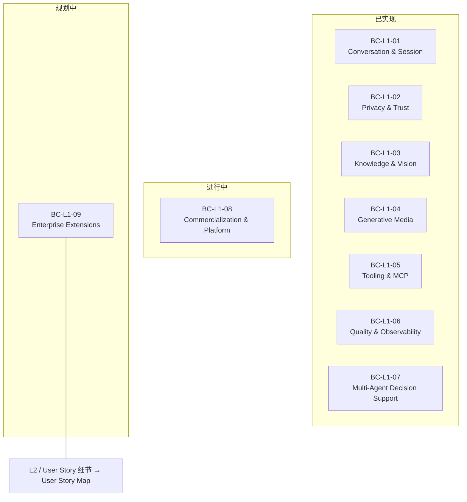

# Diagram — Business Capability Map (L1)

> 负责人：Product Owner · ADM Phase B  
> 来源：Mermaid（文内）  
> Catalog：[business-capabilities.md](./business-capabilities.md)

```mermaid
flowchart TB
  subgraph delivered [已实现]
    BC_L1_01["BC-L1-01<br/>Conversation & Session"]
    BC_L1_02["BC-L1-02<br/>Privacy & Trust"]
    BC_L1_03["BC-L1-03<br/>Knowledge & Vision"]
    BC_L1_04["BC-L1-04<br/>Generative Media"]
    BC_L1_05["BC-L1-05<br/>Tooling & MCP"]
    BC_L1_06["BC-L1-06<br/>Quality & Observability"]
    BC_L1_07["BC-L1-07<br/>Multi-Agent Decision Support"]
  end
  subgraph wip [进行中]
    BC_L1_08["BC-L1-08<br/>Commercialization & Platform"]
  end
  subgraph planned [规划中]
    BC_L1_09["BC-L1-09<br/>Enterprise Extensions"]
  end
  note["L2 / User Story 细节 → User Story Map"]
  BC_L1_09 --- note
```
