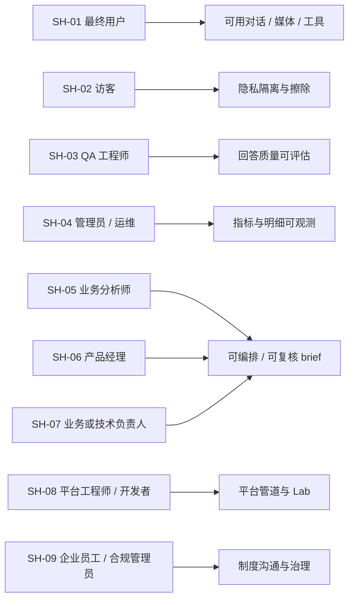

# Diagram — Stakeholder Map

> 负责人：Product Owner · ADM Phase A  
> 来源：Mermaid（文内）  
> Catalog：[stakeholders.md](./stakeholders.md)

```mermaid
flowchart LR
  SH_01["SH-01 最终用户"] --> DRV_USE["可用对话 / 媒体 / 工具"]
  SH_02["SH-02 访客"] --> DRV_PRIV["隐私隔离与擦除"]
  SH_03["SH-03 QA 工程师"] --> DRV_QUAL["回答质量可评估"]
  SH_04["SH-04 管理员 / 运维"] --> DRV_OPS["指标与明细可观测"]
  SH_05["SH-05 业务分析师"] --> DRV_BRIEF["可编排 / 可复核 brief"]
  SH_06["SH-06 产品经理"] --> DRV_BRIEF
  SH_07["SH-07 业务或技术负责人"] --> DRV_BRIEF
  SH_08["SH-08 平台工程师 / 开发者"] --> DRV_PLAT["平台管道与 Lab"]
  SH_09["SH-09 企业员工 / 合规管理员"] --> DRV_ENT["制度沟通与治理"]
```
