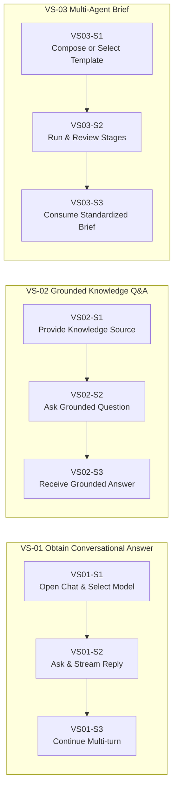

# Diagram — Value Streams

> 负责人：Product Owner · ADM Phase B  
> 来源：Mermaid（文内）  
> Catalog：[value-streams.md](./value-streams.md)

```mermaid
flowchart LR
  subgraph VS01 [VS-01 Obtain Conversational Answer]
    VS01_S1["VS01-S1<br/>Open Chat & Select Model"] --> VS01_S2["VS01-S2<br/>Ask & Stream Reply"]
    VS01_S2 --> VS01_S3["VS01-S3<br/>Continue Multi-turn"]
  end
  subgraph VS02 [VS-02 Grounded Knowledge Q&A]
    VS02_S1["VS02-S1<br/>Provide Knowledge Source"] --> VS02_S2["VS02-S2<br/>Ask Grounded Question"]
    VS02_S2 --> VS02_S3["VS02-S3<br/>Receive Grounded Answer"]
  end
  subgraph VS03 [VS-03 Multi-Agent Brief]
    VS03_S1["VS03-S1<br/>Compose or Select Template"] --> VS03_S2["VS03-S2<br/>Run & Review Stages"]
    VS03_S2 --> VS03_S3["VS03-S3<br/>Consume Standardized Brief"]
  end
```
