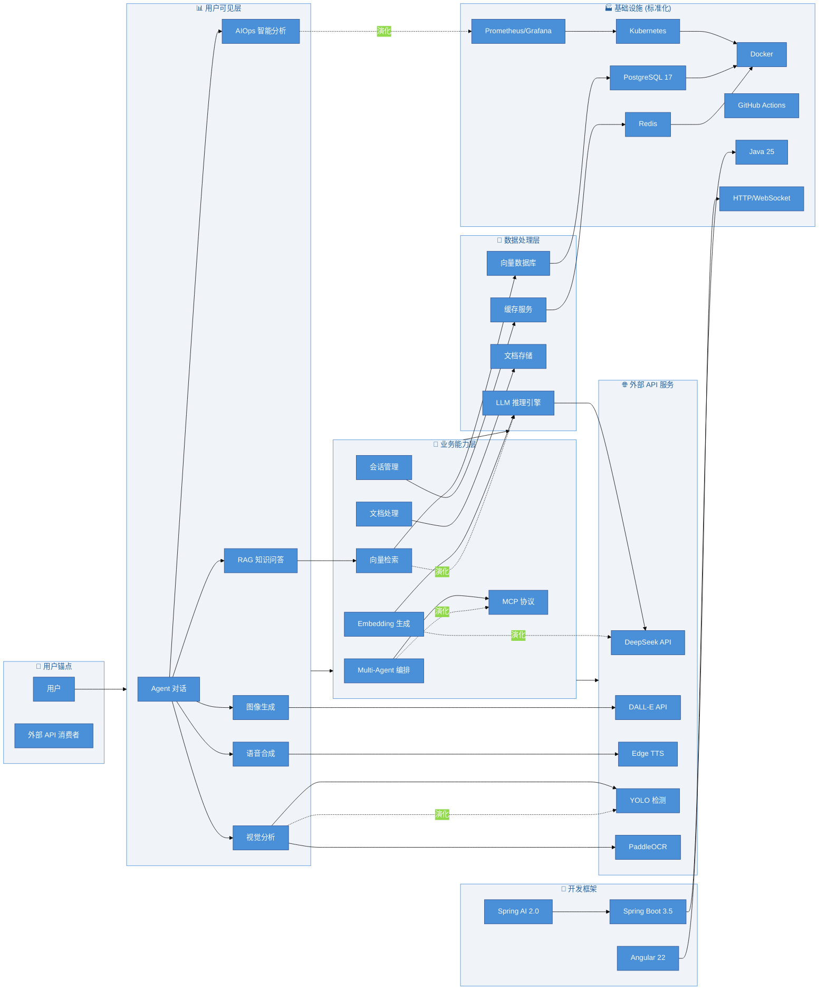

## Wardley Map

## Wardley Map 坐标位置对照

| 组件 | Visibility | Evolution | 说明 |
|------|-------------|-----------|------|
| **用户/外部消费者** | 0.90+ | 0.85+ | 右上角锚点 |
| Agent 对话、RAG | 0.75-0.85 | 0.20-0.35 | 顶部，Genesis-Custom |
| Multi-Agent、MCP | 0.55-0.65 | 0.15-0.25 | Genesis，需要创新 |
| LLM 推理、向量检索 | 0.40-0.50 | 0.30-0.40 | Custom，快速发展 |
| DeepSeek、DALL-E API | 0.30-0.40 | 0.50-0.60 | Product，供应商选择 |
| Spring Boot、Angular | 0.25-0.35 | 0.70-0.80 | Product，框架成熟 |
| Kubernetes、Docker | 0.10-0.20 | 0.85-0.95 | Commodity，标准化 |

## 战略决策矩阵

| 阶段 | X 范围 | 特征 | 战略选择 |
|------|--------|------|----------|
| **Genesis** | 0-25% | 全新、未知 | 构建差异化能力 |
| **Custom Built** | 25-50% | 定制、内部 | 内部建设，积累 |
| **Product** | 50-75% | 商业化 | 多供应商策略 |
| **Commodity** | 75-100% | 标准化 | 成本优化、自动化 |

## 关键战略洞察

1. **AIOps 智能分析** — 处于 Genesis 早期，需持续研发投入
2. **Multi-Agent 编排** — Genesis 向 Custom 演进中，核心竞争力
3. **向量检索 + LLM** — Custom 阶段，快速发展，需优化成本
4. **外部 API (DeepSeek/DALL-E)** — Product 阶段，评估 SLA，考虑多 Provider
5. **基础设施** — Commodity 阶段，标准化采购，持续自动化
